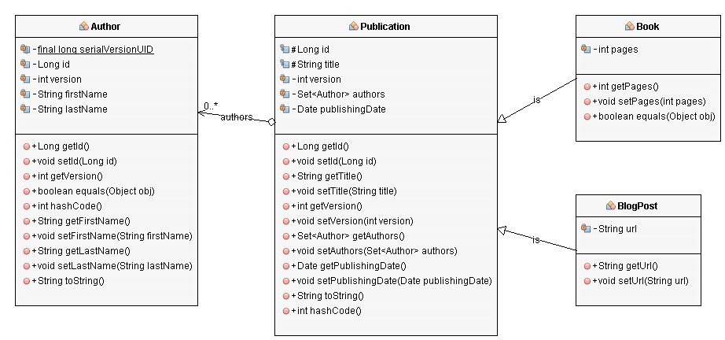
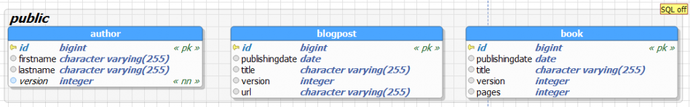
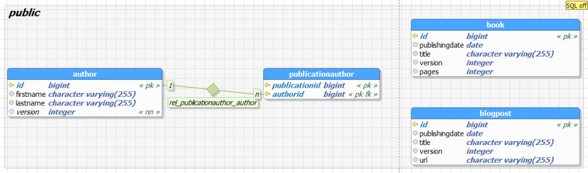
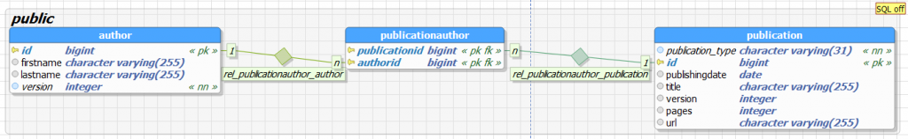
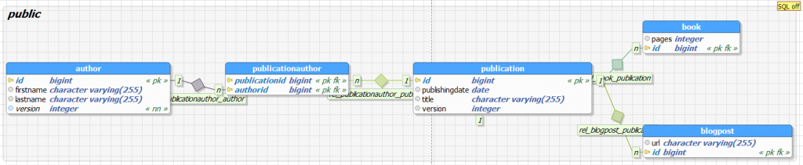

<!-- .slide: class="section" -->

<header>
	<h1>Objektový DB model v Javě</h1>
    <p>Objektově-relační mapování, Java Persistence API</p>
</header>

---

# Java EE – Objektově-relační mapování
- Java Persistence API (JPA)
	- Více implementací (EclipseLink, Hibernate, DataNucleus, …)
	- Existují alternativy (JDO)
- Primárně počítá s mapováním do relačních tabulek
	- Využívá JDBC
	- Mnoho ovladačů pro různé databáze
 
---

# Java Bean

```java
public class Person {

    private long id;
    private String name;
    private String surname;
    private Date born;

    public String getName() {
        return name;
    }

    public void setName(String name) {
        this.name = name;
    }

    …
}
```
 
---

# Persistence
- Pomocí anotací vytvoříme z třídy **entitu** persistence

```java
@Entity
@Table(name = "person")
public class Person {

    @Id
    private long id;
    private String name;
    private String surname;
    private Date born;
    …
}
```

---

# Generované ID

```java
@Entity
@Table(name = "person")
public class Person {

    @Id
    @GeneratedValue(strategy = IDENTITY)
    private long id;
    private String name;
    private String surname;
    private Date born;
    …
}
```

---

# Vztahy mezi entitami
- Anotace `@OneToMany` a `@ManyToOne`
- [Viz demo](https://github.com/DIFS-Teaching/jakartaee-basic/tree/main/rest-api/src/main/java/cz/vut/fit/pis/data)
- Nastavení mapování
	- V Eclipse pohled JPA
- Kolekce v Javě:
- `Collection<?>`
	- `List<?>` (Vector, ArrayList, …)
	- `Set<?>` (HashSet, …)
	- `Map<?, ?>` (HashMap, …)

---

# Operace s entitami

- Databázová vrstva JPA je reprezentována objektem `EntityManager`, který poskytuje standardní rozhraní
- Volá se z aplikační logiky
	- Přímé volání z metod implementujících business logiku
	- Případně zapouzdřeno do *Data Access Object* -- **DAO**

---

# Uložení objektu

```java
@PersistenceContext
EntityManager em;

Person person = new Person();
person.setName("Karel");
em.persist(person);
```

---

# Změna objektu

```java
@PersistenceContext
EntityManager em;

person.setName("Karel");
em.merge(person);
```

---

# Smazání objektu

```java
@PersistenceContext
EntityManager em;

em.remove(person);
```

---

# Dotazování

```java
TypedQuery<Person> q = em.createQuery("...", Person.class);
q.setParameter(name, value);|
q.setFirstResult(100);
q.setMaxResults(50);
q.getResultList(); // List<Person>
```

---

# JPQL dotazy
```
SELECT p FROM Person p
	WHERE p.name = "John"
```
```
SELECT c FROM Car c
	WHERE c.reg LIKE :pref
```
```
SELECT
	NEW myObject(c.type, count(c))
	FROM Car c
	GROUP BY c.type
```

- Pro dynamické sestavování dotazů: [Criteria Queries](https://www.objectdb.com/java/jpa/query/criteria)

---

# Pojmenované dotazy

```java
@Entity
@Table(name = "person")
@NamedQuery(name="Person.findAll", query="SELECT p FROM Person p") 
public class Person {
    @Id
    @GeneratedValue(strategy = IDENTITY)
    private long id;
    private String name;
    private String surname;
    private Date born;
    …
}
```

---

# Více pojmenovaných dotazů

```java
@Entity
@Table(name = "person")
@NamedQueries({
	@NamedQuery(name="Person.findAll", query="SELECT p FROM Person p"),
	@NamedQuery(name="Person.findByName",
                query="SELECT p FROM Person p WHERE p.name = :name")
})
public class Person {
    @Id
    @GeneratedValue(strategy = IDENTITY)
    private long id;
    private String name;
    private String surname;
    private Date born;
    …
}
```

---

# Použití pojmenovaných dotazů

```java
List<Person> people = 
	em.createNamedQuery("Person.findByName", Person.class)
		.setParameter(name, value)
		.setFirstResult(100)
		.setMaxResults(50)
		.getResultList();
```

---

# Vztahy mezi objekty
- Asociace A -> B
	- Třída A obsahuje vlastnost typu B nebo kolekci B (podle kardinality)
		- potenciálně inverzní (obousměrný) vztah
	- Anotace `@OneToOne`, `@OneToMany`, `@ManyToOne`, `@ManyToMany`
	- Reprezentace v relační databázi
		- `@JoinColumn`, `@JoinTable`
- Slabé entitní množiny
- Dědičnost

---

# Kaskáda

- Aplikace operace s vlastníkem i na členy vztahu

```java
public class Person
{
    @Id
    private long id;
	private String name;
    private String surname;
    @OneToMany(cascade = { CascadeType.ALL }, fetch = FetchType.EAGER, 
	 						mappedBy = "owner", orphanRemoval = true)
	private Collection<Car> cars;

	...
}
```
<!-- .element: class="small" -->

- CascadeType: `ALL`, `PERSIST`, `MERGE`, `REMOVE`, `REFRESH`, `DETACH`
- FetchType: `EAGER`, `LAZY`

---

# Vložené entity
- Položky adresy chceme reprezentovat strukturou

```java
@Entity
public class Person {

	@Id
	private String idperson;
	private String name;
    private String area;
    private String city;
    private String zipcode;

    // getters and setters
}
```

---

# Vložené entity (II)
- Jak reprezentovat vztah?
- (`@OneToOne` je v tomto případě neefektivní)

```java
@Entity
public class Person {

	@Id
	private String idperson;
	private String name;
	private Address address;

	// getters and setters
}
```
<!-- .element: class="col small" -->

```java
public class Address {

	private String area;
	private String city;
	private String zipcode;

	// getters and setters
}
```
<!-- .element: class="col small" -->

---

# Vložené entity (III)
- Sloupce area, city, zipcode budou přímo v tabulce Person

```java
@Entity
public class Person {

	@Id
	private String idperson;
	private String name;
	@Embedded
	private Address address;

	// getters and setters
}
```
<!-- .element: class="col small" -->

```java
@Embeddable
public class Address {

	private String area;
	private String city;
	private String zipcode;

	// getters and setters
}
```
<!-- .element: class="col small" -->

---

# Slabá entitní množina
- Adresy ve zvláštní tabulce ADDRESSES
- Lze i reprezentovat [metadata u vztahu](https://blog.zvestov.cz/software%20development/2015/04/15/jpa-vazebni-tabulky-s-metadaty)

```java
@Entity
public class Person {

	@Id
	private String idperson;
	private String name;
	@ElementCollection
	@CollectionTable(
		name="ADDRESSES",
		joinColumns=
			@JoinColumn(name="OWNER"))
	private Address address;

	// getters and setters
}
```
<!-- .element: class="col small" -->

```java
@Embeddable
public class Address {

	private String area;
	private String city;
	private String zipcode;

	// getters and setters
}
```
<!-- .element: class="col small" -->

---

# Jednoduchý datový typ

```java
@Entity
public class Person {

	@Id
	private String idperson;
	private String name;
	@ElementCollection
	@CollectionTable(
		name="ADDRESSES",
		joinColumns=
			@JoinColumn(name="OWNER"))
	@Column(name="PHONENUMBER")
	private List<String> phones;

	// getters and setters
}
```
<!-- .element: class="small" -->

---

# Pořadí u seznamů
- Nový sloupec ORD v tabulce adres

```java
@Entity
public class Person {

	@Id
	private String idperson;
	private String name;
	@ElementCollection
	@CollectionTable(
		name="ADDRESSES",
		joinColumns=
			@JoinColumn(name="OWNER"))
	@OrderColumn(name="ORD")
	private List<Address> addresses;

	// getters and setters
}
```
<!-- .element: class="col small" -->

```java
@Embeddable
public class Address {

	private String area;
	private String city;
	private String zipcode;

	// getters and setters
}
```
<!-- .element: class="col small" -->

---

# Pořadí u seznamů
- Totéž i pro `@OneToMany`

```java
@Entity
public class Person {

	@Id
	private String idperson;
	private String name;
	@ElementCollection
	@CollectionTable(
		name="ADDRESSES",
		joinColumns=
			@JoinColumn(name="OWNER"))
	@OrderBy(name="priority ASC")
	private List<Address> addresses;

	// getters and setters
}
```
<!-- .element: class="col small" -->

```java
@Embeddable
public class Address {

	private int priority;
	private String area;
	private String city;
	private String zipcode;

	// getters and setters
}
```
<!-- .element: class="col small" -->

---

# Dědičnost
- Mapování do relačního schématu
	- Vlastnosti nadtřídy jsou dostupné v odvozených třídách
	- Jedna tabulka nebo více tabulek?
- Typová kompatibilita
	- Odvozená třída je typově kompatibilní s nadtřídou
	- Tvorba extentu jednotlivých tříd?
- Viz např.
https://thoughts-on-java.org/complete-guide-inheritance-strategies-jpa-hibernate/ 

---

# Dědičnost – příklad 

<!-- .slide: class="normal centered fullspace" -->
 <!-- .element: style="height: 800px" -->

---

# Mapped Superclass

```java
@MappedSuperclass
public abstract class Publication {

	@Id
	protected Long id;
	protected String title;

	…
}
```
<!-- .element: class="col small" style="margin-top:4em" -->

```java
@Entity
public class Book extends Publication {

	private int pages;

	…
}
```
<!-- .element: class="col small" -->

```java
@Entity
public class BlogPost extends Publication {

	private String url;

	…
}
```
<!-- .element: class="col small" -->

---

# Mapped Superclass – výsledek 
- Třída _Publication_ není entitou
	- Nemá tabulku v databázi
	- **Nelze specifikovat vztah publikace – autor** 
- Vhodné pro efektivní definici sdílených vlastností

 <!-- .element: style="width: 100%" -->

---

# Tabulka pro každou třídu

```java
@Entity
@Inheritance(strategy = InheritanceType.TABLEPERCLASS)
public abstract class Publication {

	@Id
	protected Long id;
	protected String title;

	@ManyToMany
	@JoinTable(…)
	private Set<Author> authors;
	
	…
```
<!-- .element: class="col small" style="margin-top:2em" -->

```java
@Entity
public class Book extends Publication {

	private int pages;

	…
}
```
<!-- .element: class="col small" -->

```java
@Entity
public class BlogPost extends Publication {

	private String url;
	…
}
```
<!-- .element: class="col small" -->

---

# Tabulka pro každou třídu – výsledek 
- Třída *Publication* je entita (lze definovat vztah Publication – Author)
- Dotazy nad třídou Publication nejsou efektivní
	- Vede na JOIN nad konkrétními tabulkami
	- Např. `for (Publication p : author.getPublications()) { … }`

 <!-- .element: style="width: 90%" -->

---

# Jediná tabulka

```java
@Entity
@Inheritance(strategy = InheritanceType.SINGLETABLE)
@DiscriminatorColumn(name = "PublicationType")
public abstract class Publication {

	@Id
	protected Long id;
	protected String title;

	@ManyToMany
	@JoinTable(…)
	private Set<Author> authors;

	…
}
```
<!-- .element: class="col small" style="margin-top:2em" -->

```java
@Entity
@DiscriminatorValue(“Book”)
public class Book extends Publication {

	private int pages;
	…
}
```
<!-- .element: class="col small" -->

```java
@Entity
@DiscriminatorValue(“Blog”)
public class BlogPost extends Publication {

	private String url;
	…
}
```
<!-- .element: class="col small" -->

---

# Jediná tabulka – výsledek 
- Jedna tabulka pro všechny odvozené třídy
	- Jeden sloupec slouží jako diskriminátor
- Efektivní dotazování
	- Filtrování podle hodnoty diskriminátoru
	- Snadná reprezentace vztahu Publication – Author 
- Hodnoty nevyužitých vlastností jsou nulové
	- Nelze specifikovat _not null_ nad vlastnostmi podtříd – omezuje kontrolu integrity dat



---

# Joined

```java
@Entity
@Inheritance(strategy = InheritanceType.JOINED)
public abstract class Publication {

	@Id
	protected Long id;
	protected String title;

	@ManyToMany
	@JoinTable(…)
	private Set<Author> authors;

	…
}
```
<!-- .element: class="col small" style="margin-top:1em" -->

```java
@Entity
public class Book extends Publication {

	private int pages;
	…
}
```
<!-- .element: class="col small" -->

```java
@Entity
public class BlogPost extends Publication {

	private String url;
	…
}
```
<!-- .element: class="col small" -->

---

# Joined – výsledek 
- Tabulka pro každou třídu včetně Publication
- Snadná reprezentace vztahů, možnost integritních omezení
- Neefektivní dotazování
	- Vždy vede na JOIN více tabulek

 <!-- .element: style="width: 100%" -->
