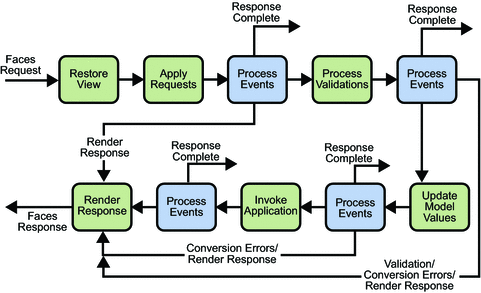

<!-- .slide: class="section" -->

<header>
	<h1>Jiné platformy</h1>
	<p>Alternativy k Jakarta EE</p>
</header>

---

# Další platformy – přehled
- Java
	- Existuje mnoho možností kromě „standardní“ J EE
- .NET (Core / Framework)
	- Mnoho řešení na všech vrstvách
- PHP
	- Různé frameworky, důraz na webovou vrstvu
- JavaScript
	- Node.js + frameworky, důraz na web a mikroslužby
- Python, Ruby, … - podobné principy

---

# Java – alternativy 
- Databázová vrstva
	- Hibernate ORM – implementuje JPA, ale i vlastní API
	- NoSQL databáze – Hibernate OGM, EclipseLink, …
- Business vrstva
	- Spring framework – alternativa EJB pro dependency injection, transakce, správa sezení, …
- Prezentační vrtstva
	- Spring MVC (controllers + JSP / Thymeleaf…)
	- Struts, Play!, …
	- https://www.dailyrazor.com/blog/best-java-web-frameworks/ 

---

# Spring
- Vznikl jako alternativa k EJB
	- Využití POJO místo (tehdy složitých) EJB
	- Omezení požadavků na infrastrukturu
- Modulární struktura, mnoho součástí
- Dependency injection
	- Podobně jako v J EE, anotace `@Bean`, `@Autowire`, …
	- Opět field, constructor, setter injection
- Spring MVC
	- Tradiční MVC přístup, bližší ostatním frameworkům
	- Ukázková aplikace
https://github.com/spring-projects/spring-mvc-showcase 

---

# Zpracování požadavku Spring MVC

 <!-- .element: class="col" style="width:40%;margin-right: 1em" -->

- Handler matching – anotace v controller třídách, vrací popis view (různé formáty) nebo přímo výsledný obsah
- View matching – výběr view podle výsledku (pokud je)
- https://docs.spring.io/spring/docs/3.2.x/spring-framework-reference/html/mvc.html 

---

# Pro srovnání: JSF

<!-- .slide: class="normal centered fullspace" -->
 <!-- .element: style="height: 800px" -->

---

# Spring Boot
- Přístup „Vše je v aplikaci“ (včetně serveru)
	- Na rozdíl od Java EE – „Server umí vše“ (thin WARs)
- Usnadňuje vytvoření aplikace a konfiguraci závislostí
	- Maven nebo Gradle šablony
	- Spring moduly (MVC, Security, …), Thymeleaf, JPA,…
- Snadné vytvoření funkční aplikace
	- Třída reprezentující celou aplikaci
	- Konfigurace pomocí anotací
	- Spustitelná main() metoda
- https://www.baeldung.com/spring-boot-start 

---

# .NET
- .NET Core / .NET Framework
- Databázová vrstva
	- Entity Framework, (LINQ, Dapper, …) \
https://docs.microsoft.com/cs-cz/ef/core/modeling/ 
- Business vrstva (služby)
	- ASP.NET Core (dependency injection, middleware)
https://docs.microsoft.com/en-us/aspnet/core/fundamentals/ 
- Webová vrstva
	- [Razor (MVVM)](https://dotnet.microsoft.com/apps/aspnet/web-apps ) – two-way data binding, HTML
	- [ASP.NET Core MVC](https://docs.microsoft.com/cs-cz/aspnet/core/tutorials/first-mvc-app/start-mvc ) – logika+model v C#, view v HTML, REST, …

---

# Entity Framework – entita 

```c#
[Table("Product")] 
public class Product 
{ 
    [Key] 
    [DatabaseGenerated(DatabaseGeneratedOption.Identity)] 
    public int Id { get; set; } 

    [Required] 
    public int CategoryId { get; set; } 

    [Required, StringLength(50)] 
    public string Name { get; set; } 

    [Required] 
    [DataType(DataType.Currency)] 
    public decimal Price { get; set; } 

    [Required] 
    public int Stock { get; set; } 

    [ForeignKey("CategoryId")] 
    public virtual Category Category { get; set; } 
} 
```

---

# PHP
- PHP je rozšiřující modul HTTP serveru
	- Žádný trvale běžící kontejner
	- \+ stabilita řešení
	- \- efektivita, možnost udržovat stav napříč požadavky
- PHP Frameworky
	- Laravel – (MVC) https://laravel.com/ 
	- Symfony – (MVC) https://symfony.com/ 
	- Nette – (MVP) https://nette.org/ 
	- …
- Správa závislostí – composer 

---

# Databázová vrstva
- Různé vlastní přístupy
- Laravel
	- Fluent query builder – specifikace SQL dotazů v PHP \
`DB::table('users')->where('name', 'John')->first();`
	- Eloquent ORM
- Nette
	- Nette database – parametrizovatelné SQL dotazy
- **Doctrine** – pokročilé ORM, podobné JPA
	- Integrovatelné do všech frameworků

---

# Doctrine: Entita

```php
<?php
use Doctrine\ORM\Annotation as ORM; 

/**
 * @ORM\Entity @ORM\Table(name="products")
**/
class Product { 

	/** @ORM\Id 
	    @ORM\Column(type="integer")
		@ORM\GeneratedValue **/
	protected $id; 

	/** @ORM\Column(type="string") **/
	protected $name; 

	// .. (other code)
} 
```

---

# Doctrine: Uložení objektu

```php
$product = new Product();
$product->setName("Tatranky");
$entityManager->persist($product);
$entityManager->flush();

echo "Created Product with ID " 
		. $product->getId() . "\n";
```

---

# Business vrstva v PHP
- Obvykle v podobě služeb – services 
- Framework poskytuje DI kontejner, který registruje služby
	- Procedurálně v PHP nebo externí konfigurační soubor
- Při vytváření controlleru framework dodá závislosti
	- Obvykle _constructor_ _injection_
- Příklady
	- Laravel https://laravel.com/docs/5.8/container#resolving
	- Symfony https://symfony.com/doc/current/components/dependency_injection.html 
	- Nette https://doc.nette.org/cs/2.4/dependency-injection 

---

# Zpracování požadavku v PHP
- Požadavek na kořenový dokument (index.php)
- Bootstrapping frameworku
	- Načtení konfigurace
	- Inicializace součástí, rozšíření, služeb (DI)
	- Obnova session
- Dekódování parametrů požadavku
	- Směrování požadavku – routing 
- Volání aplikační logiky
	- Vytvoření instance controlleru
	- Volání metody podle požadavku (handler)
- Vytvoření odpovědi (view rendering)

---

# Zpracování požadavku v PHP – Laravel
- Přiřazení controllerů k URL je definováno odděleně
`Route::get('user/{id}', 'UserController@show‘)`
- Controller konfiguruje a vrací view
 
- https://laravel.com/docs/5.8/controllers 

---

# Zpracování požadavku v PHP – Symfony
- Controller je přiřazen k URL pomocí anotací
- Vrací objekt Response
	- Různé druhy, případně včetně obsahu, přesměrování, …
	- Případně sám zajišťuje použití šablon

- https://symfony.com/doc/current/controller.html 

---

# Zpracování požadavku v PHP – Nette
- Požadavek vyřizuje _presenter_ (metoda `renderXyz(params)`)
- Presenter si sám spravuje model (není formalizováno)
- Předává data do view (template) nebo přímo odesílá odpověď (`sendResponse()`)
- https://doc.nette.org/cs/2.4/presenters 

---

# JavaScript – node.js
- Standardní řešení pro JS na serveru
- V8 JavaScript Engine + knihovny
- Procedurální implementace zpracování HTTP požadavků
	- Obdobně jako servlety
- Ukázka:
https://nodejs.org/en/docs/guides/getting-started-guide/ 
- Správce balíků npm
	- Jednoduchá instalace závislostí (knihoven)

---

# Databázová vrstva
- Knihovny pro podporu relačních DB serverů k dispozici v rámci platformy node.js
	- Např. MySQL
https://expressjs.com/en/guide/database-integration.html#mysql 
- Existují i ORM řešení
- Např. Sequelize
	- Podpora MySQL, SQLite, PostgreSQL, MSSQL
	- https://github.com/sequelize/express-example 

---

# Sequelize

```javascript
const User = sequelize.define('user', {
  firstName: {
    type: Sequelize.STRING
  },
  lastName: {
    type: Sequelize.STRING
  }
});
```

---

# Sequelize -- operace

```javascript
// Vytvoří tabulku
User.sync({force: true}).then(() => {
  return User.create({
    firstName: 'John',
    lastName: 'Hancock'
  });
});
```

```javascript
// Dotaz
User.findAll().then(users => {
  console.log(users)
})
```

---

# Business vrstva
- Implementace v JS, žádné standardní řešení
- Modularizace řešena na úrovni node.
- Případné DI řešení
	- https://www.npmjs.com/package/node-dependency-injection 

---

# Webová vrstva
- Velké množství frameworků s různými přístupy
	- http://nodeframework.com 
- Express
	- Mapování HTTP požadavků na funkce v JS
http://expressjs.com/en/guide/routing.html
	- Views pomocí několika template engines
http://expressjs.com/en/guide/using-template-engines.html
- Full stack frameworky
	- Těsnější integrace s frontendem, např. Meteor
