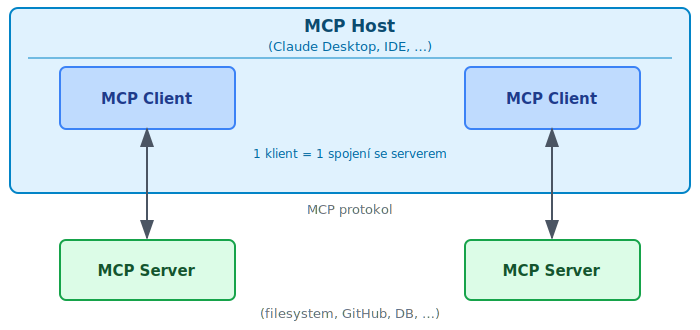

<!-- .slide: class="section" -->

<header>
	<h1>MCP</h1>
	<p>Model Context Protocol</p>
</header>

---

# Model Context Protocol (MCP)
- Otevřený standard pro připojení AI modelů k externím nástrojům a datům
- Vyvinut firmou Anthropic, zveřejněn 2024
- Cíl: sjednotit způsob, jakým AI aplikace komunikují s okolním světem
	- Databáze, souborové systémy, API, vývojové nástroje, …
- Staví na **JSON-RPC 2.0**

---

# Motivace
- LLM modely samy o sobě nemají přístup k aktuálním datům ani nástrojům
- Každá aplikace si dříve implementovala vlastní způsob napojení
	- Nekompatibilní přístupy, duplicitní práce
- MCP definuje standardní protokol
	- Nástroje napsané jednou fungují s libovolným MCP klientem

---

# Architektura

 <!-- .element: style="height:700px;margin:0.5em auto;display:block" -->

---

# Role v architektuře
- **Host** – aplikace spouštějící AI model (Claude Desktop, Cursor, …)
	- Řídí životní cyklus MCP klientů
	- Zprostředkovává přístup k serverům pro model
- **Client** – součást hostu, udržuje jedno spojení se serverem
	- Přeposílá požadavky modelu na server a vrací výsledky
- **Server** – samostatný proces poskytující nástroje a data
	- Přístup k souborovému systému, databázi, externím API, …

---

# Co server poskytuje
- **Tools** – funkce volatelné modelem (analogie: API endpoint)
	- Čtení souboru, spuštění příkazu, dotaz do databáze, …
- **Resources** – strukturovaná data k dispozici pro kontext
	- Obsah souboru, výsledek SQL dotazu, webová stránka, …
- **Prompts** – předdefinované šablony pro interakci s modelem
	- Uložené instrukce, šablony promptů, workflow

---

# Transport
- **stdio** – server běží jako podproces, komunikace přes stdin/stdout
	- Vhodné pro lokální nástroje spouštěné hostem
- **Streamable HTTP** – jeden HTTP endpoint (spec 2025-03-26)
	- Klient posílá požadavky přes HTTP POST
	- Server se rozhodne per-požadavek: `application/json` nebo SSE proud
	- Podpora session (`MCP-Session-Id`) a znovupřipojení po výpadku
	- Vhodné pro vzdálené nebo sdílené servery
- ~~HTTP + SSE~~ – původní transport (spec 2024-11-05), nyní **deprecated**
	- Vyžadoval dva samostatné endpointy (`/sse` a POST URL)

---

# Životní cyklus spojení
1. Host spustí server (nebo se připojí přes HTTP)
2. **Inicializace** – výměna verze protokolu a schopností (`initialize`)
3. Host se dozví, jaké nástroje server nabízí (`tools/list`)
4. Model požádá o volání nástroje → host předá serveru (`tools/call`)
5. Výsledek se vrátí modelu jako součást kontextu
6. Ukončení spojení (`shutdown`)

---

# Definice nástroje (server, Python)

```python
from mcp.server import Server
from mcp.types import Tool, TextContent
import mcp.server.stdio as stdio

server = Server("math-server")

@server.list_tools()
async def list_tools():
    return [Tool(
        name="is_prime",
        description="Checks whether a number is prime",
        inputSchema={
            "type": "object",
            "properties": {
                "number": {"type": "integer",
                           "description": "Number to check"}
            },
            "required": ["number"]
        }
    )]
```

---

# Implementace nástroje (server, Python)

```python
@server.call_tool()
async def call_tool(name: str, arguments: dict):
    if name == "is_prime":
        n = arguments["number"]
        is_prime = n > 1 and all(
            n % i != 0 for i in range(2, int(n**0.5) + 1))
        return [TextContent(
            type="text",
            text=str(is_prime)
        )]

async def main():
    async with stdio.stdio_server() as (r, w):
        await server.run(r, w, server.create_initialization_options())
```

---

# MCP server v Javě
- Oficiální MCP Java SDK (`io.modelcontextprotocol.sdk:mcp`)
	- Programatický přístup pomocí builder pattern
	- Podporuje stdio i HTTP+SSE transport
	- Funguje v libovolném Servlet kontejneru (Liberty, Tomcat, …)
- **Open Liberty** od verze 26.x obsahuje nativní feature `mcpServer-1.0`
	- Anotační přístup – podobný JAX-RS nebo JAX-WS
	- MCP endpoint automaticky dostupný na `/mcp`
	- Integrace se zabezpečením přes Jakarta Security

---

# Konfigurace Open Liberty (server.xml)

```xml
<featureManager>
    <feature>mcpServer-1.0</feature>
    <feature>cdi-4.0</feature>
    <feature>servlet-6.0</feature>
</featureManager>

<httpEndpoint id="defaultHttpEndpoint"
              host="*"
              httpPort="9080" />
```

- MCP server je automaticky naslouchá na `/mcp` pod kontextem aplikace
- Není třeba registrovat žádný servlet ručně

---

# Definice nástroje (Java, Open Liberty)

```java
import jakarta.enterprise.context.ApplicationScoped;
import io.openliberty.mcp.server.Tool;
import io.openliberty.mcp.server.ToolArg;
import java.util.stream.LongStream;

@ApplicationScoped
public class MathService {

    @Tool(name = "is_prime",
          description = "Checks whether a number is prime")
    public String isPrime(
            @ToolArg(name = "number",
                     description = "Number to check") long number) {
        boolean isPrime = number > 1 &&
            LongStream.rangeClosed(2, (long) Math.sqrt(number))
                      .noneMatch(i -> number % i == 0);
        return String.valueOf(isPrime);
    }
}
```

---

# MCP server – Java SDK (bez Liberty)

```java
import io.modelcontextprotocol.sdk.*;
import io.modelcontextprotocol.sdk.transport.http.*;
import com.fasterxml.jackson.databind.ObjectMapper;

var transport = new HttpServletSseServerTransportProvider(
    new ObjectMapper(), "/", "/sse");

McpServer.sync(transport)
    .serverInfo("math-server", "1.0.0")
    .capabilities(McpSchema.ServerCapabilities.builder()
        .tools(true).build())
    .tools(new McpServerFeatures.SyncToolRegistration(
        new McpSchema.Tool("is_prime",
            "Checks whether a number is prime", schema),
        (exchange, args) -> {
            long n = ((Number) args.get("number")).longValue();
            boolean result = isPrime(n);
            return new McpSchema.CallToolResult(
                List.of(new McpSchema.TextContent(String.valueOf(result))),
                false);
        }))
    .build();
```

---

# Maven závislost

```xml
<dependencies>
    <!-- MCP Java SDK -->
    <dependency>
        <groupId>io.modelcontextprotocol.sdk</groupId>
        <artifactId>mcp</artifactId>
        <version>1.1.0</version>
    </dependency>

    <!-- Jakarta Servlet API (poskytuje server) -->
    <dependency>
        <groupId>jakarta.servlet</groupId>
        <artifactId>jakarta.servlet-api</artifactId>
        <version>6.0.0</version>
        <scope>provided</scope>
    </dependency>
</dependencies>
```

---

# Výpis nástrojů – požadavek

```json
{
    "jsonrpc": "2.0",
    "id": 1,
    "method": "tools/list",
    "params": {}
}
```

---

# Výpis nástrojů – odpověď

```json
{
    "jsonrpc": "2.0",
    "id": 1,
    "result": {
        "tools": [{
            "name": "is_prime",
            "description": "Checks whether a number is prime",
            "inputSchema": {
                "type": "object",
                "properties": {
                    "number": { "type": "integer" }
                },
                "required": ["number"]
            }
        }]
    }
}
```

---

# Volání nástroje – požadavek

```json
{
    "jsonrpc": "2.0",
    "id": 2,
    "method": "tools/call",
    "params": {
        "name": "is_prime",
        "arguments": { "number": 1987 }
    }
}
```

---

# Volání nástroje – odpověď

```json
{
    "jsonrpc": "2.0",
    "id": 2,
    "result": {
        "content": [{
            "type": "text",
            "text": "true"
        }],
        "isError": false
    }
}
```

---

# Příklady MCP serverů
- **Filesystem** – čtení a zápis souborů na lokálním disku
- **GitHub** – přístup k repozitářům, issues, pull requestům
- **PostgreSQL / SQLite** – dotazy do databáze
- **Web search** – vyhledávání na internetu (Brave, Google)
- **Puppeteer** – ovládání prohlížeče, web scraping
- Stovky dalších v oficiálním registru: [registry.modelcontextprotocol.io](https://registry.modelcontextprotocol.io)

---

# MCP v informačních systémech
- AI asistent jako jednotné rozhraní pro uživatele IS
	- Dotazy přirozeným jazykem místo složitých formulářů a sestav
	- Navigace a ovládání systému hlasem nebo textem
- Přístup k datům z více subsystémů najednou
	- ERP, CRM, DMS, skladový systém – jeden asistent, více MCP serverů
- Automatizace rutinních procesů
	- Zakládání objednávek, schvalování požadavků, generování reportů
