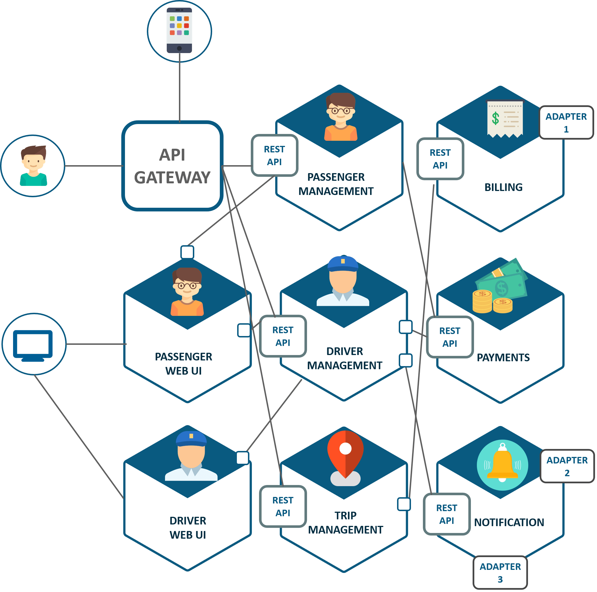
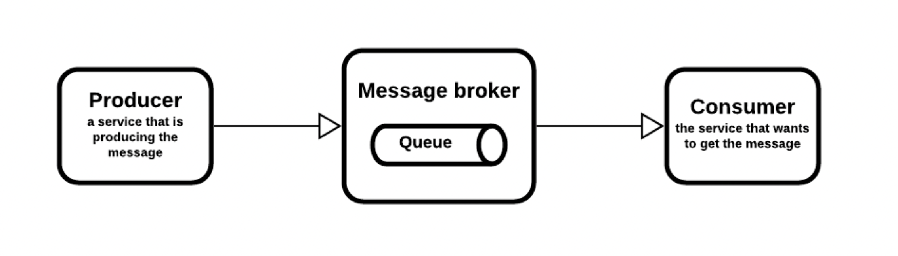
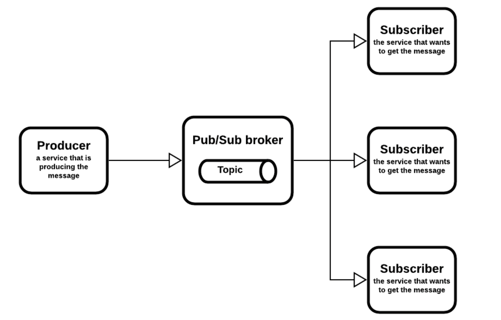

<!-- .slide: class="section" -->

<header>
	<h1>Mikroslužby (Microservices)</h1>
	<p>Architektura orientovaná na služby</p>
</header>

---

# Monolitická architektura
- Jedna aplikace
	- Jedna databáze, webové (aplikační) rozhraní
	- Business moduly – např. objednávky, doprava, sklad, …
- Výhody
	- Jednotná technologie, sdílený popis dat
	- Testovatelnost
	- Rychlé nasazení – jeden balík
- Nevýhody
	- Rozměry aplikace mohou přerůst únosnou mez
	- Neumožňuje rychlé aktualizace částí, reakce na problémy
	- Pokud použité technologie zastarají, přepsání je téměř nemožné

---

# Mikroslužby
- Aplikace je rozdělena na malé části
	- Vlastní databáze (nepřístupná vně)
	- Business logika
	- Aplikační rozhraní (REST)
- Typicky malý tým vývojářů na každou část (2 pizzas rule)
- Výhody
	- Technologická nezávislost
	- Snadné aktualizace, kontinuální vývoj
- Nevýhody
	- Testovatelnost – závislosti na dalších službách
	- Režie komunikace, riziko nekompatibility, řetězové selhání, …

---

# Mikroslužby (příklad: Uber)

<!-- .slide: class="normal centered fullspace" -->
 <!-- .element: style="height: 800px" -->

---

# Vlastnosti mikroslužby
- Vnější API
	- Dostatečně obecné – reprezentuje logiku, ne např. schéma databáze (která je skrytá)
- Externí konfigurace
- Logování
- Vzdálené sledování
	- Telemetrie – metriky (počty volání apod.), výjimky
	- Sledování živosti (Health check)
	- Logování, trasování

---

# V čem implementovat mikroslužby?
- V čemkoliv – spojovacím bodem je pouze API
	- Ale může být ruzně obtížné implementovat výše uvedené vlastnosti (logování, etc.)
- Node.js (+ express + MongoDB)
	- Populární rychlé řešení
- Java
	- Eclipse Microprofile
	- Spring Boot
	- Quarkus.io, Helidon.io

---

# Eclipse Microprofile
- https://microprofile.io/ 
- Standard založený na Jakarta EE
	- Podmnožina rozhraní JEE (např. CDI, JAX-RS, JSON-B)
	- Specifická rozhraní pro mikroslužby
		- Config, Health Check, Metrics, JWT Auth, REST Client, …
- Příklad služby
	- https://github.com/DIFS-Teaching/java-micro-service 

---

# Microprofile – další API
- Config
	- Externí konfigurace služby – zdroje, priority, …
- Fault Tolerance
	- Řešení výpadků kvůli závislosti služeb
	- Timeout, Retry, …
- Health Check
	- Vzdálené zjištění živosti mikroslužby

---

# Microprofile – další API (II)
- JWT Authentication
- Metrics
	- Statistiky o využití služby – vzdálené měření výkonu
- OpenAPI
	- Generování formalizované dokumentace API služby
- REST Client
- Příklady
https://github.com/payara/Payara-Examples/tree/master/microprofile 

---

# Config Injection
- Hodnoty parametrů dodaných z vnějšku (`@Inject`, `@ConfigProperty`)
- Různé datové typy (zabudované a vlastní konvertory)
- Zdroje konfiguračních hodnot
	- `META-INF/microprofile-config.properties`
	- Environment variables
	- System properties
		- Např. Open Liberty: `server/jvm.options`
	- Možné vlastní zdroje konfigurace

---

# Health Check
- Liveness
	- Jestli služba žije, nebo jestli je třeba ji restartovat
	- `/health/live`
- Readiness
	- Žije a může správně pracovat – např. zdroje k dispozici
	- `/health/ready`
- HTTP Status code 200 (UP), 503 (DOWN), 500 (nelze zjistit)
- https://download.eclipse.org/microprofile/microprofile-health-2.1/microprofile-health-spec.html 

---

# Metrics
- Sběr metrik různých typů v aplikaci
	- Gauge – spojitá hodnota (měřidlo), např. délka fronty
	- Counter – počítadlo, např. počet reg. uživatelů
- Počty volání, čas strávený v metodách, frekvence volání
	- `@Counted`, `@Timed`, `@Metered` (viz [OpenLiberty](https://openliberty.io/docs/latest/microservice-observability-metrics.html))
- Centrální API pro sběr metrik
	- Data sbírá a zpřístupňuje server: `/metrics`, `/metrics?scope=application`

---

# Sběr metrik
- Řešení pro sběr a vizualizaci metrik
	- [Prometheus](https://prometheus.io/) – sběr a ukládání metrik (pull model)
	- [Grafana](https://grafana.com/) – vizualizace a dashboardy
	- [VictoriaMetrics](https://victoriametrics.com/) – výkonná Prometheus-kompatibilní alternativa
	- [OpenTelemetry](https://opentelemetry.io/) – otevřený standard pro sběr metrik, logů i traces
	
---

# Distribuované logování

- Chyby mohou nastat v jednotlivých mikroslužbách i v komunikaci mezi nimi
- V případě výpadku nelze procházet jednotlivé logy odděleně
- Distribuované logování
	- Centralizace logů, programátor rozhoduje, co se loguje
- Distribuované sledování (tracing)
	- Sledování celého průběhu operací a jejich výsledků

---

# Distribuované logování

- Nástroje pro centralizovaný sběr logů
	- **ELK stack** – [Elasticsearch](https://www.elastic.co/elasticsearch) (ukládání a analýza) + [Logstash](https://www.elastic.co/logstash) (sběr) + [Kibana](https://www.elastic.co/kibana) (vizualizace)
	- **[OpenSearch](https://opensearch.org/)** – open-source fork Elasticsearch + Kibana (AWS)
	- **[Grafana Loki](https://grafana.com/oss/loki/)** – lehčí alternativa k ELK, indexuje pouze metadata logů
	- **[Fluent Bit](https://fluentbit.io/)** / **[Fluentd](https://www.fluentd.org/)** – populární alternativy k Logstash (projekty CNCF)
- Podpora v aplikacích
	- Nutný výstup ve vhodném formátu (JSON, strukturované logy)
	- V Javě např. log4j, logback

---

# Distribuované sledování (Tracing)

- Nástroje pro sledování aplikací
	- Např. [Jaeger](https://www.jaegertracing.io/), [Zipkin](https://zipkin.io/)
- Podpora v aplikacích
	- Např. [Open Telemetry](https://opentelemetry.io/), [Microprofile Open Tracing](https://download.eclipse.org/microprofile/microprofile-opentracing-2.0/microprofile-opentracing-spec-2.0.html), [Spring Cloud Sleuth](http://spring.io/projects/spring-cloud-sleuth)
	- [Open Liberty guides](https://openliberty.io/guides/microprofile-telemetry-jaeger.html).

---

# OpenTelemetry
- Otevřený standard pro observabilitu mikroslužeb – projekt [CNCF](https://www.cncf.io/)
- Sjednocuje sběr všech tří pilířů telemetrie pod jedno API a SDK
- Vendor-neutral – data lze odesílat do libovolného backendu (Prometheus, Jaeger, Grafana, Datadog, …)
- Skládá se z
	- **API** – rozhraní pro instrumentaci aplikace
	- **SDK** – implementace API pro konkrétní jazyk
	- **Collector** – přijímá, transformuje a přeposílá telemetrii
- Standardní protokol přenosu: **OTLP** (OpenTelemetry Protocol)

---

# OpenTelemetry – tři pilíře

| Pilíř | Co měří | Typický backend |
|---|---|---|
| **Metrics** | Hodnoty v čase (countery, gauge, …) | Prometheus, VictoriaMetrics |
| **Logs** | Strukturované záznamy událostí | Loki, Elasticsearch |
| **Traces** | Průběh požadavku přes více služeb | Jaeger, Zipkin |

- Korelace – trace ID propojuje log záznamy s konkrétním tracem
- Typická kombinace: **OTel Collector → Prometheus + Loki + Jaeger → Grafana**

---

# OTel Collector – pipeline
- Samostatný proces mezi aplikacemi a backends
- Pipeline: **Receivers → Processors → Exporters**

| Fáze | Příklady |
|---|---|
| **Receivers** | OTLP (gRPC/HTTP), Prometheus scrape, Jaeger, Zipkin, Kafka |
| **Processors** | `batch`, `filter`, `attributes`, `tail_sampling`, `transform` |
| **Exporters** | Prometheus, OTLP→Jaeger/Tempo, Loki, Datadog |

---

# Backend

- **Backend** = cílový systém pro ukládání a dotazování telemetrických dat
	- Samostatná služba (Prometheus, Jaeger, Loki, …), obvykle s vlastním UI nebo napojením na Grafana
	- Aplikace ani collector backend neznají – vystaví data přes standardní rozhraní, backend si je přebírá
- Jeden collector → více backendů zároveň
- Aplikace vždy mluví OTLP; backend lze změnit bez redeploymentu aplikace

---

# MicroProfile Telemetry a OTel
- MP Telemetry je CDI wrapper nad OTel Java SDK – nevytváří nový formát
- **Traces/Spany:** `@WithSpan`, `@SpanAttribute`, automatická instrumentace JAX-RS
- **Metriky:** přímo OTel Metrics API (`Counter`, `Histogram`, `Gauge`) – `@Counted`/`@Timed` z MP Metrics jsou od MP 7.0 *deprecated*
- **Logy:** strukturované logy přes OTel Logs Bridge API
- Konfigurace přes MicroProfile Config:

```properties
otel.service.name=math-service
otel.exporter.otlp.endpoint=http://collector:4317
```

- Open Liberty: feature `mpTelemetry-2.0`

---

# OTel – ukázka nasazení (Docker Compose)

<pre style="font-size: 65%; text-align: center;">
┌─────────────────────────────────────────────────────────────┐
│                                                             │
│  ┌─────────────────┐  OTLP   ┌──────────────────────────┐   │
│  │  math-service   │ ──────► │  OTel Collector          │   │
│  │  Open Liberty   │         │  receivers:  OTLP        │   │
│  │  mpTelemetry    │         │  processors: batch,      │   │
│  └─────────────────┘         │              filter      │   │
│                              │  exporters:  →           │   │
│  ┌─────────────────┐  OTLP   │                          │   │
│  │  order-service  │ ──────► └───┬──────────┬───────────┘   │
│  │  Open Liberty   │             │          │          │    │
│  └─────────────────┘             ▼          ▼          ▼    │
│                           ┌──────────┐ ┌────────┐ ┌──────┐  │
│                           │Prometheus│ │ Jaeger │ │ Loki │  │
│                           └────┬─────┘ └───┬────┘ └──┬───┘  │
│                                └───────────┼─────────┘      │
│                                            ▼                │
│                                     ┌────────────┐          │
│                                     │  Grafana   │          │
│                                     └────────────┘          │
└─────────────────────────────────────────────────────────────┘
</pre>


---

# REST Client
- Vytvoření REST klienta z definice služby
- Anotované rozhraní služby, podobně jako JAX-RS
- Vytvoření REST klienta
	- `RestClientBuilder`
- Injektování hotového klienta
	- `@RestClient`
- https://github.com/payara/Payara-Examples/tree/master/microprofile/rest-client
- https://github.com/eclipse/microprofile-rest-client

---

# Fault tolerance
- Automatické opakování metody, pokud dojde k výjimce
	- `@Retry`
- Timeout volání metody
	-  `@Timeout`
- Fallback metody
	- `@Fallback`
	- [`@CircuitBreaker`](https://download.eclipse.org/microprofile/microprofile-fault-tolerance-3.0/microprofile-fault-tolerance-spec-3.0.html#circuitbreaker)
- https://github.com/eclipse/microprofile-fault-tolerance
- https://github.com/payara/Payara-Examples/tree/master/microprofile/fault-tolerance

---

# Synchronní a asynchronní komunikace

- Synchronní komunikace
	- Nejčastěji REST
	- Klientská služba čeká na odpověď od volané služby (blokování)
	- Pokud volaná služba není dostupná, klientská služba čeká nebo selže
- Asynchronní komunikace
	- Služba zasílá zprávy, nečeká na odpověď
	- Výměnu zpráv zajišťuje centrální *message broker*
	- *Message queue* vs. *Publish/subscribe*

---

# Message queue

 <!-- .element: style="width: 1200px" class="ncol" -->

- Tvoří se fronty zpráv od konkrétního producenta pro konkrétního konzumenta
- Např. RabbitMQ, Apache ActiveMQ nebo Amazon SQS

---

# Publish / subscribe

 <!-- .element: style="width: 1200px" class="col" -->

- Zprávy jsou přiřazovány k tématům (*topics*)
- Producent publikuje zprávy k tématu, konzument se přihlašuje k doběru tématu
- Apache Kafka, Pulsar, Amazon SNS

---

# Microprofile API

- Standard [Microprofile Reactive Messaging](https://download.eclipse.org/microprofile/microprofile-reactive-messaging-1.0/microprofile-reactive-messaging-spec.html)
- Podpora různých brokerů
	- Apache Kafka, Amazon Kinesis, RabbitMQ, Apache ActiveMQ, ...
- Anotace metod produkujících zprávy `@Outgoing("my-channel")` a přijímajících zprávy `@Incoming("my-incoming-channel")`
- Demo pro OpenLiberty
	- [Creating reactive Java microservices](https://openliberty.io/guides/microprofile-reactive-messaging.html#creating-the-producer-in-the-system-microservice)
