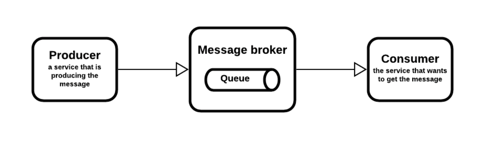

<!-- .slide: class="section" -->

<header>
	<h1>Mikroslužby (Microservices)</h1>
	<p>Architektura orientovaná na služby</p>
</header>

---

# Monolitická architektura
- Jedna aplikace
	- Jedna databáze, webové (aplikační) rozhraní
	- Business moduly – např. objednávky, doprava, sklad, …
- Výhody
	- Jednotná technologie, sdílený popis dat
	- Testovatelnost
	- Rychlé nasazení – jeden balík
- Nevýhody
	- Rozměry aplikace mohou přerůst únosnou mez
	- Neumožňuje rychlé aktualizace částí, reakce na problémy
	- Pokud použité technologie zastarají, přepsání je téměř nemožné

---

# Mikroslužby
- Aplikace je rozdělena na malé části
	- Vlastní databáze (nepřístupná vně)
	- Business logika
	- Aplikační rozhraní (REST)
- Typicky malý tým vývojářů na každou část (2 pizzas rule)
- Výhody
	- Technologická nezávislost
	- Snadné aktualizace, kontinuální vývoj
- Nevýhody
	- Testovatelnost – závislosti na dalších službách
	- Režie komunikace, riziko nekompatibility, řetězové selhání, …

---

# Mikroslužby (příklad: Uber)

<!-- .slide: class="normal centered fullspace" -->
 <!-- .element: style="height: 800px" -->

---

# Vlastnosti mikroslužby
- Vnější API
	- Dostatečně obecné – reprezentuje logiku, ne např. schéma databáze (která je skrytá)
- Externí konfigurace
- Logování
- Vzdálené sledování
	- Telemetrie – metriky (počty volání apod.), výjimky
	- Sledování živosti (Health check)
	- Logování, trasování

---

# V čem implementovat mikroslužby?
- V čemkoliv – spojovacím bodem je pouze API
- Node.js (+ express + MongoDB)
	- Populární rychlé řešení
- Java
	- Spring Boot
	- Ultralehké frameworky
Např. Spark - https://github.com/perwendel/spark 
	- Microprofile
	- Quarkus.io, Helidon.io

---

# Eclipse Microprofile
- https://microprofile.io/ 
- Standard založený na Jakarta EE
	- Podmnožina rozhraní JEE (např. CDI, JAX-RS, JSON-B)
	- Specifická rozhraní pro mikroslužby
		- Config, Health Check, Metrics, JWT Auth, REST Client, …
- Příklad služby
	- https://github.com/DIFS-Teaching/java-micro-service 

---

# Microprofile – další API
- Config
	- Externí konfigurace služby – zdroje, priority, …
- Fault Tolerance
	- Řešení výpadků kvůli závislosti služeb
	- Timeout, Retry, …
- Health Check
	- Vzdálené zjištění živosti mikroslužby

---

# Microprofile – další API (II)
- JWT Authentication
- Metrics
	- Statistiky o využití služby – vzdálené měření výkonu
- OpenAPI
	- Generování formalizované dokumentace API služby
- REST Client
- Příklady
https://github.com/payara/Payara-Examples/tree/master/microprofile 


---

# Health Check
- Liveness
	- Jestli služba žije, nebo jestli je třeba ji restartovat
	- `/health/live`
- Readiness
	- Žije a může správně pracovat – např. zdroje k dispozici
	- `/health/ready`
- HTTP Status code 200 (UP), 503 (DOWN), 500 (nelze zjistit)
- https://download.eclipse.org/microprofile/microprofile-health-2.1/microprofile-health-spec.html 

---

# Metrics
- Sběr metrik různých typů v aplikaci
	- Gauge – spojitá hodnota (měřidlo), např. délka fronty
	- Counter – počítadlo, např. počet reg. uživatelů
	- Timer – časové údaje, např. průměrný čas operace, atd.
- Počty volání a čas strávený v metodách
	- `@Metered`, `@Timed`
- Centrální API pro sběr metrik
	- Data sbírá a zpřístupňuje server
	- /metrics, /metrics/application
- Předpokládá využití řešení pro sběr metrik (např. [Prometheus](https://prometheus.io/)) a případně vizualizaci (např. [Grafana](https://prometheus.io/docs/visualization/grafana/))
	
---

# Distribuované logování

- Chyby mohou nastat v jednotlivých mikroslužbách i v komunikaci mezi nimi
- V případě výpadku nelze procházet jednotlivé logy odděleně
- Distribuované logování
	- Centralizace logů, programátor rozhoduje, co se loguje
- Distribuované sledování (tracing)
	- Sledování celého průběhu operací a jejich výsledků

---

# Distribuované logování

- Nástroje pro centralizovaný sběr logů
	- Např. ELK stack:
		- Elastic Search -- ukládání, prohledávání a analýza dat (JSON)
		- Logstash -- sběr logů z různých zdrojů
		- Kibana -- vizualizace a procházení
- Podpora v aplikacích
	- Nutný výstup ve vhodném formátu (např. pro logstash)
	- V Javě např. log4j, logback.

---

# Distribuované sledování

- Nástroje pro sledování aplikací
	- Např. [Jaeger](https://www.jaegertracing.io/), [Zipkin](https://zipkin.io/)
- Podpora v aplikacích
	- Např. [Microprofile Open Tracing](https://download.eclipse.org/microprofile/microprofile-opentracing-2.0/microprofile-opentracing-spec-2.0.html), [Spring Cloud Sleuth](http://spring.io/projects/spring-cloud-sleuth)

---

# Microprofile Open Tracing

```java
@RequestScoped
@Path("/items")
@Produces(MediaType.APPLICATION_JSON)
public class CatalogService {
  @Inject
  Tracer tracer;
 
  @Timeout(value = 2, unit = ChronoUnit.SECONDS)
  @Retry(maxRetries = 2, maxDuration = 2000)
  @Fallback(fallbackMethod = "fallbackInventory")
  @GET
  @Traced(value = true, operationName = "getCatalog.list")
   public List<Item> getInventory() {
        ...snip...
    // Return all items in Inventory
  }
 
  public List<Item> fallbackInventory() {
    try (ActiveSpan childSpan =
      tracer
        .buildSpan("Grabbing messages from Messaging System")
        .startActive()) {
            ...snip...
          // Return a default fallback list
        }
    }
  }

}
```

Viz [Monitor and Debug Java Microservices with MicroProfile OpenTracing](https://www.ibm.com/cloud/blog/monitoring-java-microservices-with-microprofile-opentracing) nebo [Open Liberty guides](https://openliberty.io/guides/microprofile-opentracing.html).

---

# Config Injection
- Hodnoty parametrů dodaných z vnějšku (`@Inject`, `@ConfigProperty`)
- Různé datové typy (zabudované a vlastní konvertory)
- Zdroje konfiguračních hodnot
	- `META-INF/microprofile-config.properties`
	- Environment variables
	- System properties
		- Např. Open Liberty: `server/jvm.options`
	- Možné vlastní zdroje konfigurace

---

# REST Client
- Vytvoření REST klienta z definice služby
- Anotované rozhraní služby, podobně jako JAX-RS
- Vytvoření REST klienta
	- `RestClientBuilder`
- Injektování hotového klienta
	- `@RestClient`
- https://github.com/payara/Payara-Examples/tree/master/microprofile/rest-client
- https://github.com/eclipse/microprofile-rest-client

---

# Fault tolerance
- Automatické opakování metody, pokud dojde k výjimce
	- `@Retry`
- Timeout volání metody
	-  `@Timeout`
- Fallback metody
	- `@Fallback`
	- `@CircuitBreaker`
- https://github.com/eclipse/microprofile-fault-tolerance
- https://github.com/payara/Payara-Examples/tree/master/microprofile/fault-tolerance

---

# Synchronní a asynchronní komunikace

- Synchronní komunikace
	- Nejčastěji REST
	- Klientská služba čeká na odpověď od volané služby (blokování)
	- Pokud volaná služba není dostupná, klientská služba čeká nebo selže
- Asynchronní komunikace
	- Služba zasílá zprávy, nečeká na odpověď
	- Výměnu zpráv zajišťuje centrální *message broker*
	- *Message queue* vs. *Publish/subscribe*

---

# Message queue

 <!-- .element: style="width: 1200px" class="ncol" -->

- Tvoří se fronty zpráv od konkrétního producenta pro konkrétního konzumenta
- Např. RabbitMQ, Apache ActiveMQ nebo Amazon SQS

---

# Publish / subscribe

 <!-- .element: style="width: 1200px" class="col" -->

- Zprávy jsou přiřazovány k tématům (*topics*)
- Producent publikuje zprávy k tématu, konzument se přihlašuje k doběru tématu
- Apache Kafka, Pulsar, Amazon SNS

---

# Microprofile API

- Standard [Microprofile Reactive Messaging](https://download.eclipse.org/microprofile/microprofile-reactive-messaging-1.0/microprofile-reactive-messaging-spec.html)
- Podpora různých brokerů
	- Apache Kafka, Amazon Kinesis, RabbitMQ, Apache ActiveMQ, ...
- Anotace metod produkujících zprávy `@Outgoing("my-channel")` a přijímajících zprávy `@Incoming("my-incoming-channel")`
- Demo pro OpenLiberty
	- [Creating reactive Java microservices](https://openliberty.io/guides/microprofile-reactive-messaging.html#creating-the-producer-in-the-system-microservice)
