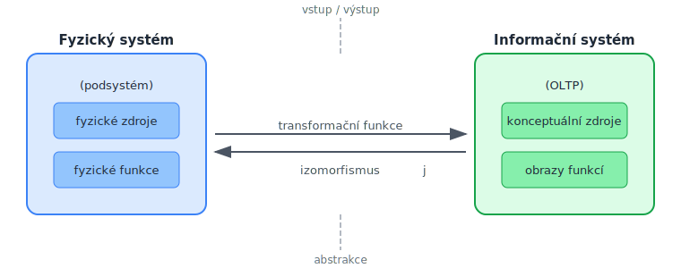
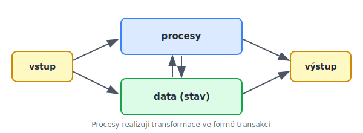

<!-- .slide: class="section" -->

<header>
	<h1>Procesy v informačním systému</h1>
	
OLTP jako model fyzického systému, procesy v IS

</header>

---

# OLTP jako model fyzického systému

 <!-- .element: style="height:480px;margin:0.5em auto;display:block" -->

- Mezi OLTP a fyzickým systémem existuje **izomorfismus** *j* – každé funkci fyzického systému odpovídá obraz v IS
- Modelujeme vždy jen **podsystém** (abstrakce) – jen zdroje a procesy podstatné pro danou úroveň řízení

---

# Procesy ve schématu IS

 <!-- .element: style="height:450px;margin:0.5em auto;display:block" -->

- IS se skládá z **dat** uchovávajících *stav* systému a **procesů** realizujících transformace
- Transformace jsou často implementovány ve formě **transakcí**
