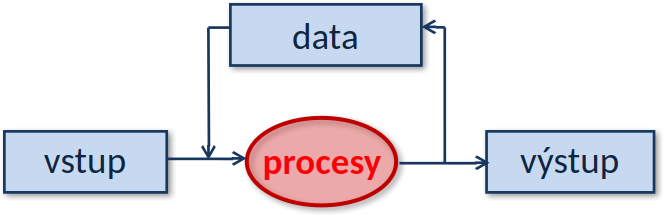

# Procesy ve schématu IS

 <!-- .element: style="height:450px;margin:0.5em auto;display:block" -->

- **Data** uchovávající **stav** systému
- **Procesy** realizující transformace často ve formě *transakcí*.
- Obojí má být **isomorfní** s reálným systémem
