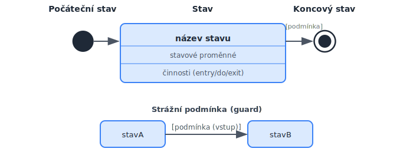
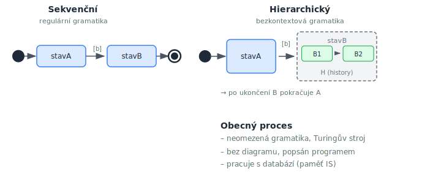

<!-- .slide: class="section" -->

<header>
	<h1>Procesy a jejich definice</h1>
	<p>UML stavové diagramy, typy procesů, dvouúrovňové schéma</p>
</header>

---

# UML stavový diagram

 <!-- .element: style="height:500px;margin:0.5em auto;display:block" -->

---

# Sekvenční procesy
- Model = **regulární gramatiky**, **konečné automaty**
	- Pravidlo tvaru `A → b B` nebo `A → b`
- Stavový diagram popisuje přechody mezi stavy na základě vstupů
- Vstup může být i prázdný

```
stavA → [vstup b] stavB
stavA → [vstup b] (a konec)
```

---

# Sekvenční procesy – příklad

| Stav | Přechod | Cílový stav |
|------|---------|-------------|
| Zobrazení košíku | [tlačítko Odhlásit] | Odhlášení |
| Zobrazení košíku | [tlačítko Přepočítat] | Úprava množství |

- *Vizualizace + komunikace* → stav čeká na uživatele
- *Dávka* → server provádí zpracování (zde může jít o transakci)

---

# Hierarchické procesy
- Model = **bezkontextové gramatiky**, **zásobníkový automat**
	- Pravidlo tvaru `A → b B pokračováníA`
- Stav může být *vnitřně strukturován* (vnořené stavové stroje)
- Po ukončení vnořeného stavu B se pokračuje v A
- Vstup **musí být vždy označen**, jinak může vzniknout nekonečný cyklus
- Vnitřní kontext zachován pomocí zásobníku (**H** = history)

---

# Obecné procesy
- Model = **neomezené gramatiky**, **Turingův stroj**
	- Pravidlo tvaru `a A b → c B d`
- Stavový diagram neexistuje – popis v programovacím jazyce
- Pokud za paměť považujeme data IS v databázi → **obecné procesy**

---

# Typy procesů – přehled

 <!-- .element: style="height:500px;margin:0.5em auto;display:block" -->

---

# Dvouúrovňové schéma
- Řízení na nejvyšší úrovni: **sekvenční a hierarchické procesy**
	- Popis přechodů mezi stavy (státový diagram)
- Obecné procesy v jednotlivých stavech: popsány **transakcemi**
	- Pracují s databází, mění stav systému

```
Vrstva řízení:   stavový diagram (sekvence, hierarchie)
     ↓
Vrstva stavů:    obecné procesy / transakce (v každém stavu)
```

---

# Diagram stavů internetového obchodu

| Stav | Typ | Transakce? |
|------|-----|-----------|
| Domovská stránka | vizualizace | – |
| Vyhledávání v nabídce | vizualizace + komunikace | – |
| Přidání do košíku | dávka | **T** |
| Zobrazení košíku | vizualizace + komunikace | – |
| Úprava množství | dávka | – |
| Nákup – vyskladnění | dávka | **T** |
| Přihlášení / Odhlášení | dávka | – |

- Větvení v komunikačních stavech – tlačítka (vstup od uživatele)
- Větvení v dávkových stavech – porušení konzistence (chyby na serveru)

---

# Poznámky k diagramu stavů
- Větvení:
	- v *komunikačních stavech* – událost způsobená uživatelem (tlačítko)
	- v *dávkových stavech* – porušení konzistence (kontrola na serveru)
- Zabránit vzniku cyklů z hran bez označení
- Transakce **T** pouze v dávkových stavech (ne ve všech)
