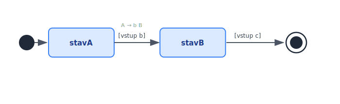
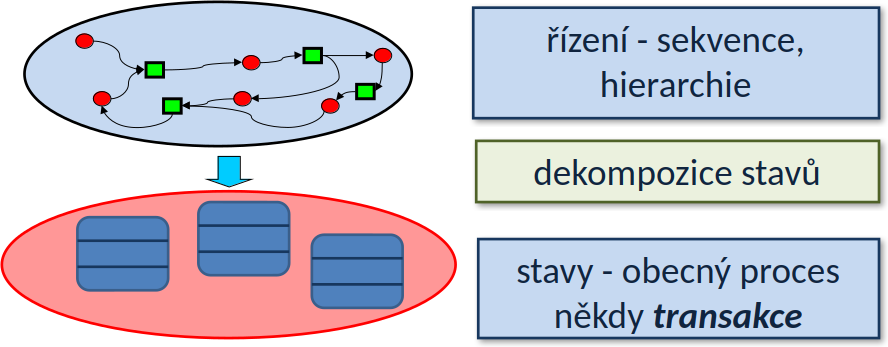

<!-- .slide: class="section" -->

<header>
	<h1>Procesy a jejich definice</h1>
	<p>UML stavové diagramy, typy procesů, dvouúrovňové schéma</p>
</header>

---

# UML stavový diagram

 <!-- .element: style="height:700px;margin:0.5em auto;display:block" -->

---

# Sekvenční procesy
- Model = **regulární gramatiky**, **konečné automaty**
	- Pravidlo tvaru `A → b B` nebo `A → b` *(A, B jsou stavy; b je vstup – událost nebo podmínka)*
- Stavový diagram popisuje přechody mezi stavy na základě vstupů
- Vstup může být i prázdný

 <!-- .element: style="height:360px;margin:0.5em auto;display:block" -->

---

# Hierarchické procesy
- Model = **bezkontextové gramatiky**, **zásobníkový automat**
	- Pravidlo tvaru `A → b B pokračováníA`
- Stav může být *vnitřně strukturován* (vnořené stavové stroje)
- Po ukončení vnořeného stavu B se pokračuje v A
- Vstup **musí být vždy označen**, jinak může vzniknout nekonečný cyklus
- Vnitřní kontext zachován pomocí zásobníku (**H** = history)

---

# Obecné procesy
- Model = **neomezené gramatiky**, **Turingův stroj**
	- Pravidlo tvaru `a A b → c B d`
- Stavový diagram neexistuje – popis v programovacím jazyce
- Pokud za paměť považujeme data IS v databázi → **obecné procesy**

---

# Typy procesů – přehled

 <!-- .element: style="height:800px;margin:0.5em auto;display:block" -->

---

# Dvouúrovňové schéma
- Řízení na nejvyšší úrovni: **sekvenční a hierarchické procesy**
	- Popis přechodů mezi stavy (státový diagram)
- Obecné procesy v jednotlivých stavech: popsány **transakcemi**
	- Pracují s databází, mění stav systému

```
Vrstva řízení:   stavový diagram (sekvence, hierarchie)
     ↓
Vrstva stavů:    obecné procesy / transakce (v každém stavu)
```

---

# Dekompozice - dvouúrovňové schéma

 <!-- .element: style="height:400px;margin:0.5em auto;float:right" -->

- Standardně jsou procesy dekomponovány na řízení a činnost stavů -- transakce
- Na nejvyšší úrovni vystačíme se sekvenčními a hierarchickými procesy
- Obecné procesy ve stavech (pracující s databází) -- modelujeme v obecném programovacím jazyce (transakce).
