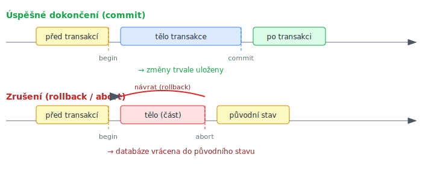

<!-- .slide: class="section" -->

<header>
	<h1>Databázové transakce</h1>
	
Pojem transakce, ACID vlastnosti

</header>

---

# Motivace
- Co se stane při poruše během práce s důležitými daty?
- Které operace byly před poruchou skutečně provedeny?
- Co se stane, když více uživatelů současně modifikuje tentýž údaj?
- Budou údaje v databázi stále smysluplné?

→ Odpovědí jsou **transakční modely** a **transakční zpracování**

---

# Pojem transakce
- **Transakce** = skupina operací prováděných jako celek (*buď celá dávka, nebo nic*)
- Modeluje stav popisovaného výseku reálného světa
- Dva základní účely:
	- Poskytnout **bezpečnou jednotku práce** – správné zotavení z poruch
	- Poskytnout **izolaci** programům přistupujícím k databázi současně

---

# Systém pro zpracování transakcí (TPS)
- Systém (platforma, databázový systém) **podporující provádění transakcí**
- Zajišťuje speciální **vlastnosti transakcí** (atomičnost, nezávislost, trvanlivost)
- Angl. **Transactional Processing System** (zkratka **TPS**)

---

# Vlastnosti transakce – ACID

| Zkratka | Vlastnost | Popis |
|---------|-----------|-------|
| **A** | **Atomičnost** (Atomicity) | Celá transakce, nebo nic |
| **C** | **Konzistence** (Consistency) | DB zůstane v konzistentním stavu |
| **I** | **Izolovanost** (Isolation) | Souběžné = sekvenční výsledek |
| **D** | **Trvanlivost** (Durability) | Potvrzené změny přežijí havárii |

---

# Kdo co zajišťuje
- **Programátor** zodpovídá za konzistenci transakce
- **TPS** zajišťuje:
	- **Atomičnost** – mechanismus commit/rollback
	- **Izolovanost** – zamykání záznamů
	- **Trvanlivost** – žurnál, zrcadlení

---

# Atomičnost

 <!-- .element: style="height:500px;margin:0.5em auto;display:block" -->

---

# Důvody zrušení transakce

**Nepředvídatelné:**
- havárie systému

**V režii TPS:**
- porušení integritního omezení
- porušení izolovanosti souběžných transakcí
- detekované uváznutí (deadlock)

**V režii transakce/programátora:**
- na požadavek samotné transakce (`rollback`)

---

# Příklad: bankomat
- Transakce výběru hotovosti se skládá ze dvou akcí:
	1. snížení stavu účtu o vybranou částku
	2. vydání příslušného obnosu hotovosti
- Atomické provedení: buď **obě** akce, nebo **žádná**
- Pokud systém havaruje po výdeji hotovosti, ale před commitem → rollback musí vrátit i databázi

---

# Konzistence datového modelu
- DB musí splňovat všechna integritní omezení (IO)
- **Transakce nesmí po svém dokončení porušovat žádné IO!**
- U nekonzistentní DB je chování transakcí nedefinováno
- Díky **atomičnosti** nevadí dočasná nekonzistence *během* provádění

---

# Izolovanost
- **Sekvenční zpracování** = v jeden okamžik nejvýše 1 transakce
	- zachování konzistence, ale špatná propustnost
- **Souběžné zpracování** – využití paralelismu
- **Plán** = sloučení plánů souběžných transakcí (operace se mohou promíchat)
- **Uspořadatelný plán** = výsledek souběžného zpracování = výsledek sekvenčního

---

# Úrovně izolovanosti

| Úroveň | Popis |
|--------|-------|
| **Serializable** | Plná izolovanost, nejbezpečnější |
| **Repeatable read** | Čtení stejného záznamu dá stejný výsledek |
| **Read committed** | Vidí pouze potvrzené změny |
| **Read uncommitted** | Může vidět i nepotvrzené změny (dirty read) |

- Volba optima mezi **správností** a **výkonem**

---

# Trvanlivost
- **Trvanlivost** = stálost změn potvrzených transakcí
- **Dostupnost** = rychlost uvedení systému do funkčního stavu po havárii
	- Nonstop dostupnost (zrcadlení disků)
	- Pomalejší dostupnost (obnova z zálohy)
- Různé úrovně – odolnost vůči selhání CPU, disků, živelní pohromě, útoku
