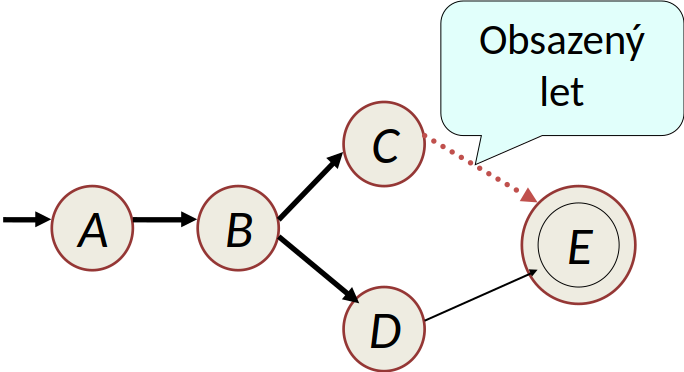

<!-- .slide: class="section" -->

<header>
	<h1>Modely procesů (transakcí)</h1>
	<p>Plochá transakce, body návratu, dvouúrovňová dekompozice</p>
</header>

---

# Plochá transakce (Flat transaction)
- Minimální model bez vnitřní struktury – obecný proces v programovacím jazyce
- Struktura:
	1. `begin_transaction()`
	2. tělo transakce (sekvence operací)
	3. `commit()` (úspěch) nebo `rollback()` / `abort()` (neúspěch / porucha)
- **Žádné** částečné zotavení ani body návratu

---

# Struktura ploché transakce

```
begin_transaction();

    ... blok programu ...
    if (chyba) abort();
    ...

commit();
```

- Lokální nedatabázové proměnné jsou součástí programu, ne DB kontextu

---

# Problém ploché transakce

 <!-- .element: style="height:500px;margin:0em auto;float:right" -->

- Příklad: rezervace letu A → B → C → E
	- transakce rezervuje A→B, poté B→C
	- zjistí, že C→E není volné
	- **nemůže provést částečný návrat** (jen na B) – musí zrušit celou transakci
	- přijde o práci (rezervaci A→B)
- Řešení: **body návratu (savepoints)**

---

# Body návratu (Savepoints)
- **Savepoint** = bod návratu pro *částečný rollback* v rámci jedné transakce
- Vytvoření: `sp := create_savepoint()`
- Částečný návrat: `rollback(sp)` – obnoví DB kontext, **lokální proměnné zachovány**
- Po rollback se **pokračuje** za příkazem návratu
- Zrušené milníky mezi cílem a místem návratu zanikají

---

# Příklad bodů návratu

```
begin_transaction();
    S1;
    sp1 := create_savepoint();
    S2;
    sp2 := create_savepoint();
    S3;
    if (podmínka) {
        rollback(sp2);   // vrátí S3, pokračuje dál
        S4;
    }
commit();
```

- Po `rollback(sp2)` milník `sp3` již neexistuje
- `abort` vs `rollback`: abort *zastaví* transakci, rollback *pokračuje*

---

# Příklad: rezervace s body návratu

 <!-- .element: style="height:500px;margin:0em auto;float:right" -->

- Na začátku a v každém větvení se vytvoří savepoint
- Při neúspěchu `rollback` na předchozí savepoint → zkouší jinou variantu
- Strategie **backtracking** (zásobník bodů návratu):
	- A→B (sp1), B→C (sp2), C→E obsazeno → rollback(sp2), B→D (sp3), D→E volné → commit

