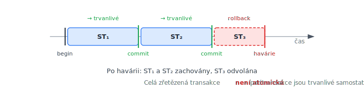

<!-- .slide: class="section" -->

<header>
	<h1>Zřetězené transakce</h1>
	<p>Chained transactions – dvouúrovňová dekompozice sekvencí</p>
</header>

---

# Motivace
- Většina aplikací = sekvence transakcí
	- Příklad objednávkového systému: přijetí objednávky → doprava → fakturace
- **Dlouho trvající transakce** snižují výkonnost
	- blokují záznamy, při havárii se ztratí veškerá provedená práce
- Řešení: **dekompozice** na menší podtransakce

---

# Slučování řízení a transakcí

```
přijetí objednávky → [bez podmínky] → doprava → [bez podmínky] → fakturace
```

- Sekvence stavů s přechody bez podmínek → jedna modelovaná struktura
- Dochází ke slučování vrstev dvouúrovňového modelu
	- **Vrstva řízení** (stavový diagram) nerozhoduje nic — jen sekvencuje kroky
	- **Vrstva stavů** (transakce) vykonává obsah každého kroku
- Pokud přechody nemají podmínky, obě vrstvy lze vyjádřit jednou strukturou: **zřetězenou transakcí**

---

# Zřetězená transakce

 <!-- .element: style="height:900px;margin:0 auto;display:block" -->

---

# Schéma zřetězené transakce

```
begin_transaction();
    S1;
commit();       // ST1 potvrzena, trvanlivá
    S2;
commit();       // ST2 potvrzena, trvanlivá
    ...
    Sn;
commit();       // STn potvrzena
```

- $S_i$ je tělo i-té transakce, kterou budeme dále označovat jako podtransakci $ST_i$.
- Každý `commit()` zajišťuje **trvanlivost předchozí podtransakce**
- Při havárii v $ST_i$ zůstanou $ST_1$, …, $ST_{i-1}$ zachovány

---

# Vlastnosti vs. ACID

| Vlastnost | Zřetězená transakce |
|-----------|-------------------|
| **Atomičnost** | ❌ pouze každá podtransakce zvlášť |
| **Konzistence** | ⚠️ vyžadována po každém commitu |
| **Izolovanost** | ❌ každá podtransakce izolovaná, celek nikoli |
| **Trvanlivost** | ✅ potvrzené podtransakce jsou trvanlivé |

---

# Databázový kontext mezi podtransakcemi
- Po commitu $ST_i$ se uvolní všechny zámky a kurzory
- Souběžné transakce mají přístup k dříve zamknutým záznamům
- $ST_{i+1}$ může pracovat s jinými hodnotami (změněnými souběžnou transakcí)
- **Každá podtransakce je izolovaná, ale celek není**
- Výhoda: kratší doba zamykání → vyšší propustnost

---

# Komunikace mezi podtransakcemi
- **Lokální proměnné** nepřežijí havárii (ztratí se)
- Alternativa: komunikace přes **databázové proměnné**
	- Před commitem $ST_i$ se uloží do DB → přežijí pád systému
	- Nevýhoda: viditelné ostatním souběžným transakcím → nutnost **zámků**

---

# Kompenzující transakce
- Po potvrzení několika podtransakcí nelze provést klasický rollback
	- Fyzické obnovení by porušilo trvanlivost jiných transakcí
- Řešení: **kompenzující transakce** – logická obnova efektu jiné transakce
- Příklad: registrace studenta do předmětu
	- Kompenzace = odregistrace (sníží počet studentů zpět)
	- Funguje správně i při souběžné registraci dalšího studenta

---

# Alternativní sémantika – chain()

```
begin_transaction();
    S1;
chain();        // potvrdí ST1, začne ST2, ale neuvolní kontext
    S2;
chain();        // potvrdí ST2, začne ST3, neuvolní kontext
    ...
    Sn;
commit();
```

- `chain()` **neuvolňuje databázový kontext** (zámky, kurzory)
- Souběžné transakce nevidí mezistavy
- Celek je **izolovaný** – na úkor výkonnosti

---

# Dopředný návrat (roll forward)
- Zotavení z havárie při alternativní sémantice:
	- Klasický rollback nelze – nekonzistentní stav po $ST_i$
	- Řešení: **dopředný návrat** (roll forward)
- Po restartu TPS se obnoví DB kontext a **dokončí se** nedokončené podtransakce
- Výsledek: zachována izolovanost i atomičnost celé zřetězené transakce
