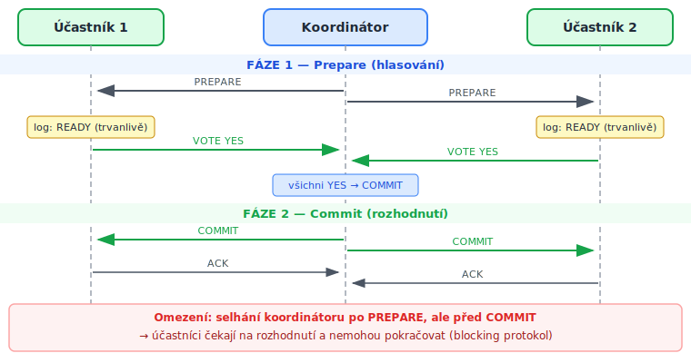
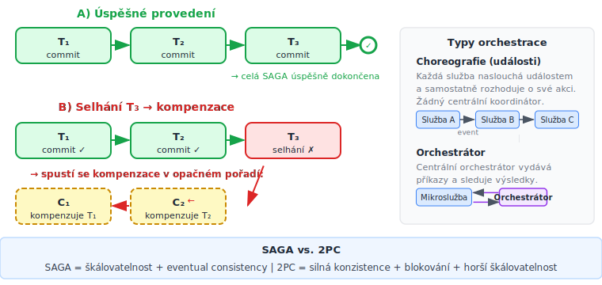

<!-- .slide: class="section" -->

<header>
	<h1>Distribuované transakce</h1>
	
Dvoufázový commit, SAGA pattern

</header>

---

# Problém distribuovaných transakcí
- Dosud uvažovaný model: **jeden TPS, jedna databáze**
- Distribuované systémy: více **nezávislých TPS** musí jednat atomicky
	- Příklad: převod peněz mezi dvěma bankami – každá má vlastní TPS
	- Příklad: objednávka v e-shopu spouští sklad, platbu i dopravu jako samostatné služby
- Scénář selhání:
	- Banka A odečte peníze (commit) → Banka B havaruje → peníze jsou v prázdnu
- Klasický rollback nefunguje přes hranice TPS — nutný **protokol pro distribuovaný commit**

---

# Dvoufázový commit (2PC)

 <!-- .element: style="height:600px;margin:0.3em auto;display:block" -->

- Před hlasováním každý účastní provede svoji část až po event. `commit()`

---

# Dvoufázový commit — vlastnosti
- **Zaručuje atomičnost** přes více nezávislých TPS
- Standard: **XA protokol** (Java JTA, většina enterprise databází)
- **Omezení — blocking protokol:**
	- Koordinátor havaruje *po* Prepare, *před* Commit
	- Účastníci uzamknou záznamy a nemohou pokračovat — čekají neomezeně
	- 3PC (three-phase commit) částečně řeší blokování, ale v praxi se nepoužívá
- **Problém škálovatelnosti:** drží distribuované zámky → nevhodné pro mikroslužby

---

# XA protokol
- Standard API koordinaci distribuované transakce (The Open Group)
- Každý **resource manager** (DB, message broker) musí implementovat tři operace:

| Operace | Fáze 2PC | Význam |
|---|---|---|
| `xa_prepare()` | Prepare | Připrav se, zapiš do logu, vrať YES/NO |
| `xa_commit()` | Commit | Potvrď transakci |
| `xa_rollback()` | Rollback | Odvolej transakci |

- **Koordinátor** (v Javě JTA) volá tyto operace na všech účastnících
- Databáze i JMS broker v jedné transakci → atomické „ulož do DB + vlož do fronty"

---

# SAGA pattern

 <!-- .element: style="height:750px;margin:0.3em auto;display:block" -->

---

# SAGA — vlastnosti a použití
- **SAGA** = sekvence lokálních transakcí T₁, T₂, …, Tₙ
	- Každá Tᵢ má svou **kompenzační transakci** Cᵢ (logická obnova efektu)
	- Selhání Tₖ spustí kompenzace Cₖ₋₁, …, C₁ v opačném pořadí
- Přímá vazba na **kompenzující transakce** (viz předchozí sekce)
	- SAGA je jejich formalizace pro distribuované systémy
- Standardní pattern pro distribuované business transakce v **mikroslužbách**
- Vlastnosti
	- Žádné distribuované zámky (škálovatelnost)
	- Pouze **eventual consistency**
		- Systém je dočasně nekonzistentní mezi Tᵢ a Tᵢ₊₁
	- Kompenzace musí být pečlivě navrženy (ne vždy jde o prostý rollback)
