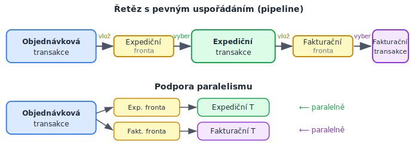

<!-- .slide: class="section" -->

<header>
	<h1>Zotavitelné fronty a reálné události</h1>
	
Recoverable queues, real-world events

</header>

---

# Motivace: zotavitelné fronty
- Aplikace nevyžaduje úzké semknutí akcí do jedné izolované transakce
- Stačí zaručit, že po dokončení jedné akce **bude někdy provedena další**
- Na rozdíl od zřetězených transakcí může být mezi akcemi **podstatná časová prodleva**
- Příklad: objednávka → expedice → fakturace
	- Fakturace a expedice mohou proběhnout kdykoli po úspěšné objednávce

---

# Zotavitelná fronta – definice
- **Zotavitelná fronta** = mechanismus pro plánování transakcí k budoucímu vykonání
- Základní operace:
	- **Vlož** – transakce vloží záznam o práci při svém commitu
	- **Vyber** – jiná transakce záznam vyzvedne a práci provede (obvykle spouští server)
- Záznam obsahuje popis akce a data potřebná pro předání (např. ID objednávky)

---

# Vlastnosti zotavitelné fronty
- Fronta **musí být trvanlivá** – přežít havárii systému
- Koordinace s transakcemi:
	- Vloží-li transakce do fronty záznam a později je zrušena (rollback), tak musí být tento záznam z fronty odstraněn.
	- Vybere-li transakce z fronty záznam a později je zrušena (rollback), tak musí být tento záznam do fronty navrácen.
	- Záznamy od nepotvrzené transakce nesmí vybírat jiné transakce.

---

# Organizace zotavitelné fronty

 <!-- .element: style="height:800px;margin-top:-1em;display:block" -->

---

# Paralelismus přes fronty
- Objednávková transakce vloží záznamy do **obou** front najednou
- Expediční a fakturační transakce mohou proběhnout **paralelně**
	- Zákazník může dostat fakturu dříve než zboží (obchodně v pořádku)
- Fronta odděluje producenta od konzumenta v čase i prostoru
	- Nemusí běžet současně
	- Komunikují pouze přes frontu (jinak o sobě vzájemně nevědí)

---

# Implementace trvanlivosti fronty
- Nejjednodušší: tabulka v databázi
	- Časté přístupy tvoří **výkonnostní slabinu** (bottleneck)
- Vhodné: **oddělený aplikační modul** (message broker)
	- RabbitMQ, Apache ActiveMQ, Apache Kafka, Amazon SQS, …

---

# Reálné události
- Některé akce transakce **nelze vrátit zpět**
	- Příklad: bankomat vydá hotovost → havárie → TPS vrátí DB, ale hotovost ne
- **Reálné (fyzické) události** (real-world events) nemají rollback
- Atomičnost musí být dosažena jinak → **dopředný návrat** + zotavitelná fronta

---

# Řešení s frontami: reálná událost
- Transakce *T* **vloží požadavek** na fyzickou akci do fronty *Q*
- Pokud *T* je zrušena → požadavek odstraněn z *Q*
- Pokud *T* je potvrzena → požadavek zůstane v *Q*, fyzická akce se **jistě provede**
- Havárie po commitu: fronta přežije, akce bude provedena po restartu

---

# Detekce stavu fyzické události
- Fyzické zařízení obsahuje **čítač** *C* inkrementovaný atomicky s provedením akce
- Transakce před commitem uloží aktuální hodnotu *C* do DB (*D*)
- Při zotavení z havárie: porovnání *C* a *D*:
	- *C* = *D* → fyzická akce nebyla provedena → provést znovu
	- *C* ≠ *D* → fyzická akce provedena před havárií → odebrat záznam z fronty

---

# Shrnutí: cesta k workflow
- Zotavitelné fronty umožňují **sekvence i paralelismus** transakcí
- Tvoří základ pro složitější **workflow systémy**
- Klíčové vlastnosti:
	- Trvanlivost plánovaných akcí
	- Oddělení producenta a konzumenta v čase
	- Podpora paralelního zpracování nezávislých větví
