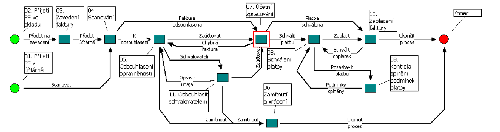

<!-- .slide: class="section" -->

<header>
	<h1>Podnikové procesy a workflow</h1>
	
Vývoj architektur IS, business procesy, příklady

</header>

---

# Vývoj architektur IS

| Dekáda | Vývoj |
|--------|-------|
| **60. léta** | Řada samostatných aplikací – vlastní data, UI i komunikace |
| **70. léta** | Osamostatnění dat – databázové systémy |
| **80. léta** | Osamostatnění UI – Windows API, X Window, … |
| **90. léta** | Osamostatnění řídicích procesů – **workflow systémy** |

---

# Podnikové (business) procesy
- Koordinační mechanismus napříč organizačními jednotkami
- Distribuovaný v čase a prostoru
- Integruje a koordinuje distribuované zdroje
- Poskytuje správnou informaci správnému člověku ve správný čas

**CO – JAK – KDY – KDO**

- Z hlediska technologie jde o:
	- Popis procesů *mimo* vlastní implementaci IS
	- Infrastrukturu schopnou zajistit vykonání popsaných procesů
	- Doplňkové funkce: monitorování, analýza, …

---

# Příchozí faktura

<!-- .slide: class="normal centered fullspace" -->
 <!-- .element: style="height:600px" -->

---

# Příklady procesů
- Vyřízení reklamace
	- obdržení požadavku, rozhodnutí o oprávněnosti, odpověď, …
- Vyřízení žádosti o půjčku
	- žádost, analýza rizik, schválení, sledování splátek, uzavření, …
- Zápis studentů do dalšího ročníku
	- předběžný zápis, kontrola studia, zápis, změny, …
- Výběrové řízení na zakázky
	- zadání, vyhodnocení nabídek, výběr dodavatele, realizace, …

---

# Workflow
- **Procedurální automatizace** business procesu
- Správa sekvence pracovních aktivit a vyvolání příslušných zdrojů
- Rozdíl mezi *business procesem* a *workflow*:
	- **Business proces** – obecnější pohled, organizační perspektiva
	- **Workflow** – konkrétní popis realizace procesu, technická implementace

---

# Od front k workflow

- Zavedli jsme **zotavitelné fronty** jako základ pro sekvenování a paralelismus transakcí
	- Fronta zaručuje: *„po dokončení akce A se někdy provede akce B"*
- **Workflow** přidává nad tento základ:
	- **Jazyk pro popis procesů** – formální definice aktivit, podmínek, větvení
	- **Role a swimlanes** – přiřazení aktivit konkrétním účastníkům
	- **Směrování** – XOR/AND/OR brány místo ručně programované logiky
	- **Monitorování a analýza** – sledování stavu instancí, výkonnostní metriky
- Popis procesu je **oddělen od implementace IS**.
