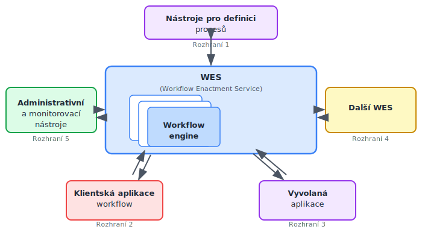

<!-- .slide: class="section" -->

<header>
	<h1>Standardy a architektura workflow</h1>
	
WfMC, referenční model, prvky WF systému

</header>

---

# Standardizace – WfMC
- Velké množství SW nástrojů realizujících workflow → nutnost integrace
- **Workflow Management Coalition (WfMC)** – nevýdělečná mezinárodní organizace (1993)
- Oblasti standardizace:
	- Terminologie a referenční model
	- Spolupráce a propojení WF systémů
	- Formáty výměny definic procesů (XPDL → BPMN 2.0 XML)

---

# Referenční model WfMC

 <!-- .element: style="height:600px;margin:0.5em auto;display:block" -->

---

# WES a Workflow engine
- **WES** (Workflow Enactment Service)
	- Zajišťuje vykonání správné činnosti pomocí správného prostředku ve správný čas
	- Složen z jednoho nebo více *workflow engines*
- **Workflow engine**
	- Interpretace definice procesu
	- Vytváří instance procesů a řídí jejich vykonávání
	- Zajišťuje přechody mezi aktivitami a vytváří pracovní položky
	- Administrace a dohled

---

# Prvky WF systému

- **Klientské aplikace workflow** – provádějí jednotlivé úkoly, interakce uživatelů
- **Vyvolané aplikace** – spouštěné automaticky při zahájení úkolu
- **Nástroje pro definici procesů** – grafické editory (BPMN); prvky: zprávy, události, rozhodnutí
- **Nástroje pro analýzu a verifikaci**
	- Simulace: „co se stane, když…?" – ověření modelu, predikce
	- Verifikace: bude každá objednávka vyřízena? – matematické metody (**Petriho sítě**)
- **Administrace a monitorování** – sledování stavu instancí, SLA, výkonnost

---

# 3D pohled na workflow – dimenze

- **Případ (case)** – konkrétní řešený problém (žádost o půjčku)
	- Obvykle jej generuje externí zákazník
	- Zpracovává se prováděním úloh v určitém pořadí
- **Úloha (task)** – krok provádění procesu
	- Charakterizována podmínkami před (*precondition*) a po (*postcondition*)
- **Zdroj (resource)** – zařízení nebo osoba
	- **Role** – třída zdrojů dle schopností (např. programátoři)
	- **Organizační jednotka** – třída dle struktury (např. reklamační oddělení)
- **Pracovní položka (work item)** – úkol pro konkrétní případ
- **Činnost (activity)** – úkol + konkrétní zdroj → fronta (*worklist*)

---

# Role v workflow
- Práci vykonávají **kategorie pracovníků** (role)
- Jedna osoba může mít více rolí, mnoho osob má stejnou roli
- Role jsou autorizovány provádět požadavky z front spojených s činnostmi
- Přidělování požadavků: **staticky** nebo **dynamicky** (load balancing)

---

# Data ve workflow

| Typ dat | Popis |
|---------|-------|
| **Řídicí data** | Interní data WF systému, nedostupná externě |
| **Věcná data** | Používána pro rozhodování; dostupná i aplikacím |
| **Aplikační data** | Specifická pro aplikace; nepřístupná WF systému |

- **Model organizační struktury** – role, vztahy nadřízený–podřízený
- **Definice procesu** – činnosti, přidělení rolím, rozhodovací pravidla
- **Seznam úkolů** – aktuální úkoly pro konkrétní uživatele
	- Skrytý (postupné přidělování) nebo přístupný (uživatel si volí pořadí)

---

# Životní cyklus workflow

1. **Definice procesu** – modelování v grafickém editoru (BPMN)
2. **Nasazení** – deployment definice do WF enginu
3. **Spuštění instancí** – vytváření a řízení běžících případů
4. **Monitorování** – sledování stavu, SLA, využití zdrojů
5. **Analýza a optimalizace** – identifikace úzkých míst, úprava modelu
