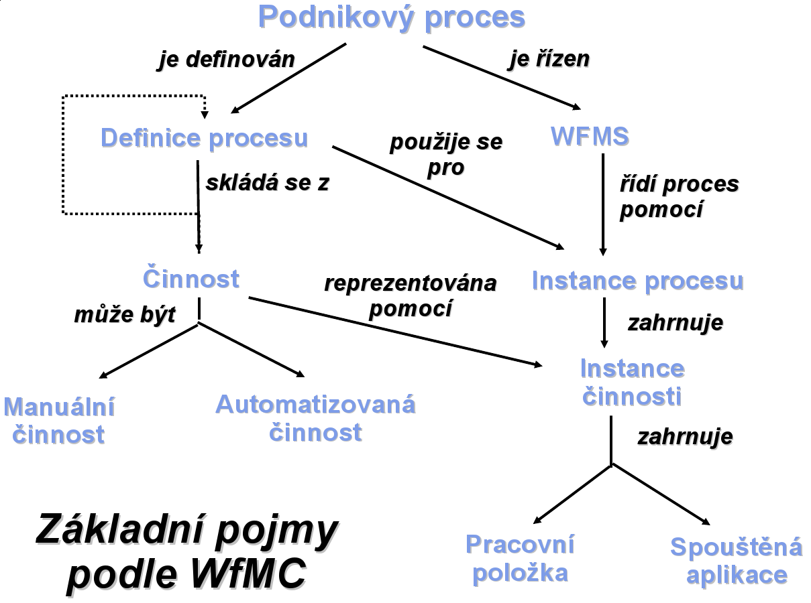
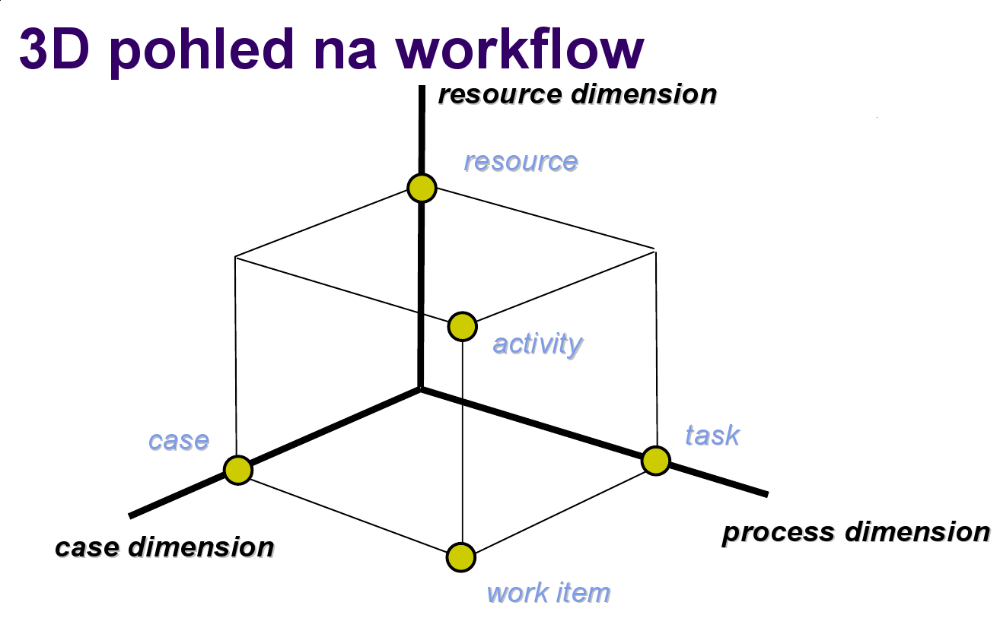
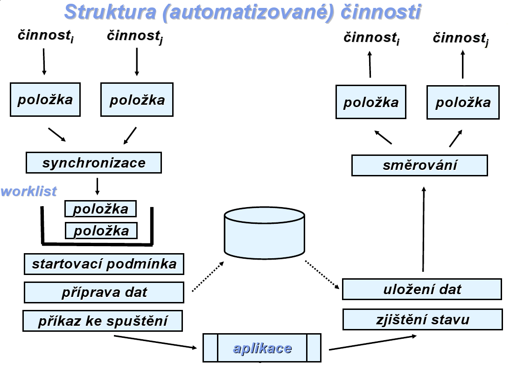
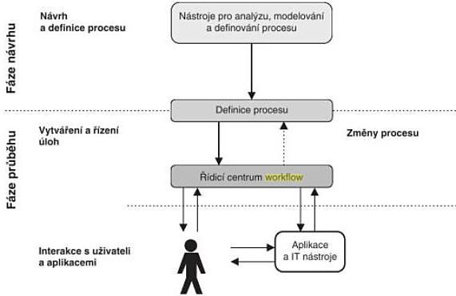

<!-- .slide: class="section" -->

<header>
	<h1>Standardy a architektura workflow</h1>
	
WfMC, referenční model, prvky WF systému

</header>

---

# Standardizace
- Velké množství SW nástrojů realizujících workflow → nutnost integrace
- **Workflow Management Coalition (WfMC)**
	- Založena 1993, nevýdělečná mezinárodní organizace
	- Prodejci, uživatelé, analytici, univerzity (cca 130 členů)
- Oblasti standardizace:
	- Terminologie
	- Spolupráce a propojení WF systémů
	- Formáty výměny definic procesů

---

# Referenční model WfMC

 <!-- .element: style="height:600px;margin:0.5em auto;display:block" -->

---

# Základní pojmy WfMC

<!-- .slide: class="normal centered fullspace" -->
 <!-- .element: style="height:650px" -->

---

# WES a Workflow engine
- **WES** (Workflow Enactment Service)
	- Zajišťuje vykonání správné činnosti pomocí správného prostředku ve správný čas
	- Složen z jednoho nebo více *workflow engines*
- **Workflow engine**
	- Interpretace definice procesu
	- Vytváří instance procesů a řídí jejich vykonávání
	- Zajišťuje přechody mezi aktivitami a vytváří pracovní položky
	- Administrace a dohled

---

# Prvky WF systému – klientské aplikace
- **Klientské aplikace workflow**
	- Provádějí jednotlivé úkoly
	- Interakce uživatelů s workflow
- **Vyvolané aplikace**
	- Spouštěné v souvislosti se započetím úkolu

---

# Nástroje pro definici procesů
- Umožňují definici a rozplánování procesů na počítači
- Obvykle grafické nástroje
- Prvky modelu:
	- **Zprávy** zaslané účastníkům procesu
	- **Události**, které mohou nastat
	- **Rozhodnutí**, která je třeba učinit

---

# Nástroje pro analýzu a verifikaci
- **Simulace procesů**
	- „Co se stane, když …?" – ověření modelu, predikce
- **Verifikace procesů**
	- Bude každá objednávka vyřízena?
	- Bude každá reklamace vyřízena do 14 dnů?
	- Matematické metody – **Petriho sítě**
- **Nástroje pro administraci** a monitorování

---

# 3D pohled na workflow

<!-- .slide: class="normal centered fullspace" -->
 <!-- .element: style="height:550px" -->

---

# 3D pohled na workflow – dimenze

- **Případ (case)** – konkrétní řešený problém (žádost o půjčku)
	- Obvykle jej generuje externí zákazník
	- Zpracovává se prováděním úloh v určitém pořadí
- **Úloha (task)** – krok provádění procesu
	- Charakterizována podmínkami před (*precondition*) a po (*postcondition*)
- **Zdroj (resource)** – zařízení nebo osoba
	- **Role** – třída zdrojů dle schopností (např. programátoři)
	- **Organizační jednotka** – třída dle struktury (např. reklamační oddělení)
- **Pracovní položka (work item)** – úkol pro konkrétní případ
- **Činnost (activity)** – úkol + konkrétní zdroj → fronta (*worklist*)

---

# Role v workflow
- Práci vykonávají **kategorie pracovníků** (role)
- Jedna osoba může mít více rolí, mnoho osob má stejnou roli
- Role jsou autorizovány provádět požadavky z front spojených s činnostmi
- Přidělování požadavků: **staticky** nebo **dynamicky** (load balancing)

---

# Struktura automatizované činnosti

<!-- .slide: class="normal centered fullspace" -->
 <!-- .element: style="height:620px" -->

---

# Data ve workflow

| Typ dat | Popis |
|---------|-------|
| **Řídicí data** | Interní data WF systému, nedostupná externě |
| **Věcná data** | Používána pro rozhodování; dostupná i aplikacím |
| **Aplikační data** | Specifická pro aplikace; nepřístupná WF systému |

- **Model organizační struktury** – role, vztahy nadřízený–podřízený
- **Definice procesu** – činnosti, přidělení rolím, rozhodovací pravidla
- **Seznam úkolů** – aktuální úkoly pro konkrétní uživatele
	- Skrytý (postupné přidělování) nebo přístupný (uživatel si volí pořadí)

---

# Fáze vývoje workflow

<!-- .slide: class="normal centered fullspace" -->
 <!-- .element: style="height:620px" -->
