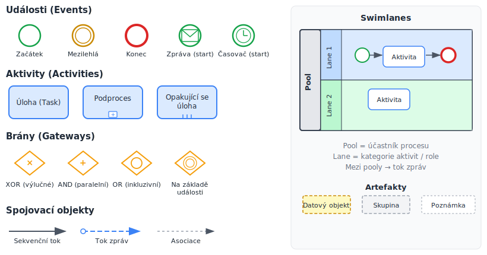
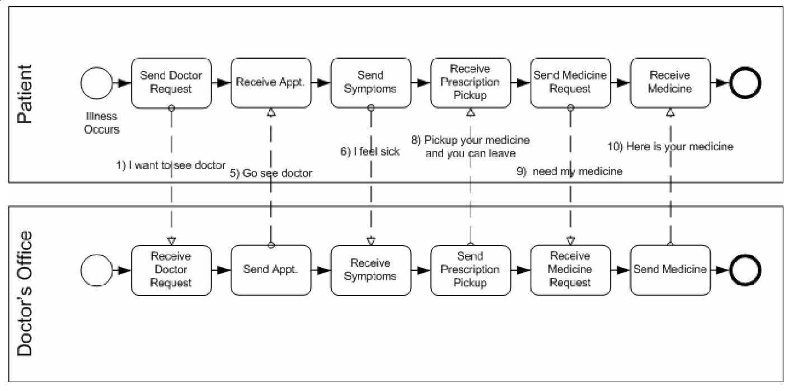
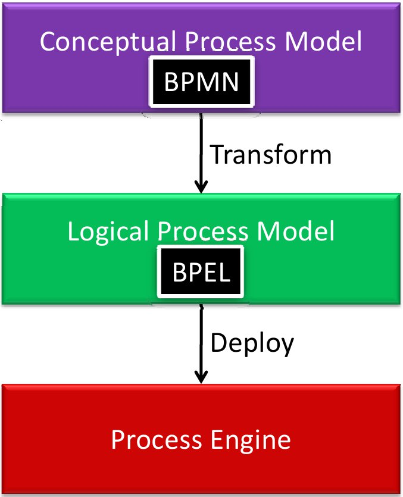

<!-- .slide: class="section" -->

<header>
	<h1>Modelování business procesů</h1>
	
BPMN – Business Process Model and Notation

</header>

---

# Cíle BPM
- **Formální popis** procesů probíhajících v organizaci
- **Řízení** popsaného procesu pomocí WFM systému
- **Analýza a verifikace** – zvýšení efektivity

---

# Standardy pro modelování
- **BPMN** (Business Process Model and Notation)
	- Grafická notace pro specifikaci procesů
	- Diagramy BPD (Business Process Diagram)
- Jazyky pro popis procesu:
	- **BPEL** (BPEL4WS, WS-BPEL) – procedurální, orientovaný na webové služby
	- **XPDL** – deskriptivní, původní formát WfMC
	- **BPMN XML** – serializace od BPMN 2.0
- Definovaná mapování:
	- Ukládání BPMN grafů v XPDL
	- Transformace BPMN → BPEL

---

# Elementy BPMN

 <!-- .element: style="height:650px;margin:0.3em auto;display:block" -->

---

# Objekty toku (Flow objects)

- **Událost (Event)**
	- Ovlivňuje tok procesu – začátek nebo konec procesu, zpráva, časovač, …
- **Aktivita (Activity)**
	- Práce, která se má vykonat – atomická úloha nebo podproces
- **Brána (Gateway)**
	- Řídí větvení a slučování toku – XOR, AND, OR

---

# Spojovací objekty

- **Sekvenční tok** – pořadí navazujících aktivit (plná šipka)
- **Tok zpráv** – zpráva mezi dvěma účastníky procesu (přerušovaná šipka s kroužkem)
- **Asociace** – propojuje objekt s dodatečnou informací

---

# Plavecké dráhy (Swimlanes)
- **Pool**
	- Reprezentuje účastníka v procesu (organizaci, systém)
	- Mezi pooly se komunikuje tokem zpráv
- **Swimlane**
	- Kategorizuje aktivity v rámci poolu – obvykle odpovídá roli nebo oddělení

---

# Příklad: Pool s swimlanes (pacient a lékař)

<!-- .slide: class="normal centered fullspace" -->
 <!-- .element: style="height:620px" -->

---

# Vrstvy modelování procesů

<!-- .slide: class="normal centered fullspace" -->
 <!-- .element: style="height:620px" -->
