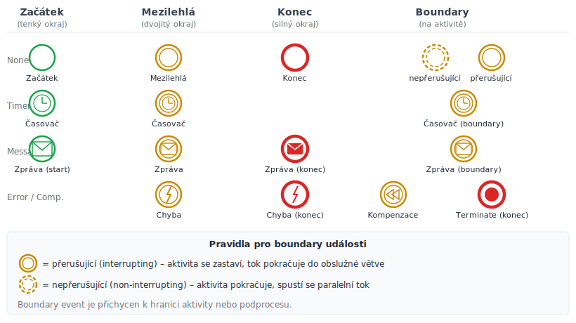
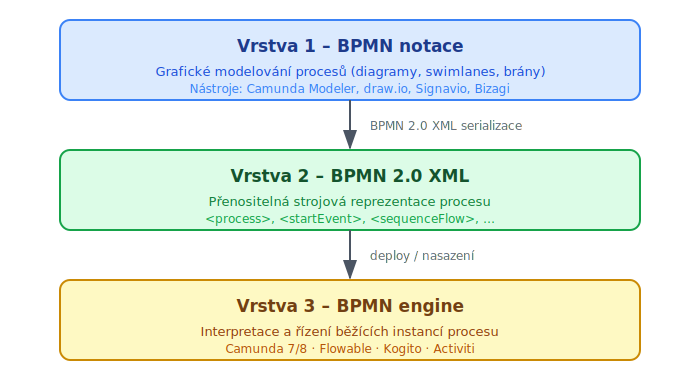

<!-- .slide: class="section" -->

<header>
	<h1>Modelování business procesů</h1>
	<p>BPMN – Business Process Model and Notation</p>
</header>

---

# Cíle BPM
- **Formální popis** procesů probíhajících v organizaci
- **Řízení** popsaného procesu pomocí WFM systému
- **Analýza a verifikace** – zvýšení efektivity

---

# Standardy pro modelování
- **BPMN 2.0** (Business Process Model and Notation) – aktuální primární standard
	- Grafická notace + nativní XML serializace (BPMN XML)
	- Přímo spustitelné BPMN 2.0 enginy (Camunda, Flowable, …)
- Historické formáty (dnes legacy):
	- **XPDL** – původní deskriptivní formát WfMC, nahrazen BPMN XML
	- **BPEL** (WS-BPEL) – procedurální jazyk orientovaný na webové služby; nahrazen BPMN 2.0 enginy

---

# Elementy BPMN

 <!-- .element: style="height:650px;margin:0.3em auto;display:block" -->

---

# Objekty toku (Flow objects)

- **Událost (Event)**
	- Ovlivňuje tok procesu – začátek nebo konec procesu, zpráva, časovač, …
- **Aktivita (Activity)**
	- Práce, která se má vykonat – atomická úloha nebo podproces
- **Brána (Gateway)**
	- Řídí větvení a slučování toku – XOR, AND, OR

---

# BPMN 2.0 – typy událostí

 <!-- .element: style="height:600px;margin:0.3em auto;display:block" -->

---

# BPMN 2.0 – typy událostí (popis)

| Typ | Symbol | Podtypy |
|-----|--------|---------|
| **Start** | tenký okraj | None, Timer, Message, Signal |
| **Intermediate** | dvojitý okraj | Timer, Message, Error, Escalation |
| **End** | silný okraj | None, Message, Error, Terminate |
| **Boundary** | přichycená k aktivitě | Timer, Error, Message (přerušující / nepřerušující) |

- **Přerušující** boundary event – zastaví aktivitu a přejde jinam
- **Nepřerušující** – aktivita pokračuje, spustí se paralelní tok

---

# Kompenzace v BPMN

- BPMN 2.0 má vestavěnou podporu pro **kompenzaci** (compensation)
- **Kompenzační úloha** – aktivita, která logicky „vrátí" efekt jiné aktivity
	- Analogie s SAGA kompenzujícími transakcemi z p07_procesy
- **Compensation event** – spouští kompenzační tok při chybě nebo explicitním požadavku
- Příklad: objednávka zaplacena → shipment selhal → kompenzace = vrácení platby

```
[Platba] --kompenzace--> [Vrácení platby]
[Odesílání] --chyba--> Compensation End → spustí kompenzace
```

---

# Spojovací objekty

- **Sekvenční tok** – pořadí navazujících aktivit (plná šipka)
- **Tok zpráv** – zpráva mezi dvěma účastníky procesu (přerušovaná šipka s kroužkem)
- **Asociace** – propojuje objekt s dodatečnou informací

---

# Plavecké dráhy (Swimlanes)
- **Pool**
	- Reprezentuje účastníka v procesu (organizaci, systém)
	- Mezi pooly se komunikuje tokem zpráv
- **Swimlane**
	- Kategorizuje aktivity v rámci poolu – obvykle odpovídá roli nebo oddělení

---

# Příklad: Pool s swimlanes (pacient a lékař)

<!-- .slide: class="normal centered fullspace" -->
 <!-- .element: style="height:620px" -->

---

# Vrstvy modelování procesů

 <!-- .element: style="height:580px;margin:0.3em auto;display:block" -->
