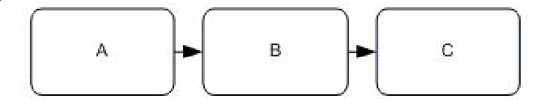
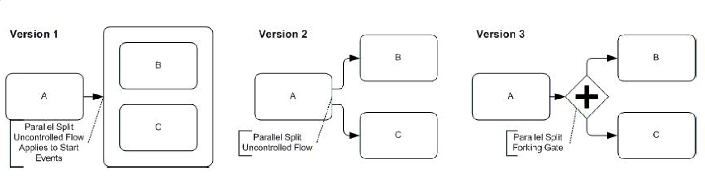
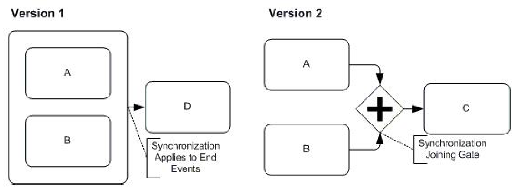
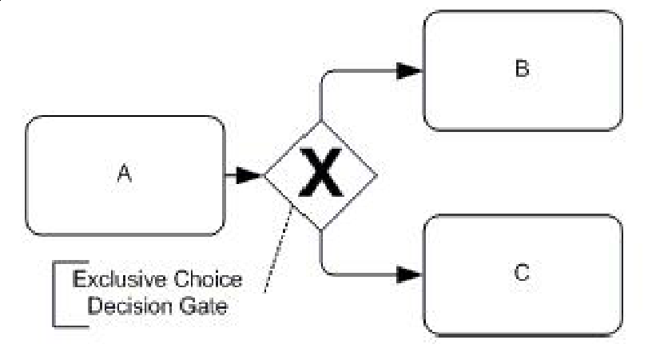
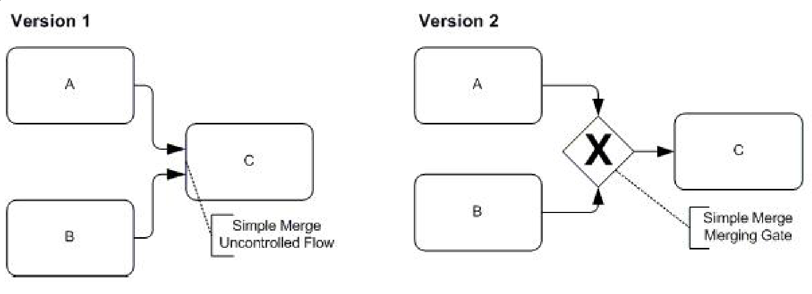
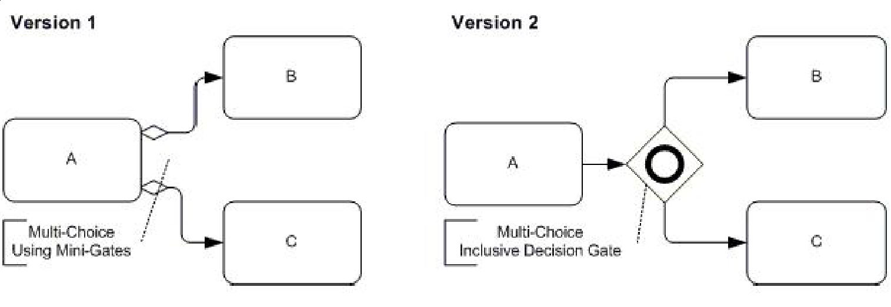
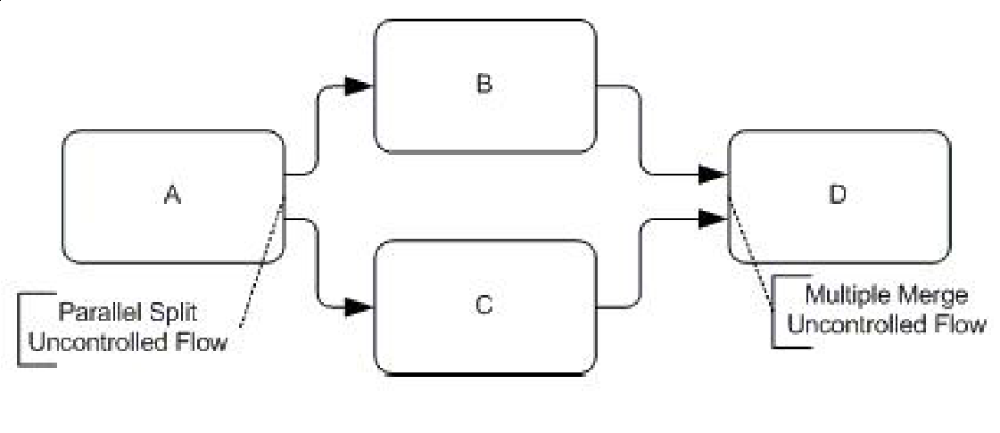

<!-- .slide: class="section" -->

<header>
	<h1>Workflow patterns</h1>
	
Řízení toku, směrování, flexibilita

</header>

---

# Směrování – řízení toku
- **Split** – rozdělení toku na více větví
- **Join / Merge** – sloučení více větví do jedné
- Typy bran (gateway):
	- **XOR** – vzájemné vyloučení (právě jedna větev)
	- **AND** – paralelní zpracování (všechny větve)
	- **OR** – inkluzivní volba (jedna nebo více větví)

---

# 1. Sekvence
- Pracovní úkol je povolen, až je dokončeno provedení předcházejícího úkolu
- Nejzákladnější vzor – základ všech procesů

 <!-- .element: style="height:200px;margin:3em auto;display:block" -->

---

# 2. Parallel Split (AND-split)
- Rozděluje tok procesů do **dvou a více paralelních** vláken
- Všechny větve jsou spuštěny současně

 <!-- .element: style="height:500px;margin:1em auto;display:block" -->

---

# 3. Synchronizace (AND-join)
- Navazující úkol začne, až jsou **dokončena všechna** předchozí vlákna
- Párový vzor k AND-split

 <!-- .element: style="height:500px;margin:1em auto;display:block" -->

---

# 4. Výlučné rozhodnutí (XOR-split)
- Rozděluje tok na větve **vzájemně výlučné**
- Na základě podmínky (v bráně) se vstupuje do **právě jedné** z větví

 <!-- .element: style="height:500px;margin:1em auto;display:block" -->

---

# 5. Jednoduché spojení (XOR-merge)
- Spojení dvou nebo více **nezávislých** větví do jedné
- Navazující aktivita začne okamžitě, jakmile **jedno** vlákno dosáhne konce
- Nemusí čekat na ostatní větve

 <!-- .element: style="height:500px;margin:1em auto;display:block" -->

---

# 6. Vícenásobná volba (OR-split)
- Rozdělení toku do **jedné nebo více** větví
- Výběr na základě podmínek (neexkluzivní)

 <!-- .element: style="height:500px;margin:1em auto;display:block" -->

---

# 7. Synchronizující sloučení (OR-join)
- Čeká na ukončení **všech větví, které byly spuštěny** (ne nutně všech možných)
- Párový vzor k OR-split – „skončí vše, co začalo"

 <!-- .element: style="height:500px;margin:1em auto;display:block" -->

---

# Pravidla pro přechod mezi činnostmi
- **Lhůta (deadline)** – časový limit pro provedení
- **Vstupní podmínka (pre-condition)**
	- Musí být splněna pro spuštění činnosti
	- Vyhodnocována WF systémem
- **Výstupní podmínka (post-condition)**
	- Musí být splněna pro ukončení; do té doby se činnost opakuje
- **Přechodová podmínka**
	- Umožňuje určit pořadí zpracování, např. pro mimořádné situace

---

# Flexibilita workflow
- Podmínky pro chod organizace se mění
	- Změna legislativy, restrukturalizace, …
- Zajištění flexibility:
	- **Dopředné** – uvažujeme všechny možné situace předem
	- **Zpětné** – **změna workflow za běhu** (dynamická evoluce)

---

# Dynamická změna workflow
- Pomocí **evolution patterns** – základní typy změn
	- Vždy definováno, zda lze změnu provést a jak
- Převod existujících instancí:
	- *Concurrent to completion* – stávající instance doběhnou původním způsobem
	- *Migrace na finální schéma* – jen za určitých podmínek
	- *Migrace na ad-hoc schéma*
- **Verifikace výsledku** – bude WF stále dělat to, co má?
	- Analýza cest, dosažitelnost stavů
	- **Petriho sítě**

---

# Concurrent to completion
- Existující instance pokračují podle **původního schématu** až do svého přirozeného konce
- Nové instance se spouštějí podle **nového schématu**
- Nejjednodušší a nejbezpečnější přístup
- Nevýhoda: po dobu přechodu existují v systému instance **různých verzí**
	- Komplikuje monitoring a reporting

---

# Migrace na finální schéma
- Existující instance jsou **převedeny přímo na nové schéma**
- Podmínky proveditelnosti migrace:
	- Instance musí být v **kompatibilním stavu** – nesmí být uprostřed aktivity, která zanikla nebo se zásadně změnila
	- Stav instance musí být jednoznačně namapovatelný na stav v novém schématu
- Zachovává konzistenci – všechny instance běží podle **jedné verze** schématu

---

# Migrace na ad-hoc schéma
- Existující instance jsou převedeny na **dočasné přechodové schéma**
	- „Most" mezi starým a novým schématem
- Použití: přímá migrace na finální schéma není možná (nekompatibilní stavy)
- Ad-hoc schéma definuje, jak instance „uprostřed" starého procesu dojde do stavu kompatibilního s novým schématem
- Nejflexibilnější, ale nejsložitější na **implementaci a verifikaci**
