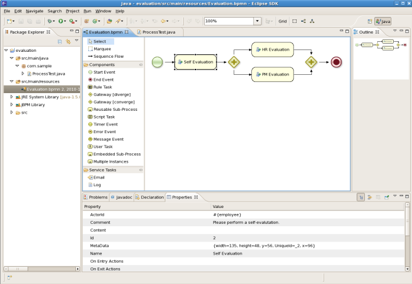
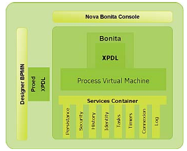
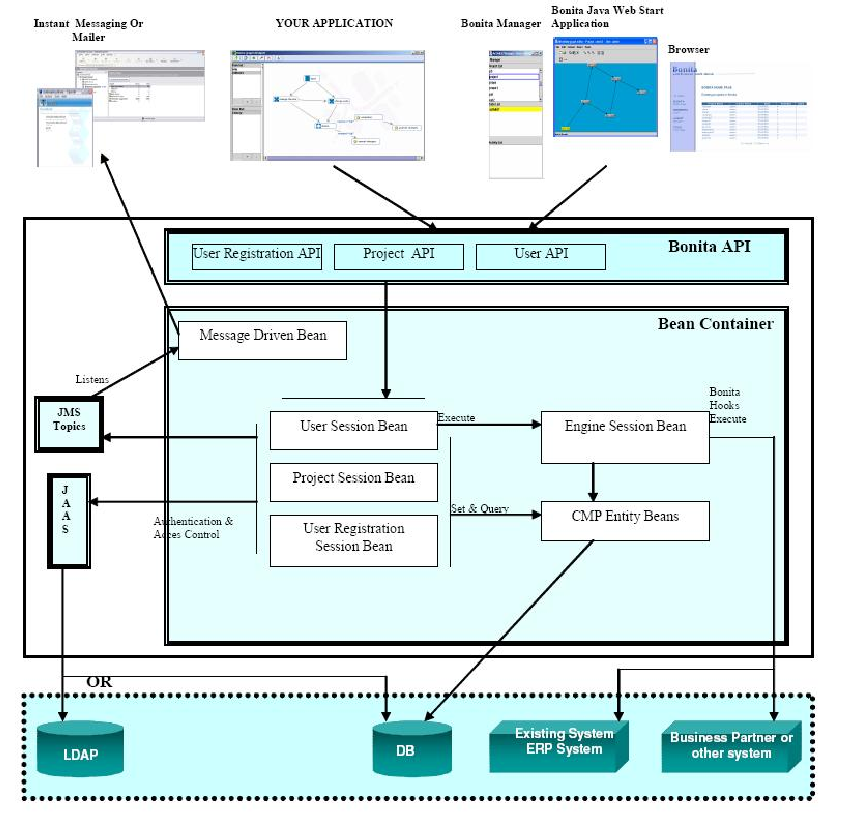

<!-- .slide: class="section" -->

<header>
	<h1>Technologie a nástroje</h1>
	<p>XPDL, BPEL, jBPM, open-source nástroje</p>
</header>

---

# Jazyk XPDL
- **XML Process Description Language**
- Jazyk popisující BPMN graf – aplikace XML
- Hlavní prvky dokumentu:
	- `Package`, `Application`
	- `WorkflowProcess`
	- `Activity`, `Transition`
	- `Participant`, `DataField`, `DataType`

---

# XML serializace BPMN 2.0

```xml
<process processType="Private" isExecutable="true"
         id="com.sample.HelloWorld" name="Hello World">

  <!-- nodes -->
  <startEvent id="_1" name="StartProcess"/>
  <scriptTask id="_2" name="Hello">
    <script>System.out.println("Hello World");</script>
  </scriptTask>
  <endEvent id="_3" name="EndProcess">
    <terminateEventDefinition/>
  </endEvent>

  <!-- connections -->
  <sequenceFlow id="_1-_2" sourceRef="_1" targetRef="_2"/>
  <sequenceFlow id="_2-_3" sourceRef="_2" targetRef="_3"/>

</process>
```

---

# Jazyk BPEL
- **Business Process Execution Language** – de-facto průmyslový standard
- Procedurální jazyk, formát XML
- Předpokládá implementaci úkolů pomocí **webových služeb**
	- Orchestrace volání webových služeb
- BPMN 2.0 obsahuje podmnožinu ekvivalentní BPEL
	- Lze použít BPMN 2.0 engine místo BPEL engine

---

# Webové služby a BPEL
- Standard komunikace v distribuované aplikaci
	- Vzdálené volání funkcí, výměna dokumentů
- Standardní jazyky:
	- **WSDL** – popis rozhraní služby
	- **SOAP** – výměna zpráv (obvykle přes HTTP)
- BPEL orchestruje volání webových služeb do business procesu

---

# BPEL & BPMN enginy
- Apache ODE
- MS BizTalk Server
- Oracle BPEL Process Manager
- IBM WebSphere Process Server
- **jBoss jBPM**
- …

---

# jBoss jBPM
- Framework implementující workflow, BPM a orchestraci procesů
- Běží na jBoss nebo jiném JEE serveru
- Snadná integrace s Java EE:
	- Web Services, Java Messaging (JMS), JDBC, EJB
- Zajišťuje správu stavů a úloh
- Měří časy provádění kroků, logování
- Unifikuje správu workflow procesů

---

# jBPM – grafický editor

<!-- .slide: class="normal centered fullspace" -->
 <!-- .element: style="height:600px" -->

---

# Jazyky v jBPM
- **Grafický editor BPMN** v Eclipse
- **BPMN 2.0 serializace**
	- Workflow management
	- Správa úkolů prováděných lidmi
- ~~BPEL~~
	- Opuštěno v novějších verzích jBPM
	- Nahrazeno BPMN 2.0

---

# AgilPro
- Open source nástroje pro modelování procesů
- **AgilPro LiMo** – grafický editor procesů
- **AgilPro Simulator** – simulátor procesů
- Platformy: Eclipse + JWT (Java Workflow Tooling)
	- Vlastní formát JWT
	- Export/import: XPDL, BPMN, …

---

# Bonita BPM

<!-- .slide: class="normal centered fullspace" -->
 <!-- .element: style="height:620px" -->

---

# Bonita BPM
- Open source projekt
	- Java EE a XPDL
	- API pro vytváření i provoz workflow
- Workflow prováděný vlastním virtuálním strojem

<!-- .slide: class="normal centered fullspace" -->
 <!-- .element: style="height:480px" -->

---

# Literatura
- M. Beneš: *Úvod do technologie workflow systémů* (slidy)
- T. Novotný: *Workflow – BPM Systémy*
- P. Opletal: *Procesy a workflow* (slidy)
- V. Mates, T. Hruška: *Workflow*, studijní opora
- [workflowpatterns.com](http://www.workflowpatterns.com/) – katalog workflow patterns (van der Aalst et al.)
