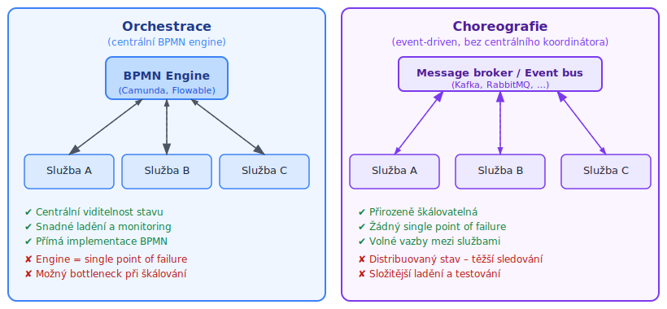

<!-- .slide: class="section" -->

<header>
	<h1>Technologie a nástroje</h1>
	<p>BPMN 2.0 enginy, moderní přístupy, process mining</p>
</header>

---

# BPMN 2.0 – strojová reprezentace

```xml
<process processType="Private" isExecutable="true"
         id="com.sample.HelloWorld" name="Hello World">

  <!-- nodes -->
  <startEvent id="_1" name="StartProcess"/>
  <scriptTask id="_2" name="Hello">
    <script>System.out.println("Hello World");</script>
  </scriptTask>
  <endEvent id="_3" name="EndProcess">
    <terminateEventDefinition/>
  </endEvent>

  <!-- connections -->
  <sequenceFlow id="_1-_2" sourceRef="_1" targetRef="_2"/>
  <sequenceFlow id="_2-_3" sourceRef="_2" targetRef="_3"/>

</process>
```

---

# Moderní BPMN enginy

| Engine | Typ | Poznámka |
|--------|-----|----------|
| **Camunda 7** | open-source, Java | Nejrozšířenější BPMN engine; REST API, embedded i standalone |
| **Camunda 8 / Zeebe** | cloud-native | Distribuovaný engine; SaaS i self-hosted; škálovatelný |
| **Flowable** | open-source, Java | Odvozen z Activiti; lehčí, Spring Boot integrace |
| **Activiti** | open-source, Java | Základ ekosystému; spravován Alfresco |
| **Kogito** (Red Hat) | cloud-native | Nástupce jBPM; Quarkus/Kubernetes; BPMN + DMN |
| **Bonitasoft** | open-source low-code | Grafické studio, citizen developer přístup |
<!-- .element: style="font-size: 80%" -->

---

# Orchestrace vs. choreografie

 <!-- .element: style="height:700px;margin:0.3em auto;display:block" -->

---

# Orchestrace vs. choreografie – srovnání

| | Orchestrace | Choreografie |
|-|-------------|--------------|
| **Koordinátor** | Centrální BPMN engine | Žádný; každá služba reaguje na události |
| **Viditelnost procesu** | Engine zná celý stav | Distribuovaný stav, těžší sledování |
| **SAGA implementace** | Engine orchestruje T₁…Tₙ a kompenzace | Každá služba naslouchá a vydává události |
| **Škálovatelnost** | Engine = možný bottleneck | Přirozeně škálovatelná |
| **Ladění** | Snadné (centrální log) | Složitější (distribuované sledování) |
| **Příklad** | Camunda + REST volání | Apache Kafka + event-driven služby |
<!-- .element: style="font-size: 80%" -->

---

# Moderní distribuované workflow

- **Temporal** (temporal.io) – workflow jako kód (Java, Python, Go, TypeScript)
	- Centrální engine (v Go)
	- Proces popsaný kódem (Python, Java, ...)
	- Automatický retry, timeouty, zotavení bez ztráty stavu
	- Vhodné pro: orchestraci mikroslužeb, dlouhotrvající procesy
- **Cloudové managed služby:**
	- **AWS Step Functions** – vizuální stavový stroj, serverless, integrace Lambda/SQS
	- **Azure Logic Apps** – low-code, rozsáhlý konektor ekosystém
	- **Google Cloud Workflows** – YAML/JSON definice, integrace GCP služeb
	- Společné: serverless model, platba za přechody; nevýhoda: vendor lock-in

---

# Process mining

- **Process mining** – automatické *objevování procesů* z event logů
	- Event log = záznamy z IS nebo workflow enginu: \
	`[caseID, aktivita, čas]`
- Klíčové úlohy:
	- **Discovery** – rekonstrukce modelu procesu z logů
	- **Conformance checking** – porovnání skutečného průběhu s BPMN
	- **Enhancement** – doplnění modelu o výkonnostní metriky
- Nástroje:
	- **ProM** – akademická platforma (TU/e, van der Aalst)
	- **Celonis** – komerční
	- **Disco** / **Bupar** (Python) – lehčí nástroje

---

# Literatura
- W.M.P. van der Aalst: *Process Mining: Data Science in Action* (2. vyd., Springer, 2016)
- Camunda: [docs.camunda.org](https://docs.camunda.org) – referenční BPMN engine dokumentace
- Temporal: [docs.temporal.io](https://docs.temporal.io) – distribuované workflow jako kód
- [workflowpatterns.com](http://www.workflowpatterns.com/) – katalog workflow patterns (van der Aalst et al.)
