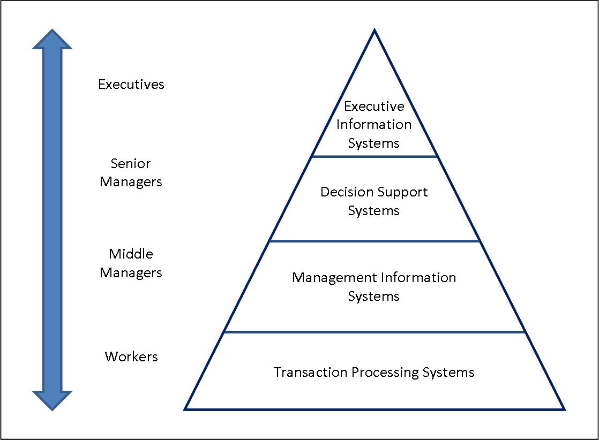

<!-- .slide: class="section" -->

<header>
	<h1>Business Intelligence a OLAP</h1>
	
Motivace a přehled

</header>

---

<!-- ⚠️ ZASTARALÉ/ZBYTEČNÉ: Data/informace/znalosti jsou podrobně probrány v p01. Stačí odkaz nebo jeden souhrnný slide. -->

# Data – informace – znalosti

- **Data** – hodnoty různých datových typů, bez přímé sémantiky
- **Informace** – interpretovaná data; sémantiku přidává uživatel nebo systém
- **Znalosti** – informace zařazené do souvislostí; sekudárně odvozené, agregované
- Některé IS pracují s daty transakčně (**OLTP**), jiné generují znalosti pro rozhodování (**OLAP**)

---

# Pyramidové schéma IS

<!-- .slide: class="normal centered" -->

 <!-- .element: style="height:600px;" -->

- Spodní vrstvy: transakční zpracování (**OLTP**)
- Vrcholové vrstvy: analytické technologie – **Business Intelligence**, datové sklady, OLAP, dolování dat

---

# Motivace – příklady

- Manager potřebuje vědět, kterým klientům nabídnout úvěrovou kartu a u kterých hrozí odchod ke konkurenci
- Manager potřebuje znát vývoj tržeb za posledních 30 dní v členění dle regionů a produktů
- Porovnání skutečného výkonu společnosti s plánovaným

_Tyto dotazy vyžadují agregaci, historická data a vícerozměrné pohledy – k tomu OLTP databáze nestačí._

---

# Business Intelligence

- Souhrn procesů, technologií a nástrojů pro **přeměnu dat na znalosti** pro podporu rozhodování
- **Vstup:** velké objemy primárních (produkčních) dat
- **Výstup:** znalosti využitelné v rozhodovacím procesu

---

# Prostředky Business Intelligence

- **Datové sklady** (_data warehouses_)
	- systém pro převod a uložení dat připravených pro analýzu
- **OLAP** (_On-Line Analytical Processing_)
	- rozhraní pro multidimenzionální analýzu a zpřístupnění výsledků
- **Dolování dat** (_data mining_)
	- automatická extrakce znalostí ze syrových dat
	- viz specializovaný kurz Získávání znalostí z databází (ZZN)
