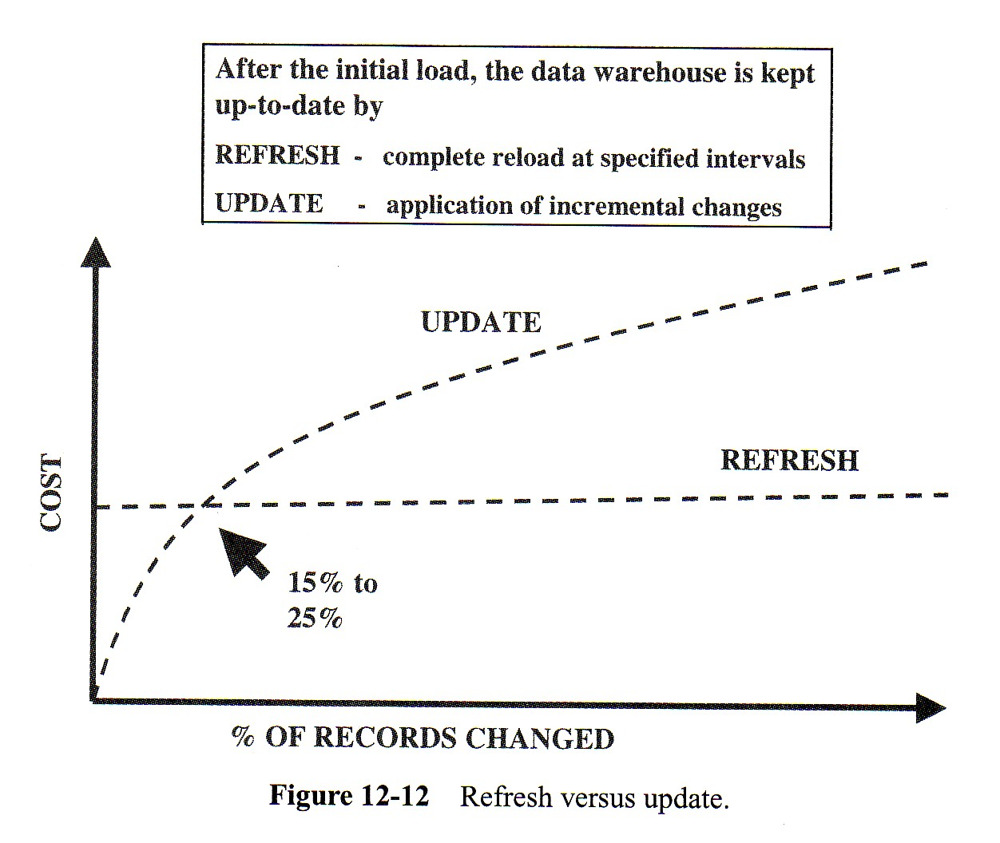

<!-- .slide: class="section" -->

<header>
	<h1>ETL</h1>
	
Extraction, Transformation, Loading

</header>

---

# Příprava údajů – ETL

- Klíčová úloha správy datového skladu
- **ETL = Extraction, Transformation, Loading**
- Hlavní cíl: **integrace údajů** z různých zdrojů do jednotného modelu

---

# Typy zdrojových dat

- **Produkční data**
	- z různých produkčních databází podniku pomocí dotazů
- **Interní data**
	- soubory v privátní správě zaměstnanců (typicky Excel)
- **Externí data**
	- z různých externích zdrojů (webové služby, otevřená data)

---

# Fáze ETL procesu

- **Extrakce** – výběr dat z různých zdrojů
- **Transformace** – ověření, čištění, integrace, časové označení dat
- **Loading** – přesun a uložení dat do tabulek datového skladu

---

# Extrakce

- Různé metody podle zdroje:
	- **Periodická extrakce** – z interních zdrojů
	- **Občasná extrakce** – z externích zdrojů (Internet)
	- **První extrakce** – z archivních dat při iniciálním naplnění

---

# Metody extrakce při aktualizaci

- **Přímá extrakce** – zachycení změn při jejich vzniku:
	- pomocí **log souborů** databáze
	- pomocí **databázových triggerů**
	- prostřednictvím **databázových aplikací**

- **Odložená extrakce** – změny se detekují až při nahrávání:
	- pomocí **časových razítek** (označení přidaných/editovaných záznamů)
	- pomocí **porovnávání souborů** (aktuální stav vs. předchozí)

---

# Transformace – typické problémy

- **Nejednoznačnost údajů** – různě uložená informace (M / muž / Muž)
- **Chybějící hodnoty** – doplnit, ignorovat nebo označit příznakem
- **Duplicitní hodnoty** – detekce a odstranění
- **Různé konvence názvů** – sjednocení terminologie
- **Různé peněžní měny** nebo formáty čísel a řetězců
- **Referenční integrita** – neaktuální záznamy (např. zrušené oddělení)
- **Chybějící časová razítka** – časový aspekt je v datových skladech kritický

---

# Loading – nahrávání dat

- Přesun dat do tabulek datového skladu, pokud možno **automatizovaný**
- **3 typy nahrávání:**
	- _Iniciální nahrávání_ – naplnění prázdného skladu
	- _Inkrementální nahrávání_ – promítnutí změn (provádí se periodicky)
	- _Přepis dat_ – kompletní smazání a znovunaplnění

---

# Módy nahrávání dat

- **Load** – cílová data jsou smazána a nahrazena aktuálními
- **Append** – nová data se přidají ke stávajícím; při duplicitě uživatel rozhoduje
- **Destruktivní sloučení** – při shodných klíčích se přepíše hodnota řádku
- **Konstruktivní sloučení** – při shodných klíčích se přidá nový prvek, starý zůstane

---

# Refresh vs. Update

<!-- .slide: class="normal centered" -->

 <!-- .element: style="height:480px;" -->

- **REFRESH** – kompletní obnova v daném intervalu (výhodné při > 15–25 % změn)
- **UPDATE** – aplikace inkrementálních změn (výhodné při malém počtu změn)
