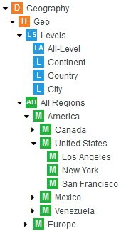
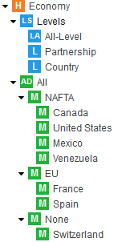
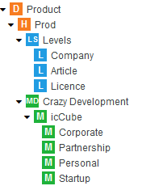
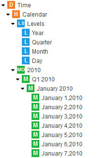

<!-- .slide: class="section" -->

<header>
	<h1>Multidimenzionální model</h1>
	<p>Dimenze, fakty, datová kostka</p>
</header>

---

# Proč multidimenzionální model?

- Umožňuje **komplexní analýzu a vizualizaci** dat
- Jiný datový model než relační – klade důraz na **strukturu pro ad hoc dotazy** vyžadující agregační a statistické výpočty
- Předpočítané agregáty lze **materializovat** (uložit) pro rychlý přístup
- Data jsou **read-only** – nevzniká problém konzistence při vícenásobném přístupu

---

# Dimenze

- **Dimenze** je uspořádatelná množina hodnot diskrétního základního typu (integer, výčet, čas) nebo množina jejich struktur **hierarchicky organizovaných**
- Příklady dimenzí:
	- _Čas_: den → měsíc → kvartál → rok
	- _Místo_: město → kraj → stát → kontinent
	- _Produkt_: název → kategorie → druh

---

# Hierarchická dimenze – příklad

```
Dimenze Místo:
  Kontinent
    └── Stát
          └── Kraj / Provincie
                └── Město

Dimenze Čas:
  Rok
    └── Kvartál
          └── Měsíc
                └── Den
```

---

# Příklad dimenze Geography v icCube

<!-- .slide: class="normal" -->

 <!-- .element: style="height:260px;" -->
 <!-- .element: style="height:260px;" -->

---

# Příklad dimenze Product a Time

<!-- .slide: class="normal" -->

 <!-- .element: style="height:250px;" -->

 <!-- .element: style="height:250px;" -->

---

# Fakt (míra, measure)

- **Fakt** je libovolná **agregovatelná** hodnota přiřazená průsečíku dimenzí
	- Lze ji sčítat, průměrovat, řetězit apod.
- Příklady: tržby, počet prodaných kusů, náklady, průměrná cena
- Fakty tvoří **metriky** datové kostky

 <!-- .element: style="height:200px;" -->

---

# Multidimenzionální kostka

- **Datová kostka** je funkce:
  
  _g_(_D_₁ × _D_₂ × _D_₃ × … × _D_ₙ) = _F_

- _D_ᵢ_ jsou dimenze, _F_ je hodnota faktu (míry)
- Pro _n_ dimenzí existuje _n!_ různých uspořádání (pohledů na kostku)
- Kostka je zpravidla **řídká** – ne každá kombinace hodnot dimenzí má přiřazený fakt

---

# 3D kostka – příklad

```
         Produkt
        /       \
       /         \
      /___________\
     /|            |
    / |   Čas      |
   /  |  /         |
  /   | /          |
 /____|/____________|
 Region

Fakt (např. tržby) = funkce (Produkt, Čas, Region)
```

---

# Podkostky (kuboidy)

- **Podkostka** (kuboid) je kostka odvozená aktivací pouze podmnožiny dimenzí
- Příklad pro 4 dimenze {time, item, location, supplier}:
	- 4D: {time, item, location, supplier} – základní kuboid
	- 3D: {time, item, location}, {time, item, supplier}, …
	- 2D: {time, item}, {time, location}, …
	- 1D: {time}, {item}, …
	- 0D: {} – vrcholový kuboid (celkový agregát: _all_)

---

# Svaz kuboidů

- Podkostky tvoří **svaz** (lattice):
	- **Základní kuboid** (n dimenzí) = nejdetailnější pohled (dolní ohraničení)
	- **Vrcholový kuboid** _all_ (0 dimenzí) = celkový agregát (horní ohraničení)
- Roll-up odpovídá pohybu **nahoru** ve svazu (méně dimenzí = více agregace)
- Drill-down odpovídá pohybu **dolů** ve svazu (více dimenzí = více detailu)

---

<!-- ⚠️ ZASTARALÉ/ZBYTEČNÉ: Následující formální matematické partie o částečném uspořádání, Hasseových diagramech a svazech jsou příliš detailní pro přednášku IS. Lze nahradit stručným odkazem nebo zcela vynechat. -->

# Formální základ: svaz podkostek

- Podkostky pro jedno uspořádání dimenzí a jednu agregační funkci tvoří svaz [_S_, ∨, ∧]
- **Průsek** ∧: kuboid s _m_ dimenzemi ∧ kuboid s _m_ dimenzemi = kuboid s _m+1_ dimenzemi (přidání dimenze)
- **Spojení** ∨: kuboid s _m_ dimenzemi ∨ kuboid s _m_ dimenzemi = kuboid s _m−1_ dimenzemi (odebrání dimenze)

_Viz studijní opora: Matematické základy modelování informačních systémů_
