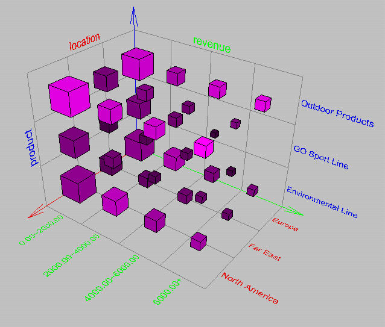
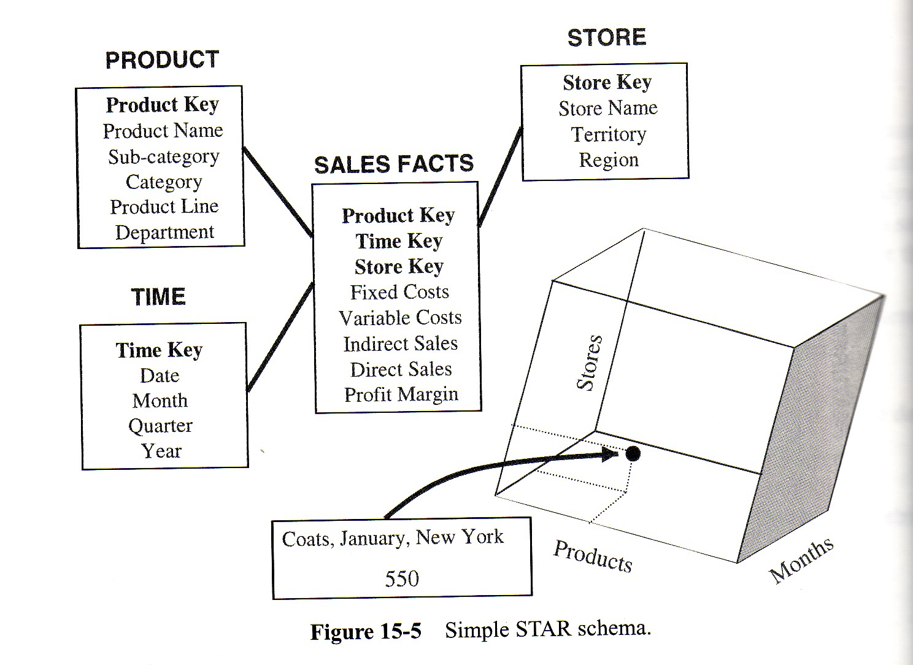

<!-- .slide: class="section" -->

<header>
	<h1>OLAP operace</h1>
	<p>Prohlížení datové kostky</p>
</header>

---

# Prohlížení datové kostky

<!-- .slide: class="normal centered" -->

 <!-- .element: style="height:480px;" -->

- **Vizualizace, operace, interaktivní manipulace**

---

# Přehled OLAP operací

- **Roll-up** – vzrůst úrovně agregace (méně dimenzí)
- **Drill-down** – snížení úrovně agregace, zvýšení detailu (více dimenzí)
- **Pivoting** – změna uspořádání dimenzí (otočení kostky)
- **Slicing & Dicing** – výběr podmnožiny dat (filtry nad dimenzemi)

---

# Roll-up

- **Posun o jednu úroveň výše** v hierarchii kuboidů – odebrání dimenze
- Vstup: aktivní dimenze {_A_₁, _A_₂, …, _A_ₘ_}
- Výstup: {_A_₁, _A_₂, …, _A_ₘ₋₁_} – nejmenší dimenze _Aₘ_ je deaktivována
- Výsledkem je kostka s **méně detailními, více agregovanými** hodnotami

_Příklad: z pohledu (čas × produkt × region) na (čas × produkt) – agregace přes region_

---

# Drill-down

- **Posun o jednu úroveň níže** v hierarchii kuboidů – přidání dimenze
- Vstup: {_A_₁, _A_₂, …, _A_ₘ_}, kde _m_ ≤ _n_
- Výstup: {_A_₁, …, _A_ₘ, _A_ₘ₊₁_} – přidána nová aktivní dimenze
- Pro _m_ = _n_ bude výsledkem **detail** všech hodnot
- Opak roll-up; zvyšuje granularitu výsledků

---

# Příklad drill-down

<!-- .slide: class="normal centered" -->

 <!-- .element: style="height:460px;" -->

_Aktivní dimenze: produkt; zaktivizovaná dimenze: čas; míra: objem prodejů_

---

# Pivoting

- **Změna uspořádání dimenzí** – otočení jedné ze stěn kostky k sobě
- Vstup: uspořádání {_D_₁, _D_₂, …, _D_ₙ_} s relací uspořádání _R_
- Výstup: jiné uspořádání {_D_ₓ₁, _D_ₓ₂, …, _D_ₓₙ_} – jiná relace _R_
- Počet možných uspořádání pro _n_ dimenzí: _n!_

_Příklad: z (produkt, region, čas) na (region, produkt, čas)_

---

# Příklad pivotingu

<!-- .slide: class="normal" -->

 <!-- .element: style="height:300px;" -->

 <!-- .element: style="height:280px;" -->

---

# Slicing & Dicing

- **Změna efektivní kardinality dimenzí** – omezení dat pomocí filtrů
- Výběrem nebo nastavením **filtru (predikátu)** nad hodnotami dimenze
- Výsledkem je podmnožina kostky – "řez" nebo "kostička"

_Příklady:_
- _Slice:_ zobrazit pouze rok 2024
- _Dice:_ zobrazit pouze Čechy a Moravu, kategorie Elektronika

---

# Roll-up nad 4D svazem kuboidů

```
         all
          |
   time  item  location  supplier
          |
    time,item  time,location  time,supplier  item,location  ...
          |
   time,item,location  time,item,supplier  ...
          |
   time, item, location, supplier

──────────────────────────────────────────
roll-up ↑      drill-down ↓
pivoting: 4! = 24 permutací dimenzí
```
