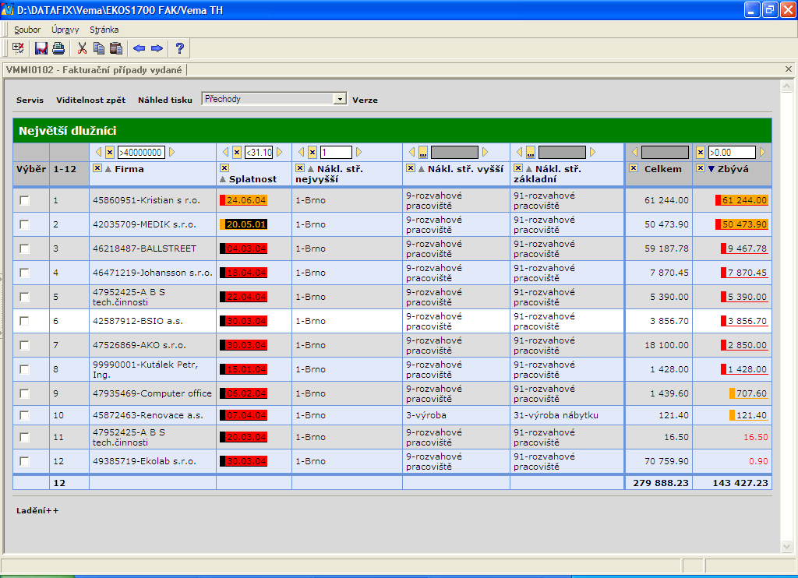
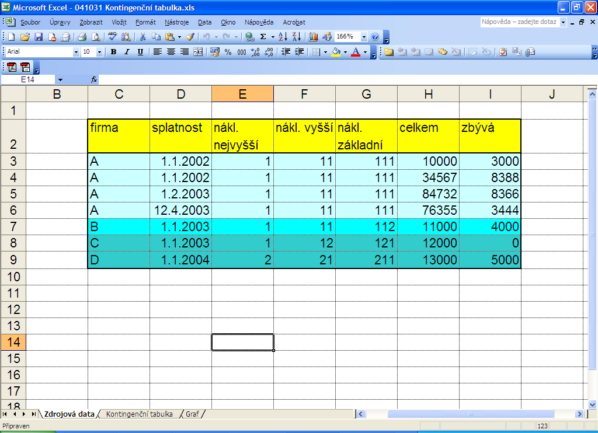
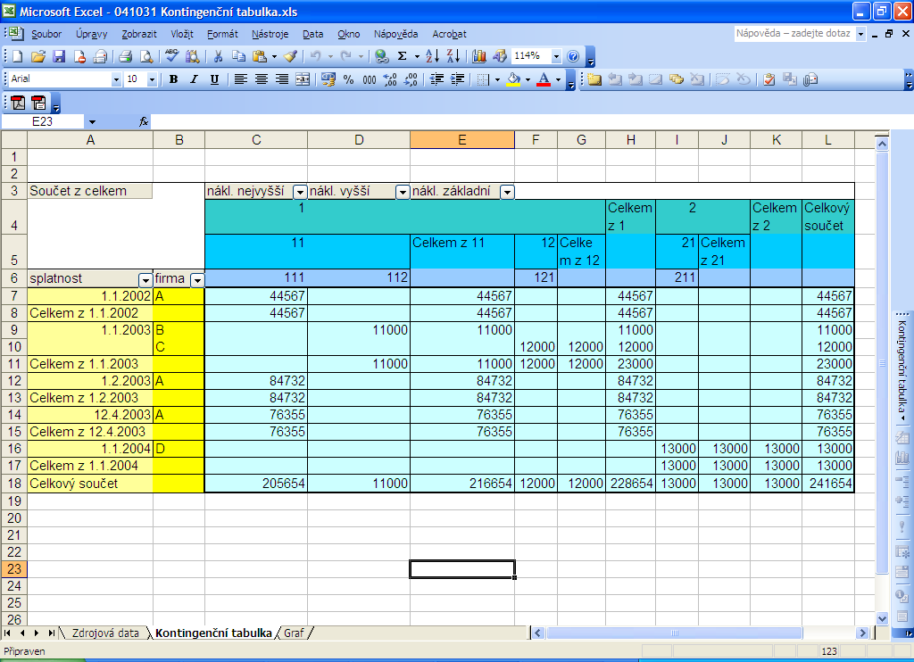
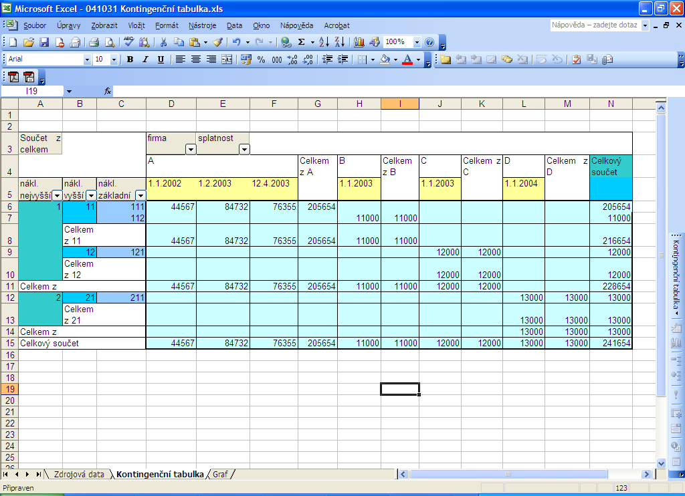
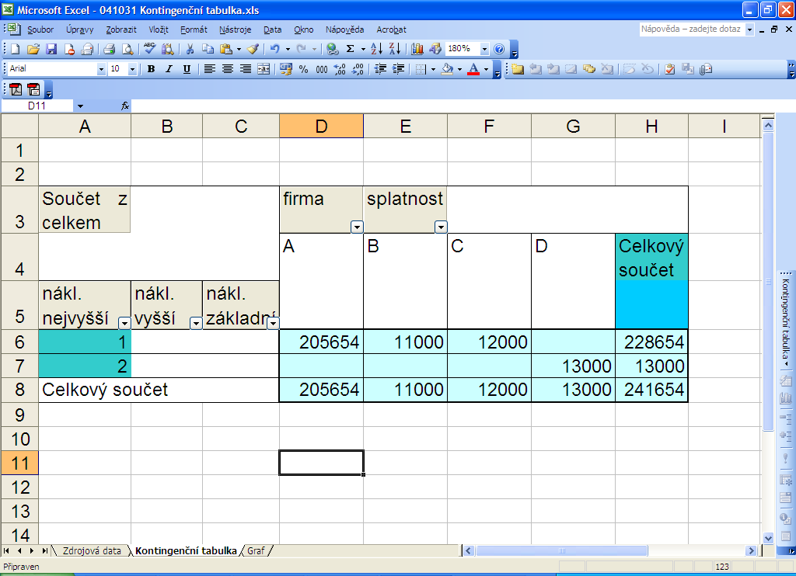
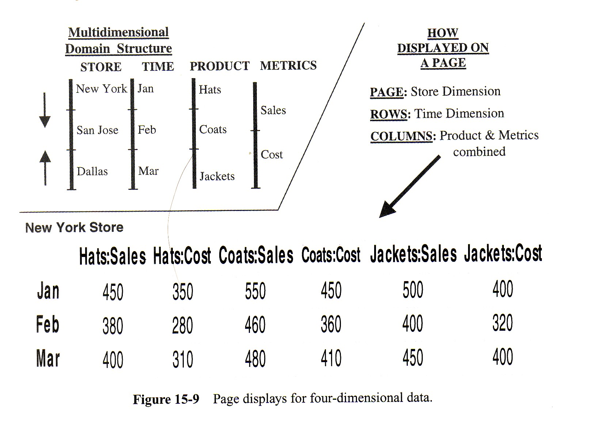
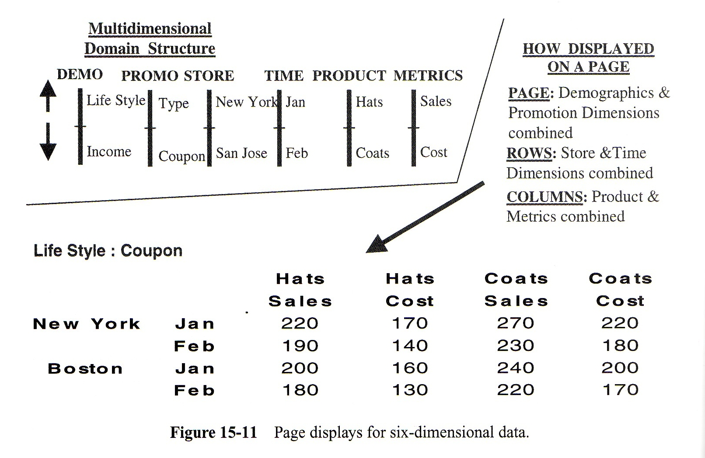

<!-- .slide: class="section" -->

<header>
	<h1>Vizualizace</h1>
	<p>Tabulky, kontingenční tabulky, grafy</p>
</header>

---

# Vizualizace na 2D průmětně

- Data kostky s více než 3 dimenzemi nelze přímo zobrazit
- Funkce _g(A_₁ × A_₂ × … × Aₘ) = F_ je vlastně **kolekcí struktur** – vizualizujeme ji **tabulkou**

```
collection of structure
  properties
    A1 : typ1     -- dimenze
    A2 : typ2
    ...
    Am : typm
    F  : agregovatelný typ   -- fakt
end structure
```

---

# Tabulka – příklad

<!-- .slide: class="normal centered" -->

 <!-- .element: style="height:440px;" -->

---

# Tabulka – OLAP operace

- **Roll-up** – odebrání dimenzionálních sloupců zprava (nebo obecně)
- **Drill-down** – přidání dimenzionálních sloupců
- **Pivoting** – přeuspořádání dimenzionálních sloupců
- **Slicing & Dicing** – filtry, výběr hodnot zaškrtáváním

---

# Kontingenční tabulka (Pivot Table)

- Řádky i sloupce jsou **dimenze** (i hierarchické)
- Fakta jsou na **průsečíku** dimenzí
- Zpravidla zobrazuje **jediný fakt** (více faktů se řeší záložkami nebo opakováním tabulky)

---

# Kontingenční tabulka – OLAP operace

- **Pivoting** – přesun dimenzí mezi osami x/y nebo změna pořadí v hierarchii
- **Roll-up / Drill-down** – zakrytí/odkrytí úrovní hierarchie dimenzí
- **Slice & Dice** – zneviditelnění sloupců, filtry

---

# Prvotní data ve formě relace

<!-- .slide: class="normal centered" -->

 <!-- .element: style="height:420px;" -->

---

# Kontingenční tabulka

<!-- .slide: class="normal centered" -->

 <!-- .element: style="height:420px;" -->

---

# Pivoting – přetočení dimenzí

<!-- .slide: class="normal centered" -->

 <!-- .element: style="height:500px;" -->

---

# Roll-up a Drill-down v kontingenční tabulce

<!-- .slide: class="normal centered" -->

 <!-- .element: style="height:480px;" -->

---

# Zobrazení více dimenzí

<!-- .slide: class="normal" -->

**4 dimenze** – sloupce kombinované s oddělovači:

 <!-- .element: style="height:240px;" -->

**6 dimenzí** – přechod ke kontingenční tabulce:

 <!-- .element: style="height:220px;" -->

---

# Grafické zobrazení

- K multidimenzionálnímu pohledu je vhodné přidat **grafy** pro rychlou vizualizaci trendů
- **Jednoduchý graf (histogram):** kolekce dvojic (x – dimenze, y – fakt); nutno redukovat na 1 dimenzi
- **Koláčový graf:** vyjadřuje podíly z celku (y = úhel výseče = 360° × hodnota/součet)
- **Násobný graf:** více faktů najednou (y₁, y₂, …, yₙ); stačí 1 dimenze, počet faktů neomezen

---

# Operace kostky u grafů

- **Slicing & Dicing** – filtry nad dimenzemi ✓
- **Pivoting** – u jedné dimenze nemá smysl
- **Roll-up** – neužívá se přímo
- **Drill-down (živé grafy)** – kombinovaná operace:
	- kliknutím na hodnotu dimenze _Dᵢ_ se nastaví **filtr rovnosti** (slicing)
	- a jako aktivní dimenze se zobrazí _Dᵢ₊₁_ (drill-down)
