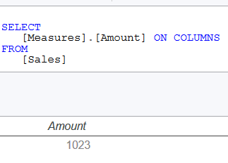
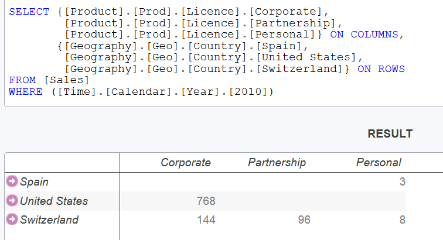
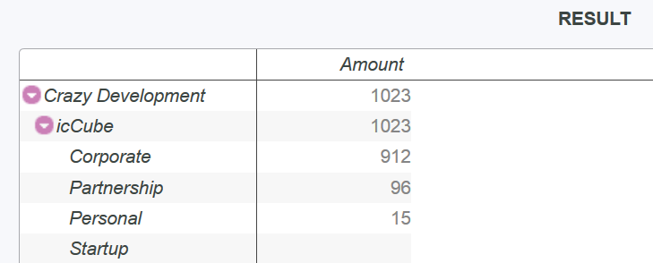
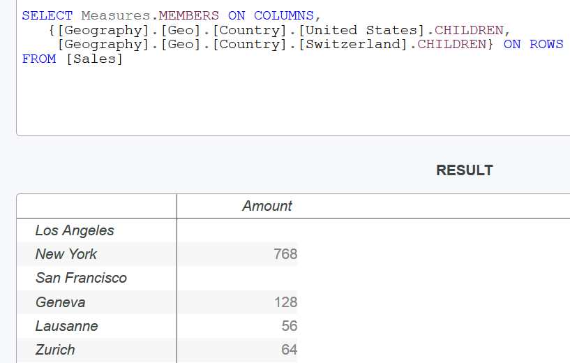
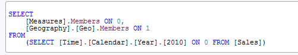

<!-- .slide: class="section" -->

<header>
	<h1>Dotazovací jazyk MDX</h1>
	<p>MultiDimensional eXpressions</p>
</header>

---

<!-- ⚠️ ZASTARALÉ/ZBYTEČNÉ: Část o XMLA (XML for Analysis) s historií z roku 2000–2002 a odkazem na Microsoft OLE DB for OLAP je silně zastaralá. XMLA standard již není aktivně rozvíjen, icCube není mainstream nástroj. Lze buď zcela vynechat, nebo zmínit jednou větou jako kontext pro MDX. -->

# Přístup k OLAP – XMLA

- **XMLA** (XML for Analysis) – průmyslový standard pro přístup k analytickým systémům
- Postaven na XML, SOAP a HTTP
- Dvě metody: **Discover** (zjišťování schématu, metadat) a **Execute** (provádění dotazů)
- Dotazy se zapisují v jazyce **MDX**

---

# MDX – Multi Dimensional eXpressions

- Dotazovací jazyk pro navigaci v **multidimenzionálních datech**
- Výsledkem dotazu je **zobrazitelná tabulka** (2D nebo náhradní techniky)
- Syntaxí vzdáleně připomíná SQL

```
Dotaz MDX  →  Datová kostka  →  Výsledná datová množina (tabulka)
```

---

# Základní syntaxe MDX SELECT

```mdx
SELECT <specifikace_osy> ON COLUMNS,
       <specifikace_osy> ON ROWS
FROM   <kostka>
[WHERE <filtr>]
```

- **Osy:** COLUMNS, ROWS, PAGES, SECTIONS, CHAPTERS nebo AXIS(číslo)
- Až 128 os; osy číslovány od 0 (0 = x, 1 = y, 2 = z)

---

# Příklad – celkový agregát

```mdx
SELECT [Measures].[Amount] ON COLUMNS
FROM [Sales]
```

| Amount |
|--------|
| 1023   |

 <!-- .element: style="height:140px;" -->

---

# Příklad – n-tice dimenzí

```mdx
SELECT ([Product].[Prod].[Licence].[Corporate],
        [Geography].[Geo].[Continent].[America]) ON COLUMNS
FROM [Sales]
```

| Corporate / America |
|---|
| 768 |

---

# Příklad – řádky i sloupce

```mdx
SELECT {[Product].[Prod].[Licence].[Corporate],
        [Product].[Prod].[Licence].[Partnership],
        [Product].[Prod].[Licence].[Personal]} ON COLUMNS,
       {[Geography].[Geo].[Country].[Spain],
        [Geography].[Geo].[Country].[United States],
        [Geography].[Geo].[Country].[Switzerland]} ON ROWS
FROM [Sales]
WHERE ([Time].[Calendar].[Year].[2010])
```

---

# Výsledek dotazu

<!-- .slide: class="normal centered" -->

 <!-- .element: style="height:360px;" -->

---

# Funkce MEMBERS

```mdx
SELECT [Measures].MEMBERS ON COLUMNS,
       [Product].MEMBERS ON ROWS
FROM [Sales]
```

- Vrací fakta pro **všechny prvky** dané dimenze včetně součtů na každé úrovni

 <!-- .element: style="height:280px;" -->

---

# Funkce CHILDREN – práce s hierarchií

```mdx
SELECT Measures.MEMBERS ON COLUMNS,
   {[Geography].[Geo].[Country].[United States].CHILDREN,
    [Geography].[Geo].[Country].[Switzerland].CHILDREN} ON ROWS
FROM [Sales]
```

- Vrací **přímé potomky** uzlu v hierarchii dimenze

 <!-- .element: style="height:240px;" -->

---

# Poddotazy – FROM jako filtr

```mdx
SELECT
    [Measures].MEMBERS ON 0,
    [Geography].[Geo].MEMBERS ON 1
FROM
    (SELECT [Time].[Calendar].[Year].[2010] ON 0 FROM [Sales])
```

- Jiný způsob realizace operace **slice** – filtrování pomocí poddotazu v klauzuli FROM

 <!-- .element: style="height:220px;" -->
