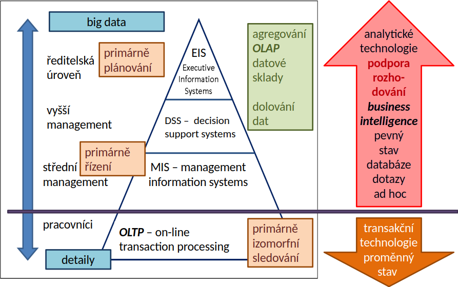

<!-- .slide: class="section" -->

<header>
	<h1>Business Intelligence</h1>
	
Motivace a základní pojmy

</header>

---

<!-- POZNÁMKA: Slajdy o datech/informacích/znalostech jsou podrobně probrány v p01.
     Zde ponecháme jen stručné shrnutí kontextu. Zvážit, zda zcela vypustit. -->

# Data, informace, znalosti – shrnutí

- **Data** – hodnoty bez sémantiky, reprezentují _stav_ systému
- **Informace** – interpretovaná data (interpretaci provádí uživatel nebo systém)
- **Znalosti** – informace zařazené do kontextu, _sekundární odvozené informace_
    - Získávány agregací a analýzou (nad **velkými daty**)

- Některé IS pracují s daty transakčně (**OLTP**), jiné generují znalosti pro rozhodování (**OLAP**)

---

# Pyramidové schéma informačních systémů

<!-- .slide: class="normal centered" -->

 <!-- .element: style="height: 750px;" -->

---

# Motivace

- Manager potřebuje vědět:
    - Kterým klientům lze nabídnout úvěrovou kartu?
    - U kterých klientů je vysoké riziko odchodu ke konkurenci?
    - Jak se vyvíjejí tržby za posledních 30 dní v členění dle regionů a produktů?
    - Jak se liší skutečný výkon od plánovaného?

- Klasická transakční (OLTP) databáze na tyto otázky **neumí efektivně odpovědět**

---

# Business Intelligence

- Procesy, technologie a nástroje potřebné k **přetvoření dat a informací do znalostí** pro podporu rozhodování
- **Vstup**: velké objemy (big data) primárních produkčních dat
- **Výstup**: znalosti využitelné v procesu rozhodování na různých úrovních řízení

---

# Prostředky Business Intelligence

- **Datové sklady** (_data warehouses_)
    - Systém převodu a uložení dat pro analýzu
    - Definují formální model dat
- **OLAP** (_On-line Analytical Processing_)
    - Rozhraní pro manipulaci s modelem a zpřístupnění výsledků
- **Data Mining** (dolování dat)
    - Viz specializovaný kurz _Získávání znalostí z databází_ (ZZN)
