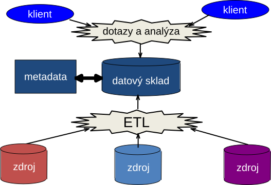

<!-- .slide: class="section" -->

<header>
	<h1>Datové sklady</h1>
	
Data Warehouses

</header>

---

# Pojem datového skladu

- Podnikově strukturovaný depozitář **subjektově orientovaných, integrovaných, časově proměnlivých, historických dat** použitých pro získávání _znalostí_ a podporu rozhodování
- Obsahuje operační i agregovaná data

---

# Datový sklad – technologie

- Technologie zajišťující:
    - **Natažení** (extrakce a transformace),
    - **Uložení** (_loading_) a
    - **Poskytování** dat
- Pro **podporu rozhodování prováděnou analýzou informací** a vytvářením _znalostí_
- Provozován **odděleně** od základní **operační (produkční) databáze**

---

# Nevhodnost produkčních databází pro analýzu

- Navrženy pro **ukládání detailních dat** v izomorfním modelu
- Výsledkem jsou zpravidla data explicitně uložená – bez agregačních úprav
- Vhodné pro **jednoduché transakce** (OLTP), nevhodné pro **složitější analýzu velkých dat**

---

# Nevhodnost produkčních databází – pokračování

- **Decentralizovanost** OLTP systémů
    - Data pro analýzu jsou uložena v **různých heterogenních DB na různých serverech**
    - Není k dispozici integrovaný zdroj
- **Nehomogenní struktura** – různé názvy atributů, datové typy
- **Degradace výkonu** opakovanými agregačními výpočty
- Zpravidla uchovávají **pouze aktuální data** – chybí historická data

---

# Vhodný model – vícerozměrnost

- Pro komplexní analýzu a vizualizaci jsou data v datovém skladu modelována **multidimenzionálně**
- Jiný datový model, než relační
- Klade důraz na **strukturu vhodnou pro ad hoc dotazy** vyžadující agregační a statistické výpočty

---

# Multidimenzionální databáze

- Platforma pro získání **agregovaných údajů**
- Výpočty, které by se opakovaně prováděly, mohou být **spočteny předem a uloženy (materializovány)** pro rychlý přístup
- Redundance zde není podstatný problém:
    - Data jsou **read-only**
    - Nevzniká problém udržování konzistence a vícenásobného přístupu

---

<!-- .slide: class="normal centered" -->

# Architektura datového skladu

 <!-- .element: style="height:700px;" -->

---

# Architektura datového skladu – 3 části

1. **Získání dat**
    - Zdrojová data + místo přípravy (_ETL_: Extraction, Transformation, Loading)
2. **Uložení dat**
    - Datový sklad + datové trhy + uložení metadat
    - Navrženo _pro analýzu_, read-only
3. **Předávání výsledků**
    - OLAP, dotazovací nástroje, generátory zpráv, data mining

---

# Vlastnosti datového skladu

- **Orientace podle subjektu** – fakta organizována podle průsečíků n-dimenzí
- **Integrace** – data z různých zdrojů ukládána _jednotně jednou_
    - Jednotná terminologie, jednotky veličin
    - Nutnost úpravy, vyčistění a sjednocení vstupních dat
- **Časová proměnlivost** – každý klíč obsahuje čas (explicitně nebo implicitně)
    - Historický horizont: typicky 5–10 let (vs. aktuální data v OLTP)
- **Neměnnost** – v datovém skladu se data _nemění_
    - Pouze dvě operace: **vkládání** a **čtení**
    - Nepotřebuje zpracování transakcí ani mechanismy souběžného přístupu

---

# Produkční databáze vs. datový sklad

| Vlastnost | Produkční DB (OLTP) | Datový sklad (OLAP) |
|-----------|--------------------|--------------------|
| Uživatelé | Běžní pracovníci | Manažeři, analytici |
| Data | Aktuální, detailní | Historická, sloučená |
| Model | ER + aplikace | Multidimenzionální kostka |
| Pohled na data | Aktuální, lokální | Agregovaný |
| Přístup | Aktualizace | Read-only, komplexní dotazy |

---

# Shrnutí požadavků na datový sklad

- Schopnost **agregace**
- Databáze navržená pro **analytické dotazy**
- Možnost **integrovat data** z více aplikací
- Převažuje operace **čtení**
- **Periodické** doplňování dat
- Možnost využití **současných i historických dat**
