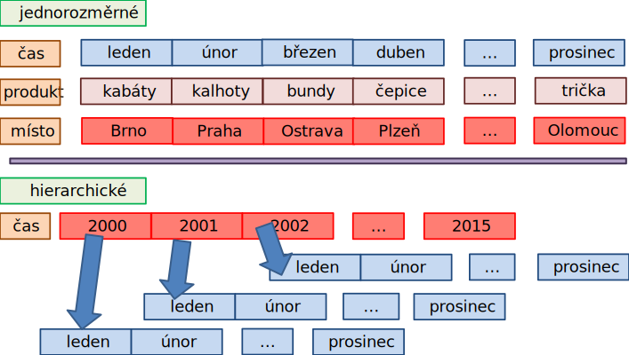
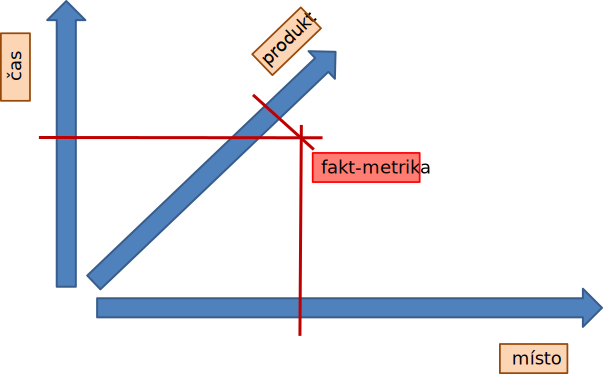
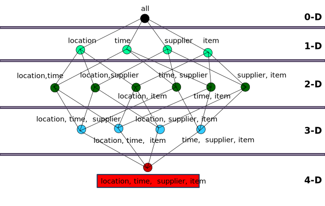
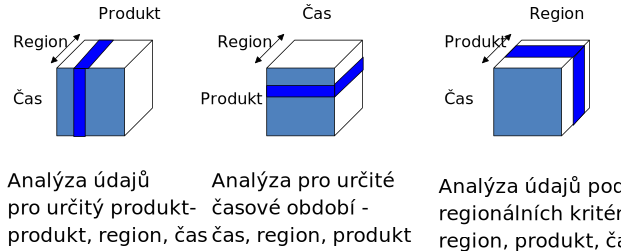

<!-- .slide: class="section" -->

<header>
	<h1>Multidimenzionální model</h1>
	
Dimenze, fakta, kostka

</header>

---

# Dimenze

- **Dimenze** je _uspořádatelná_ množina hodnot _diskrétního_ základního typu
  (integer, výčet, čas) nebo množina jejich struktur **hierarchicky organizovaných**
- Příklady dimenzí:
    - **Čas**: leden, únor, …, prosinec (nebo rok → kvartál → měsíc → den)
    - **Místo**: Praha, Brno, Ostrava, Plzeň, … (nebo kontinent → země → město)
    - **Produkt**: kabáty, kalhoty, bundy, čepice, trička, …

---

<!-- .slide: class="normal centered" -->

# Příklady dimenzí

 <!-- .element: style="height: 750px" -->

---

# Definice multidimenzionální kostky

- Nechť existuje **uspořádaná** množina **n dimenzí** $\{D_1, D_2, D_3, \dots, D_n\}$
  - Celkem $n!$ uspořádání (pro 3 dimenze $3! = 6$)
- **Multidimenzionální kostka** je funkce:

  $$g_m(A_1 \times A_2 \times A_3 \times \dots \times A_m) = F$$

  kde $\{A_1, A_2, \dots, A_m\}$ je uspořádaná podmnožina **aktivních dimenzí** ($m \leq n$),
  uspořádání zůstává zachováno.

- Prvky $F$ nazýváme **fakty (míry, _measures_)**

---

# Fakt (míra, measure)

- **Fakt** je libovolná **agregovatelná** hodnota (lze ji sčítat, průměrovat, apod.)
- Příklady faktů:
    - Počet prodaných kusů
    - Tržba v Kč
    - Průměrná cena
- Výsledkem jsou kostky _počtů_, _součtů_, _průměrů_ apod.
- Fakta jsou organizována na průsečících hodnot dimenzí

---

# 3D kostka – příklad

- Dimenze: **čas** × **produkt** × **region**
- Na každém průsečíku je uložen (nebo vypočten) **fakt** – např. objem prodejů

 <!-- .element: style="height: 600px" -->

---

# Podkostky (kuboidy)

- Z n-dimenzionální kostky lze odvozovat **podkostky** (kuboidy) – kostky s méně dimenzemi
- Podkostka vznikne **agregací** přes jednu nebo více dimenzí (roll-up)
- Podkostky tvoří **částečně uspořádanou množinu (poset)**:

  $$g(A_1 \times \dots \times A_i \times \dots \times A_m) \leq g(A_1 \times \dots \times A_{m-1})$$

  Podkostka je „větší", pokud má o jednu dimenzi méně

---

# Kostka jako svaz kuboidů

- Množina všech podkostek jedné kostky tvoří **svaz** (lattice)
- **Vrcholový kuboid** (0-D): jediný agregovaný fakt přes _všechny_ dimenze (`all`)
- **Základní kuboid** (*n*-D): fakta pro _všechny_ aktivní dimenze

---

<!-- .slide: class="normal centered" -->

# Kostka jako svaz kuboidů

 <!-- .element: style="height: 800px" -->

---

# Multidimenzionální kostka jako řídká matice

- Každá dimenze $A_i$ má **skutečnou kardinalitu** $k_i$ (skutečný počet prvků)
- Výsledná kostka je **„vykotlaná" – řídká n-rozměrná matice**
    - Ne všechny průsečíky dimenzí mají definovanou hodnotu faktu
- Příklad: ne pro každou kombinaci (den, produkt, obchod) existuje prodej

---

# 3D kostka - příklad 3! otočení

 <!-- .element: style="height: 600px" -->

Je možný i produkt, čas, region - čas, produkt, region a region, čas, produkt.
