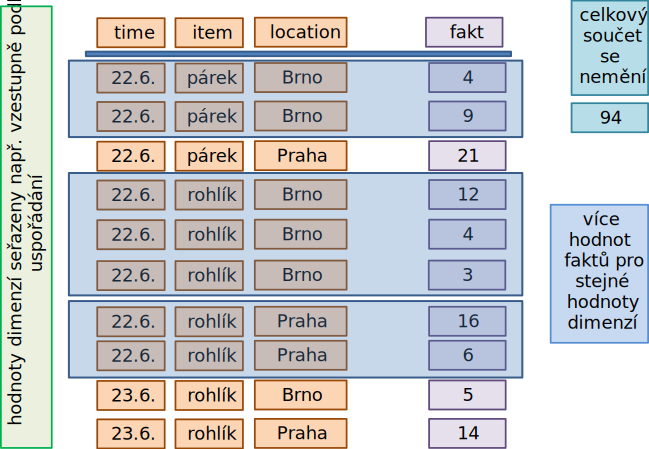
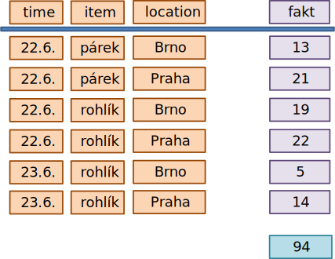
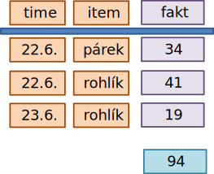
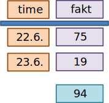
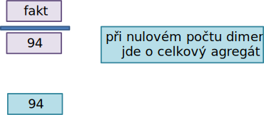
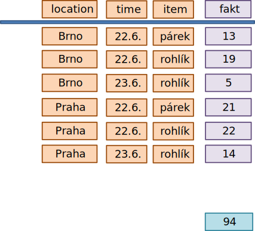
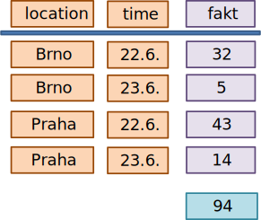

<!-- .slide: class="section" -->

<header>
	<h1>Agregace</h1>
	
Agregační funkce a výpočet podkostek

</header>

---

# Agregační funkce

- **Agregační funkce** shlukují množiny hodnot do jediné hodnoty
- Základní agregační funkce:
    - **Počet** (COUNT)
    - **Součet** (SUM)
    - **Průměr** (AVG)
    - **Maximum** (MAX)
    - **Minimum** (MIN)
- Méně časté:
    - **Medián** – prostřední hodnota uspořádané datové množiny
    - **Modus** – hodnota, která se v množině vyskytuje nejčastěji

---

# Detailní hodnoty

- **Detail** (základní fakt) je existující hodnota na průsečíku hodnot všech dimenzí $(d_1, d_2, \dots, d_n)$
- Pro stejné hodnoty dimenzí může existovat více faktů (např. více transakcí).

---

# Detailní hodnoty: Příklad

| time | item   | location | fakt |
|------|--------|----------|------|
| 22.6 | rohlík | Praha    | 6    |
| 22.6 | rohlík | Brno     | 12   |
| 22.6 | rohlík | Brno     | 4    |
| 22.6 | párek  | Brno     | 9    |
| 22.6 | párek  | Praha    | 21   |
| 23.6 | rohlík | Brno     | 5    |
| 23.6 | rohlík | Praha    | 14   |
| …    | …      | …        | …    |
<!-- .element: style="font-size:80%" -->

---

<!-- .slide: class="normal lefteq" -->

# První krok agregace detailů

- Pro dané uspořádání dimenzí $\\{D_1, D_2, \dots, D_n\\}$ platí pro podkostky $\textbf{součet}_n$, $\textbf{počet}_n$, $\textbf{průměr}_n$ a detailní hodnoty $\textit{detail}(d_1, d_2, \dots, d_n)$:

$$\textbf{součet}_n(d_1, \dots, d_n) = \sum \textit{detail}(d_1, d_2, \dots, d_n)$$

$$\textbf{počet}_n(d_1, \dots, d_n) = \sum\_{detail(d_1,\dots,d_n)} 1$$

$$\textbf{průměr}_n(d_1, \dots, d_n) = \frac{\textbf{součet}_n(d_1, \dots, d_n)}{\textbf{počet}_n(d_1, \dots, d_n)}$$

---

# Příklad detailních hodnot

 <!-- .element: style="height: 800px; display: block; margin: auto; margin-top: -1em" -->

---

# První krok pro kostku *součet*

 <!-- .element: style="height: 650px; display: block; margin: auto; margin-top: -1em" -->

- není více hodnot  faktů pro stejné hodnoty dimenzí
- neubylo dimenzí

---

<!-- .slide: class="normal lefteq" -->

# Podkostky

- Pro $n > m \geq 0$ dimenzí $\\{A_1, A_2, \dots, A_m\\}$ platí pro podkostky $\textbf{součet}_m$, $\textbf{počet}_m$, $\textbf{průměr}_m$ a jejich přímé následníky $(m+1)$ v částečném uspořádání $\\{A_1, \dots, A_i, \dots, A_m\\}$:

$$\textbf{součet}_m(d_1, \dots, d_m) = \sum\_{d_i \in D_i} \textbf{součet}\_{m+1}(d_1, \dots, d_i, \dots, d_m)$$

$$\textbf{počet}_m(d_1, \dots, d_m) = \sum\_{d_i \in D_i} \textbf{počet}\_{m+1}(d_1, \dots, d_i, \dots, d_m)$$

$$\textbf{průměr}_m(d_1, \dots, d_m) = \frac{\textbf{součet}_m(d_1, \dots, d_m)}{\textbf{počet}_m(d_1, \dots, d_m)}$$

---

# Podkostka bez dimenze location

- Agregujeme přes dimenzi _location_:

 <!-- .element: style="height: 500px; display: block; margin: auto" -->

---

# Podkostka bez dimenze item

 <!-- .element: style="height: 400px; display: block; margin: auto" -->

---

# Vrcholový kuboid (0D)

- Agregace přes _všechny_ dimenze:

 <!-- .element: style="height: 400px; display: block; margin: auto" -->

- Jediný agregovaný fakt – celkový součet přes vše.

---

# Jiné pořadí dimenzí v prvním kroku

 <!-- .element: style="height: 750px; display: block; margin: auto; margin-top: -1em" -->

---

# Podkostka *součet* bez dimenze item

 <!-- .element: style="height: 500px; display: block; margin: auto; margin-top: -1em" -->
