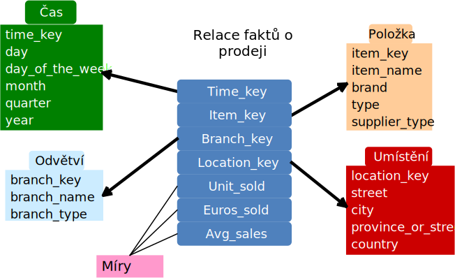
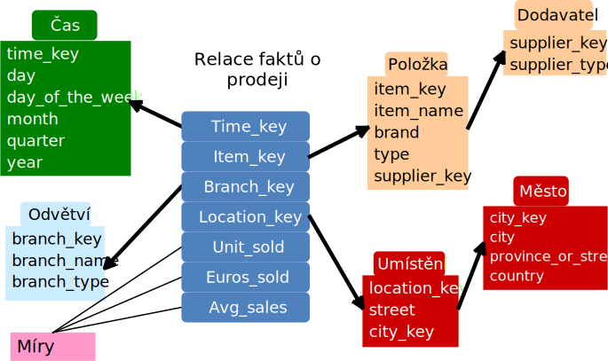
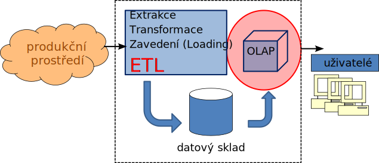

<!-- .slide: class="section" -->

<header>
	<h1>Architektury a konceptuální návrh</h1>
	
MOLAP, ROLAP, HOLAP, schémata

</header>

---

# Architektury OLAP serveru

- **MOLAP** – Multidimensional OLAP
    - Vlastní multidimenzionální datové struktury (pole, řídké matice)
    - Rychlé indexování předzpracovaných agregovaných dat
    - Výhoda: maximální výkon; Nevýhoda: redundance, velké prostorové nároky
- **ROLAP** – Relational OLAP
    - Data uložena v **relačních tabulkách**, prezentována jako multidimenzionální pohled
    - Žádná redundance; Velká možnost škálování

---

# Architektury OLAP serveru (II)

- **HOLAP** – Hybrid OLAP
    - Detailní data v relačních tabulkách (ROLAP), předagregáty v multidimenzionálních strukturách (MOLAP)
    - Příklad: Microsoft SSAS – mód lze volit per-partition
- **Specializovaný SQL server**
    - Podpora SQL dotazů nad schématy hvězda/sněhová vločka

---

# Příklady OLAP produktů

- **MOLAP**: Oracle Essbase, IBM Planning Analytics (TM1), Jedox
- **ROLAP**: Mondrian/Pentaho (open-source), Apache Kylin, ClickHouse
    - Cloud: Snowflake, Google BigQuery, Amazon Redshift
- **HOLAP**: Microsoft SSAS, SAP BW (SAP Business Warehouse)
- **Specializovaný SQL**: Apache Druid, DuckDB

---

# Konceptuální modelování kostky – schémata

- **Schéma hvězdy** (_star schema_)
    - Jedna tabulka faktů ve středu, připojená k tabulkám dimenzí
- **Schéma sněhové vločky** (_snowflake schema_)
    - Zjemnění hvězdy: hierarchie dimenzí normalizovaná do více tabulek
- **Konstelace faktů** (_fact constellation / galaxy schema_)
    - Více tabulek faktů sdílejících tabulky dimenzí

---

# Fakta a dimenze

- **Tabulka faktů**
    - Největší tabulka v DB (zpravidla jediná)
    - Obsahuje **numerické míry** (tržba, počet, cena)
    - Cizí klíče do tabulek dimenzí
- **Tabulky dimenzí** (číselníky)
    - Logicky nebo hierarchicky uspořádané popisné údaje
    - Menší a mění se méně často
    - Nejčastěji: časová, geografická, produktová dimenze

---

# Schéma hvězdy (star schema)

- Každá relace dimenze sestává z atributů odpovídajících hodnotám dimenze
- **Neposkytuje explicitní podporu pro hierarchii** – lze obejít organizačně
- Relace dimenzí nejsou normalizované → jednoduché, ale pomalejší

---

# Schéma hvězdy (příklad)

 <!-- .element: style="height: 800px; display: block; margin: auto" -->

---

# Schéma sněhové vločky (snowflake schema)

- Hierarchie dimenzí je **explicitně normalizována** do navázaných tabulek dimenzí
- Výhodná údržba relací dimenzí

- Složitější dotazy, ale lepší konzistence dat dimenzí

---

# Schéma sněhové vločky (příklad)

 <!-- .element: style="height: 800px; display: block; margin: auto" -->

---

# Celkové schéma datového skladu

 <!-- .element: style="height: 800px; display: block; margin: auto" -->
