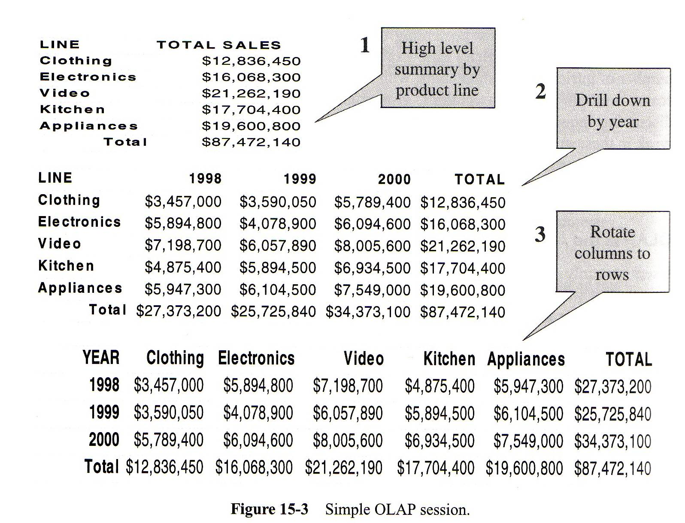
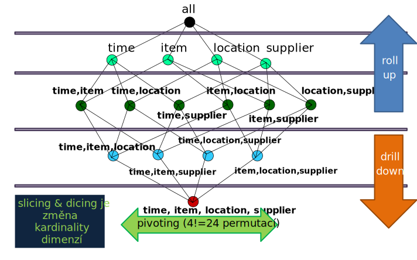

<!-- .slide: class="section" -->

<header>
	<h1>OLAP</h1>
	
Operace nad datovou kostkou

</header>

---

# On-Line Analytical Processing (OLAP)

- Analytické zpracování údajů v datovém skladu podle uživatelských dotazů
- Uživatel **interaktivně prozkoumává** multidimenzionální data
- Základní operace:
    - **Roll-up** – vyrolování (vzrůst úrovně agregace)
    - **Drill-down** – zavrtání (snížení úrovně agregace)
    - **Pivoting** – přetočení (změna uspořádání dimenzí)
    - **Slicing & Dicing** – seříznutí (výběr projekce)

---

# Příklad komplexní analýzy

- _Propad zisku podniku_ → sekvence dotazů:
    1. Celosvětové měsíční prodeje za posledních 5 měsíců
    2. Přehled měsíčních prodejů po regionech → _velký propad v Evropě_
    3. Přehled prodejů v Evropě po zemích → _velký propad ve třech zemích_
    4. Přehled prodejů po zemích a produktech
    5. Přehled přímých a nepřímých nákladů → _nepřímé náklady se zvýšily_
    6. Závěr: **vyšší daň v EU na některé produkty**

---

# Prohlížení datové kostky

<!-- .slide: class="normal centered" -->

 <!-- .element: style="height:500px;" -->

- Vizualizace, operace, interaktivní manipulace

---

# Operace Roll-up

- **Posun o jednu úroveň výše** v uspořádání kuboidů – _vzrůst agregace_
- Vstup: $m$ aktivních dimenzí $\\{A_1, A_2, \dots, A_i, \dots, A_m\\}$
- Výstup: $m-1$ aktivních dimenzí ($A_i$ bylo deaktivováno)
- Nejčastěji se deaktivuje **nejmenší dimenze** $A_m$

Příklad: (time × item × location) → roll-up → (time × item)

---

# Operace Drill-down

- **Posun o jednu úroveň níže** v uspořádání kuboidů – _zvýšení detailu_
- Vstup: $m$ aktivních dimenzí $\\{A_1, A_2, \dots, A_m\\}$, kde $m \leq n$
- Výstup: $m+1$ aktivních dimenzí (přidána neaktivní dimenze $A_i$)
- Nejčastěji se přidá **nejmenší neaktivní dimenze** na konec
- Pro $m = n$ je výsledkem **detail** všech hodnot

---

# Příklad drill-down

<!-- .slide: class="normal centered" -->

 <!-- .element: style="height:550px;" -->

---

# Operace Pivoting

- **Změna uspořádání dimenzí** (změna relace $R$) nad stejnou množinou dimenzí
- Vstup: uspořádání $\\{D_1, D_2, \dots, D_n\\}$
- Výstup: jiné uspořádání $\\{D\_{x_1}, D\_{x_2}, \dots, D\_{x_n}\\}$ – jedna z $n!$ permutací
- Jde o **otočení jedné ze stěn kostky k sobě**

Příklad: (time × item × supplier) → pivoting → (supplier × item × time)

---

# Operace Slicing & Dicing

- **Změna skutečné kardinality** jedné nebo více dimenzí
- Vstup: dimenze $\\{D_1, \dots, D_n\\}$ s kardinalitami $k_1, \dots, k_n$
- Výstup: stejné dimenze, ale změněná kardinalita $k_i \to l_i$ vybrané dimenze
- Provádí se nastavením **filtru ve tvaru predikátu**
    - Např. „zobraz jen region = Praha" nebo „čas $\in$ Q1 2024"
- Výsledek ovlivňují i filtry neaktivních dimenzí

---

# Přehled operací nad kostkou

| Operace | Efekt | Příklad |
|---------|-------|---------|
| **Roll-up** | Méně dimenzí, vyšší agregace | měsíc → kvartál → rok |
| **Drill-down** | Více dimenzí, větší detail | rok → kvartál → měsíc |
| **Pivoting** | Jiné pořadí dimenzí | čas×produkt → produkt×čas |
| **Slice** | Fixuje hodnotu jedné dimenze | region = Praha |
| **Dice** | Filtr přes více dimenzí | Praha + Q1 + elektro |

---

<!-- .slide: class="normal centered" -->

# Přehled operací nad kostkou

 <!-- .element: style="height:800px; margin-top: -1em" -->

---

# Požadavky na OLAP systémy

- Poskytování **agregačních funkcí** podle hierarchií dimenzí
- Možnost **detailního pohledu** (drill-down) na data
- Jednoduché kalkulace (výpočet zisku = prodeje – náklady)
- Sdílení kalkulací pro procentuální vyjádření vůči celku
- **Algebraické rovnice** pro klíčové indikátory výkonnosti (KPI)
- Analýza trendů statistickými metodami
