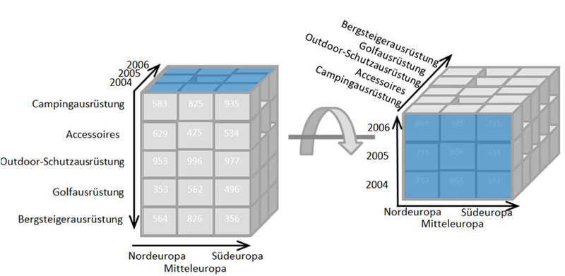

Online Analytical Processing
& Business Intelligence

---

# **data, informace, znalosti -**
**zopakování**

---

# Data
- hodnota schopná přenosu, uchování, interpretace či zpracování
- z hlediska IT jde o **_hodnoty_** různých **_datových typů_**
- data sama o sobě **_nemají sémantiku_** (význam), jsou to věty nějakého formálního jazyka určující **_syntaxi_** 
- hodnoty dat obvykle udávají **_stav_** nějakého systému

zdroj: studijní opora: Pojem informačního systému, Data, Procesy, Transakce

---

# Informace
- **_informace_** jsou interpretovaná **_data_** lidmi nebo strojově
- po interpretaci mají **_sémantiku_** (význam)
- transformaci dat na informace provádí **_uživatel_**  nebo **_specializovaný systém_**
- je nezbytné zajistit shodnou interpretaci dat u všech uživatelů informace
	- vzdělání, školení, zavedení konvencí, **_ontologie_**

zdroj: studijní opora: Pojem informačního systému, Data, Procesy, Transakce

---

# Znalosti
- informace zařazená do souvislostí (často s redukovaným množstvím dat)
- interpretace je však ještě hůře definovatelná, neboť může jít o agregace informací
- znalosti chápeme často jako **_sekundární odvozené_** **_informace_** 
- některé informační systémy se zabývají pouze **_informacemi (transakční - OLTP)_****,** některé pracují se **_znalostmi  a velkými daty (pro podporu rozhodování a plánování – OLAP)_**
- **_znalosti_** jsou často získávány operacemi nad **_velkými daty_** _(agregace, data_ _mining__, apod.)_
- 

zdroj: studijní opora: Pojem informačního systému, Data, Procesy, Transakce

---

# **Datové sklady a** **On-Line** **Analytical** **Processing** **(OLAP)**
**BusinesS** **intelligence**

---

# Pyramidové schéma

analytické

technologie **podpora** **rozho****-dování**

**_business_** **_intelligence_**

pevný

stav

databáze

dotazy

 ad hoc

transakční technologie

proměnný stav 

**_OLTP_** – on-line transaction processing

pracovníci

střední management

vyšší management

ředitelská úroveň

primárně plánování

primárně  izomorfní sledování

MIS – management information systems

primárně řízení

EIS

DSS –  decision support systems

zdroj: Wikipedie: information systems

agregování **_OLAP_**

datové sklady

dolování dat

big data

detaily

---

# Motivace, příklady
- manager potřebuje vědět, kterým klientům může nabídnout po telefonu úvěrovou kartu, u kterých klientů je vysoké riziko odchodu ke konkurenci
- manager potřebuje znát vývoj tržeb za posledních třicet dní v členění dle regionů a produktů či jak se liší skutečný výkon společnosti od plánovaného

---

# Pojem **_business_** **_intelligence_**
- procesy, technologie a nástroje potřebné k **_přetvoření dat a informací do znalostí_** pro podporu rozhodování na různých úrovních
- 
- **_Vstup_**: velké objemy (big data) primárních (produkčních) dat
- **_Výstup_**: znalosti, které lze využít v procesu rozhodování
- 

---

# Prostředky **_business_** **_intelligence_**
- **_Datové sklady_** (**_data_** **_warehouses_**)
-  systém převodu a uložení dat pro analýzu, definovaní formálního modelu dat
- **_OLAP_** (**_On-line_** **_Analytical_** **_Processing_**)
- rozhraní pro manipulaci s modelem a zpřístupnění výsledků uživateli a dalším aplikacím
- **_Data_** **_Mining_** (**_dolování dat_**)
- 

viz specializovaný kurz  Získávání znalostí z databází          

---

# **Datové sklady**
**(DATA WAREHOUSES)**

---

# Pojem datového skladu - slovně
- Podnikově strukturovaný depozitář **_subjektově orientovaných, integrovaných, časově proměnlivých, historických dat_** použitých na získávání **_znalostí_** a podporu rozhodování
- obsahuje operační i agregovaná data.

---

# Pojem datového skladu
- **_Datovým skladem_** nazýváme  technologii 
	- natažení (extrakce a transformation)
	- uložení (loading) a
	- poskytování
	
dat pro **_podporu_** **_rozhodování prováděnou analýzou informací_** _a vytvářením_ **_znalostí_**
- je typicky provozován **_odděleně_** od základní **_operační databáze_** (též **_databáze detailů_** nebo **_produkční databáze_**)

- 

---

# Rámcová architektura datového skladu

klient

klient

datový sklad

zdroj

zdroj

zdroj

dotazy a analýza

ETL

metadata

---

# Nevhodnost produkčních databází jako datových skladů
- slouží především pro **_ukládání_** primárních detailních dat **_izomorfního_** **_modelu (modelování reálného systému)_**
- výsledkem vesměs pevného počtu dotazů jsou především data explicitně uvedená v databázi bez dalších agregačních úprav
- výhodné především pro **_jednoduché transakce_** (vkládání, mazání…) - OLTP, naopak  **_nevhodné pro složitější analýzu velkých dat_**

---

# Nevhodnost produkčních databází jako datových skladů
- obvykle **_decentralizovanost_** systémů OLTP
	- data potřebná pro analýzu jsou většinou **_uložena v různých heterogenních DB na různých serverech_**, není většinou k dispozici integrovaný zdroj údajů a je složité tato data integrovat a homogenizovat
- **_nehomogenní struktura údajů_** – různé názvy vlastností, datové typy…
- nevhodnost technologie pro analýzy pro standardní výpočtové prostředky a modely

---

# Nevhodnost produkčních databází jako datových skladů
- degradace výpočetního výkonu databázového stroje – neustále **_se opakujícími stejnými agregačními výpočty_**
- případně nejsou uchovávány historické údaje – uchovávají se zpravidla **_pouze aktuální data_**

---

# Vhodný model = vícerozměrnost
- aby bylo možno provádět komplexní analýzu a vizualizaci, jsou data v datovém skladu typicky modelována **_multidimenzionálně_**.
- jiný datový model, nežli relační
- klade důraz na **_strukturu pro budoucí dotazy ad hoc vyžadující agregační a statistické výpočty_**

---

# Multidimenzionální databáze
- slouží jako platforma pro získání **_agregovaných údajů_**
- výpočty, které by se případně opakovaně prováděly, **_mohou být spočteny předem a uloženy (materializovány)_** z důvodu rychlého přístupu k agregovaným datům – zapojení učících algoritmů
- redundance zde není tak podstatným problémem (data jsou **_read-only_**, **_nevzniká problém udržování konzistence a vícenásobného přístupu_**)

---

# **Definice multidimenzionálního modelu**

---

# **DIMENZE**

---

# Dimenze
- **_Dimenze_** je **_uspořádatelná_** množina hodnot **_diskrétního_** základního typu (integer, výčet, čas)  nebo množina jejich struktur **_hierarchicky organizovaných_**

location_key

street

city_key

Umístění

city_key

city

province_or_street

country

Město

zdroj: http://www.csi.ucd.ie/staff/jcarthy/home/DataMining/DM-Lecture02-01.ppt

zde hierarchická
(dvouúrovňová)
dimenze umístění

---

# Dimenze příklady

leden

únor

březen

duben

…

prosinec

kabáty

kalhoty

bundy

čepice

…

trička

Brno

jednorozměrné

Praha

Ostrava

Plzeň

…

Olomouc

hierarchické

leden

únor

…

prosinec

leden

únor

…

prosinec

leden

únor

…

prosinec

2000

2001

2002

…

2015

čas

katalog

místo

čas

---

# Definice multidimenzionální kostky
- Nechť existuje **_uspořádaná množina_** **_n_** **_dimenzí_** {_D__1_, _D__2_, _D__3_, …  ,_D__n_}
- _tj. existuje_ **_relace_**  **_uspo_****_řádání_**  **_R_**  _(__<__) nad množinou dimenzí_
- 
- 

čas

katalog

místo

---

# Definice multidimenzionální kostky
- _počet různých prvků_ relace _R_ je _n__!_ (počet **_permutací_** nad _n_, počet různých uspořádání)
- je to také **_počet stěn n-dimenzionální kostky_**. Proto má **_3D kostka na vrhcáby_** 6, tj. 3! stěn a dvoudimenzionální čtverec 2, tj. 2! stěn.
- 

čas

katalog

místo

čas

místo

katalog

katalog

čas

místo

katalog

místo

čas

místo

katalog

čas

místo

čas

katalog

1

2

3

4

5

6

---

# Definice multidimezionální kostky
- Nechť existuje **_uspořádaná podmnožina aktivních dimenzí_**  {_A__1_, _A__2_, _A__3_, …  , _A__m_}, kde _m_<=_n__,_
_A__1_ =_D__i1_, _A__2_ = _D__i2_, _A__3_ = _D__i3_, …  , _A__m_ = _D__im_ a
_D__i1_ < _D__i2_ < _D__i3_ < … < _D__im_

- 

---

# Definice multidimezionální kostky
- Aktivní dimenze budou uspořádány stejně jako v původní množině všech dimenzí
- 

čas

katalog

místo

příznak

firma

výrobce

D

čas

katalog

místo

firma

A

---

# **zopakování** **PojmŮ** **AgregacE** **a agregačních funkcí**

---

# Shlukování, agregace

shlukování
agregace
rozhodo-
vání
na základě

agregátů
statistické
výpočty
úsporné zobrazování
grafy
dashboardy

detailní
hodnoty
evidence
detailů

OLTP – on-line transaction processing

pracovníci

střední management

vyšší management

ředitelská úroveň

MIS – management information systems

EIS

DSS –  decision support systems

---

# Agregace
- **_agregace_** (z lat. _ad_-, při- a _grex__,_ _gregis_, stádo) znamená připojení, přičlenění, případně také **_shrnutí či shlukování_**.
- **_agregační funkce_** – shlukující **_několik (množinu obvykle číselných) údajů_** do **_jediné hodnoty_** jistou **_agregační funkcí_**
- **_agregát_** – výsledek agregace, spojení několika strojů, hodnot a pod.
- 

zdroj: Wikipedie: http://cs.wikipedia.org/wiki/Agregace

---

# Agregační funkce
- **_Agregační funkce_** jsou funkce, které shlukují (různým výpočtem) dohromady množiny hodnot do jediné hodnoty
- Obecně známé jsou:
- **_počet_**
- **_součet_**
- aritmetický **_průměr_** (nadále je aritmetický průměr a průměr synonymum)
- **_maximum_**
- **_minimum_**
- Méně známé jsou:
- **_medián_**
- **_modus_**

zdroj: Wikipedie: http://en.wikipedia.org/wiki/Aggregate_function

---

# Modus
- Modus je hodnota, která se vyskytuje v množině hodnot nejčastěji. 

---

# Medián
- prostřední hodnota oddělující horní a dolní polovinu uspořádané datové množiny

---

# Porovnání průměru, mediánu a modu

---

# Definice multidimezionální kostky
- **_Multidimenzionální kostka_** je funkce  **_g_**_m_ (_A__1_ x _A__2_ x _A__3_ x …x _A__m_) = **_F_**, kde _f_**_Î_** **_F_** nazýváme **_fakt (míra,_** **_measure_****_)_** _a_ _A__1_ x _A__2_ x _A__3_ x …x _A__m_ je **_kartézský součin_** dimenzí. 
- **_Fakt_** **_(míra,_** **_measure_****_)_** je libovolná **_agregovatelná_** hodnota (lze ji sčítat, průměrovat, řetězit apod.), tedy existují kostky počtů, aritmetických průměrů, součtů apod.

zdroj: studijní opora: Matematické základy modelování informačních systémů

---

# Definice multidimenzionální kostky

čas

katalog

místo

fakt-metrika

---

# **ZOPAKOVÁNÍ - SVAZ**

---
			
# Částečně uspořádaná množina
- **_Částečně uspořádaná množina_** se skládá z množiny _S_ a relace částečného uspořádání  £. Obvykle ji, ale současně někdy také její graf, označujeme [_S_; £].

---

# Přímý předchůdce, přímý následník
- Nechť [_S_; £] je částečně uspořádaná množina. Pak prvek _a_ nazveme **_bezprostředním_** (nebo také **_přímým_**) **_předchůdcem_** prvku _b_, pokud
_a_ £ _b_ a neexistuje takový prvek _c_, pro který by platilo _a_ £ _c_ £ _b._ Relaci bezprostředního (přímého) předchůdce označujeme symbolem <. Inverzní relaci k nazýváme **_bezprostředním_** (**_přímým_**) **_následníkem_**.
- 

---

# Přímý předchůdce,  přímý následník
- Relace bezprostředního předchůdce není **_ani reflexivní, ani symetrická, ani tranzitivní_**.
- Relace přímého předchůdce je také podmnožinou původní relace částečného uspořádání. 
- 

---

# Hasseův diagram

3

5

15

1

30

10

6

2

60

20

12

4

Množina _A_ = { 1, 2, 3, 4, 5, 6, 10, 12, 15, 20, 30, 60 } všech dělitelů čísla 60 je částečně uspořádaná podle dělitelnosti 

---
			
# Maximální a minimální
- Prvek _max_ Î [_S_; £] se nazývá **_největší_** _(_**_maximální_**_)_, pokud neexistuje prvek _a_ Î [_S_; £] různý od _max_, pro který by platilo platí _max_£ _a_. Podobně se pro inverzní relaci ³ definuje **_nejmenší_** _(_**_minimální_**_)_  prvek _min_.

---

# Univerzální horní a dolní ohraničení
- Prvek _I_ Î [_S_; £] se nazývá **_univerzální_** **_horní ohraničení_**, pokud pro všechny _a_ Î [_S_; £] platí _a_ £ _I_. Podobně se pro inverzní relaci  ³ definuje **_univerzální_** **_dolní ohraničení_** prvek _O_.

---

# Příklad univerzálního dolního ohraničení

_1_

_4_

_6_

_8_

_12_

_2_

_3_

_1_

_4_

_6_

_8_

_12_

_2_

_3_

maximum 12, univerzální neni

minimum 1, univerzální je

---

# Univerzální horní a dolní ohraničení
- Konečná částečně uspořádaná množina má vždy maximální a minimální prvek. Nemusí ovšem mít horní, resp. dolní univerzální ohraničení. 
- částečně uspořádaná množina z předchozího obrázku Hasseova diagramu má univerzální dolní ohraničení (tj. prvek 1), ale nemá horní univerzální ohraničení (ale má maximální prvek 12).

---
			
# Spojení

# 
- Nechť _a_, _b_ jsou prvky částečně uspořádané množiny _a, b_ Î [_S_; £]. **_Spojením_** prvků nazýváme prvek _c_, pro který platí _a_ £ _c_  a _b_ £ _c_  a neexistuje prvek _x_ Î (_S_ – {_c_}) takový, že _a_ £ _x_  £ _c_  a také _b_ £ _x_  £ _c._ Pokud dva prvky mají **_jediné spojení_**, hovoříme o **_nejmenším horním ohraničení_** a označujeme jej _a_ Ú _b_.

---

# Průsek
- Nechť _a_, _b_ jsou prvky částečně uspořádané množiny _a,b_ Î [_S_; £]. **_Průsekem_** prvků nazýváme prvek _d_, pro který platí _d_ £ _a_  a 
_d_ £ _b_ a neexistuje prvek _x_ Î (_S_ – {_d_}) takový, že _d_ £ _x_ £ _a_  a také _d_ £ _x_ £ _b._ Pokud dva prvky mají **_jediný průsek_**, hovoříme o **_největším dolním ohraničení_** a označujeme jej _a_ Ù _b_.
- 

---

# Spojení a průsek
- Spojení _e_ dvou libovolných prvků _a_ a _b_ z konečné uspořádané množiny [_S_; £] zjistím poměrně snadno z Hasseova diagramu. 
- Skutečnost, že _a_ £ _e_ znamená, že existuje řetězec hran vedoucích vzhůru z _a_ do _e_.  
- To stejné platí i pro _b_ £ _e. e_ je potom společným prvkem ležícím na obou řetězcích takový, že žádný jiný nemá takovou vlastnost. 
- Z toho také pochází i název spojení. Spojení dvou prvků _a_ a _b_ je takový vrchol, který poprvé spojí řetězce hran vedoucí vzhůru vycházející z prvků _a_ a _b_. 

---

# Spojení pomocí Hasseova diagramu

_a_ Ú _b_

_a_

_c_

_b_

_a_ Ú _c_

---

# Svaz
- **_Svaz_** (anglicky **_lattice_**, což je anglicky mřížka a souvisí to s podobou Hasseova diagramu pro svaz) je 
- **_částečně uspořádaná množina_** [_S_; £] 
- každé dva prvky mají **_jediné spojení a jediný průsek_**. 
- svaz označujeme [_S_, Ú , Ù ].

- 

---

# Příklad svazu dělitelnosti

3

5

15

1

30

10

6

2

60

20

12

4

---

# Příklad svazu
- každá dvojice prvků má jediné spojení a jediný průsek. 
- množina _A_ = { 1, 2, 3, 4, 5, 6, 10, 12, 15, 20, 30, 60 } společně se spojením **_nejmenší společný násobek_** a průsekem **_největší společný dělitel_** je **_svazem_**.
- 

---

# **zpět k multidimenzionálnímu modelu**

---

# Definice multidimezionální kostky
- **_Podkostky_** **_(_****_kuboidy_****_)_** odvozené od jednoho uspořádání dimenzí tvoří **_poset_**  aneb **_částečně uspořádanou množinu_**.

zdroj: studijní opora: Matematické základy modelování informačních systémů

---

# Částečně uspořádaná množina podkostek
- Poset nad podkostkami kostky **_g_** je definován následovně: 
**_g_**_m_ (_A__1_x _A__2_x _A__3_ x …x _A__i_ x …x _A__m_) 
≤ 
**_g_**_m-1_ (_A__1_x _A__2_ x _A__3_ x …x _A__m-1_)
- Podkostka je přímo větší, pokud má o jednu méně dimenzí a ostatní jsou uspořádány stejně v obou podkostkách

---

# Příklad podkostek a relace **£**

time

time

item

location

supplier

**£**

item

supplier

item

supplier

item

prázdná množina je pouze jediná

**£**

**£**

**£**

time

item

location

ale taky

atd.

ale taky

time

supplier

atd.

ale taky

supplier

**£**

**£**

tady to dále pokračuje a tvoří to strukturu svazu

**£**

**£**

**£**

---

# Částečně uspořádaná množina podkostek
- **_Multidimenzionální_** **_podkostky_** pro jedno uspořádání dimenzí a jednu agregační funkci tvoří **_svaz_** 

---

# Svaz podkostek
- Co je to **_svaz_** viz také
- 
- **_Univerzální horní ohraničení_** - vrcholová podkostka **_all_**
- **_Univerzální dolní ohraničení_** - základní kostka 

**_g_****_n_** _(__D__1_ _x_ _D__2_ _x_ _D__3_ _x_ _…_  _x_ _D__n__)_

zdroj: studijní opora: Matematické základy modelování informačních systémů

---

# Svaz podkostek kostky **_g_**_n_
- **_Průsek_**  _˄_  
**_g_**_m_(_A__1_ x _A__2_ x _A__3_ x …x _A__i_ x … x _A__m_)˄ 
**_g_**_m_(_A__1_ x _A__2_ x _A__3_ x … x _A__j_ x … x _A__m_) = 
**_g_**_m+1_(_A__1_ x _A__2_ x _A__3_ x …x _A__i_ x … x _A__j_ x … x _A__m+1_) 
- **_Spojení_** _˅_  
**_g_**_m_(_A__1_ x _A__2_ x _A__3_ x … x _A__i_ x … x _A__m_) ˅
**_g_**_m_(_A__1_ x _A__2_ x _A__3_ x … x _A__j_ x … x _A__m_) = 
**_g_**_m-1_(_A__1_ x _A__2_ x _A__3_ x … x _A__m-1_)
- 

zdroj: studijní opora: Matematické základy modelování informačních systémů

---

# Kostka jako svaz kuboidů

all

time

item

location

supplier

**time,item**

**time,location**

**time,supplier**

**item,location**

**item,supplier**

**location,supplier**

**time,item,location**

**time,item,supplier**

**time,location,supplier**

**item,location,supplier**

**time, item, location, supplier**

**0****D** **(****vrchol****ový****)** **k****uboid**

**1****D** **k****uboid****y**

**2****D** **k****uboid****y**

**3****D** **k****uboid****y**

**4****D** **(z****ákladní****)** **k****uboid**

zdroj: http://www.csi.ucd.ie/staff/jcarthy/home/DataMining/DM-Lecture02-01.ppt

pořadí dimenzí v kuboidech se nemění 

---

# Model multidimenzionální kostky
- Každá dimenze _A__i_ má **_možnou_** **_kardinalitu_** danou _datovým typem dimenze_ (i nekonečnou) a **_skutečnou kardinalitu_** **_k_****_i_**  (tj. skutečný počet prvků dimenze daný **_existujícími ohodnocenými fakty_**)
- Proto bude výsledná kostka "**_vykotlaná_**", tj. **_řídká_** **_n-rozměrná matice_**.

---

# Multidimenzionální kostka jako řídká matice

_time_

_item_

_supplier_

---

# 3D kostka - příklad 3! otočení
- Princip multidimenzionální kostky
- 
- 
- 
- 
- 
- 
- 
- 
- 

je možný i produkt, čas, region - čas, produkt, region a region, čas, produkt

Produkt

Region

Čas

Region

Produkt

Produkt

Čas

Analýza údajů

pro určitý produkt-

produkt, region, čas

Čas

Region

Analýza pro určité

časové období - 

čas, region, produkt

Analýza údajů podle

regionálních kritérií - 

region, produkt, čas

---

# Neagregované - detailní hodnoty
- Předpokládejme, že existuje _n_ dimenzí {_D__1_, _D__2_, _D__3_, …  ,_D__n_}
- Každá z _n_ dimenzí má **_skutečnou kardinalitu_** **_k_****_i_** prvků pro všechna 1 … _i_… _n_.
- Fakt dané kostky pro agregační funkci **_agr_**_,_  **_detail_** (_D__1_ x _D__2_ x _D__3_ x …x _D__n_) = **_F_** _,_ kterou je existující hodnota na průsečíku hodnot dimenzí (_d__1_, _d__2_, _d__3_, …  ,_d__i_) nazveme detailní hodnotou nebo **_detailem_**_._ 

---

# Kostky počet, součet a průměr
- Uvažujme nyní výpočet funkcí (multidimenzionálních kostek) 
- **_počet_**, 
- **_součet_**_,_  
- **_průměr_** 
- pro uspořádanou podmnožinu aktivních dimenzí {_A__1_, _A__2_, _A__3_, …  ,_A__m_}  a dané uspořádání dimenzí  {_D__1_, _D__2_, _D__3_, …  ,_D__n_}.

---

# První krok agregace detailů
- Pro dané uspořádání dimenzí  {_D__1_, _D__2_, _D__3_, …  ,_D__n_}  platí pro jednotlivé podkostky **_počet_****_i_**, **_součet_****_i_** a **_průměr_****_i_** (_d__1_, _d__2_, _d__3_, …  ,_d__i_)  a detailní hodnoty **_h_** ohodnocené hodnotami všech dimenzí (_d__1_, _d__2_, _d__3_, …  ,_d__n_):
- **_součet_****_n_**(_d__1_, _d__2_, _d__3_, …  ,_d__n_) = **S** **_detail_** (_d__1_, _d__2_, _d__3_, … ,_d__n_)
- **_počet_****_n_**(_d__1_, _d__2_, _d__3_, …  ,_d__n_) = **S** **_1_** přes všechny hodnoty  **_detail_** (_d__1_, _d__2_, _d__3_, … ,_d__n_) s týmiž hodnotami dimenzí
- **_průměr_****_n_** (_d__1_, _d__2_, _d__3_, …  ,_d__n_)  = 
**_součet_****_n_**(_d__1_, _d__2_, _d__3_, …  ,_d__n_) / **_počet_****_n_**(_d__1_, _d__2_, _d__3_, …  ,_d__n_) 

---

# Podkostky
- Potom pro dané uspořádání **_n_** > **_m_** _>=_ **_0_** dimenzí  {_A__1_, _A__2_, _A__3_, …  , _A__m_} platí pro příslušné podkostky **_počet_****_m_**, **_součet_****_m_** a **_průměr_****_m_**  a jejich přímé následníky _m+1_ v částečném uspořádání  {_A__1_, _A__2_, _A__3_, … , _A__i_, … ,_A__m_} :
- **_součet_****_m_**(_d__1_, _d__2_, _d__3_, …  ,_d__m_) = **S** **_součet_****_m_****_+1_**(_d__1_, _d__2_, _d__3_, … ,_d__i_ , … ,_d__m_) přes všechny hodnoty z _D__i_
- **_počet_****_m_**(_d__1_, _d__2_, _d__3_, …  ,_d__m_) = **S** **_počet_****_m_****_+1_**(_d__1_, _d__2_, _d__3_, … ,_d__i_ , … ,_d__m_) přes všechny hodnoty z _D__i_
- **_průměr_****_m_** (_d__1_, _d__2_, _d__3_, …  ,_d__m_)  = 
**_součet_****_m_**(_d__1_, _d__2_, _d__3_, …  ,_d__m_) / **_počet_****_m_**(_d__1_, _d__2_, _d__3_, …  ,_d__m_) 

---

# Příklad detailních hodnot

22.6.

rohlík

Brno

time

item

location

fakt

22.6.

rohlík

Praha

6

22.6.

rohlík

Brno

12

22.6.

rohlík

Brno

4

3

22.6.

rohlík

Praha

16

22.6.

párek

Brno

9

22.6.

párek

Praha

21

23.6.

rohlík

Brno

5

23.6.

rohlík

Praha

14

více hodnot  faktů pro stejné hodnoty dimenzí

22.6.

párek

Brno

4

hodnoty dimenzí seřazeny např. vzestupně podle uspořádání

94

celkový součet se nemění

---

# První krok pro kostku **_součet_**

time

item

location

fakt

22.6.

rohlík

Brno

19

22.6.

rohlík

Praha

22

22.6.

párek

Praha

21

23.6.

rohlík

Brno

5

23.6.

rohlík

Praha

14

22.6.

párek

Brno

13
- není více hodnot  faktů pro stejné hodnoty dimenzí
- neubylo dimenzí

94

---

# Podkostka **_součet_** bez dimenze location

time

item

fakt

22.6.

rohlík

41

23.6.

rohlík

19

22.6.

párek

34

94

---

# Podkostka **_součet_** bez dimenze item

time

fakt

23.6.

19

22.6.

75

94

---

# Podkostka **_součet_** bez dimenzí

fakt

94

94

při nulovém počtu dimenzí jde o celkový agregát

---

# Jiné pořadí dimenzí v prvním kroku

time

item

fakt

22.6.

rohlík

22

22.6.

párek

21

23.6.

rohlík

5

23.6.

rohlík

14

22.6.

párek

13

94

22.6.

rohlík

19

location

Praha

Praha

Brno

Praha

Brno

Brno

---

# Podkostka **_součet_** bez dimenze item

time

fakt

22.6.

43

23.6.

5

23.6.

14

22.6.

32

94

location

Praha

Brno

Praha

Brno

---

# **Vlastnosti datového skladu**

---

# Orientace podle dimenzí
- Fakta jsou zapisována podle vlastností vyjádřeného průsečíkem **_n-dimenzí_**

---

# Integrace příklad

Fakt datového
skladu 
**_účet_** organizovaný
podle dimenzí 
(majitel, čas, apod.)

Spořicí účty

Běžné účty

Úvěrový účet

Data z různých zdrojů

Integrace, čištění

---

# Integrace
- data týkající se konkrétního předmětu se ukládají **_pouze jednou_**
	- jednotná terminologie, jednotky veličin
- vytvořen případně **_integrací_** několika heterogenních zdrojů dat - relační databáze, textové soubory, on-line transakce
	- problém nekonzistentních zdrojů dat
- nutnost **_úpravy, vyčištění a sjednocení_** (integrace) vstupních dat
	- je nutné ověřit konzistenci v pojmenování proměnných, jejich struktury a jednotkách pro různé zdroje dat

---

# Čas
- klíčový atribut (**_lineární, uspořádaný a spojitý_**), vhodný na spojité grafy
- Časový horizont datového skladu je zpravidla podstatně delší než u produkční databáze
	- Produkční databáze: pouze současně aktuální data
	- Data v datovém skladu: poskytují informace z historické perspektivy (např. posledních 5-10 let)
- Každá klíčová struktura v datovém skladu
	- obsahuje čas, explicitně nebo implicitně
	- klíč u produkčních dat nemusí vždy obsahovat čas

---

# Neměnnost

Produkční
 databáze

Datový

sklad

Aplikace nad produkční DB

Systém pro podporu rozhodování

pouze

čtení

vkládání

čtení, zápis, 
změna, zrušení

---

# Neměnnost
- zpravidla **_fyzicky oddělené_** uložení dat transformovaných z produkčních databází
- v datových skladech se data **_nemění_**, manipulace s daty je tedy jednodušší.
	- dva typy operací: **_vkládání_** dat a **_čtení_** dat
	- optimalizace a normalizace ztrácí smysl
	- **_nepotřebuje se_** zpracování **_transakcí_**, zotavení, mechanismy **_pro řízení souběžného přístupu_**

---

# Produkční databáze x datový sklad
- **_Uživatelé a orientace systému_**: 
	- běžný uživatel x **_manager_**
- **_Datový obsah_**: 
	- současná, detailní x **_historická, sloučená_**
- **_Návrh databáze_**: 
	- ER model + aplikace x **_multidimenzionální kostka, dimenze, fakta_**
- **_Pohled na data_**: 
	- aktuální, lokální x **_agregovaný_**
- **_Přístupové vzory_**: 
	- jednoduchá aktualizace x **_read-only, komplexní dotazy_**

---

# Porovnání vlastností

---

# Shrnutí požadavků na datový sklad
- schopnost **_agregace_**
- databáze navržená pro **_analytické_** dotazy
- možnost **_integrovat_** data z více aplikací
- častá operace **_čtení_** z databáze
- nahrání dat po určité časové periodě
- možnost využití **_současných i historických dat_**

---

# Celkové schéma datového skladu

produkční prostředí

uživatelé

OLAP

Extrakce

Transformace

Zavedení (Loading)

ETL

datový sklad

Získání údajů -> úprava a zavedení do datového skladu 

-> analýza -> zpřístupnění uživatelům

---

# Architektura datového skladu
- 3 hlavní části
- **_Získání dat_**
	- Zdrojová data + místo přípravy dat (**_ETL_**)
- **_Uložení dat (datová kostka)_**
	- Datový sklad + datové trhy + uložení metadat
- **_Předávání výsledků_**
	- přes model multidimenzionální databáze samotné získání informací (**_OLAP_**, data mining, tiskové sestavy atd.)

---

# Získání dat
- **_extrahování dat_** z mnoha produkčních databází a externích zdrojů
- čištění, transformování a integrování těchto dat - **_Extraction_****_,_** **_Transformation_****_, Loading - ETL_**
- **_periodick_****_é_** **_doplňování_** datového skladu tak, aby odrážel změny v produkčních databázích a přenos dat z datového skladu, nejčastěji do pomalejší archivní paměti.
- 

---

# Uložení dat
- Jde o oddělené skladiště pro uložení velkého množství především historických dat
- Je navrženo **_pro analýzu_**, ne pro rychlý přístup k datům
- **_read-only_**
- Musí být přístupné pro více druhů nástrojů – odpovídající rozhraní

---

# Předávání výsledků
- OLAP 
- a jiné prostředky
- dotazovací,
- generátory zpráv,
- analytické a
- prostředky **_dolování dat_** (**_data_** **_mining_**).

---

# Architektury serveru OLAP
- **_Multidimen_****_zionální_** **_OLAP (MOLAP_**) 
	- Multidimenzionální paměťový stroj založený na polích (array) - techniky řídkých matic
	- Rychlé indexování předzpracovaných agregovaných dat
- **_Relační_** **_OLAP (ROLAP)_** 
	- Užívá relační nebo rozšířená relační SŘBD
	- Zahrnují optimalizaci back-endu SŘBD, implementaci agregační navigační logiky a dodatečných pomůcek a služeb
	- Velká možnost škálování
- **_Hybrid_****_ní_** **_OLAP (HOLAP)_**
	- Uživatelská flexibilita kombinující obě předchozí metody
- **_Specializ_****_ovaný_** **_SQL server_**
	- specializovaná podpora pro SQL dotazy nad schématy hvězda/sněhová vločka

zdroj: http://www.csi.ucd.ie/staff/jcarthy/home/DataMining/DM-Lecture02-01.ppt

---

# Multidimezionální OLAP (MOLAP)
- Data se ukládají do vlastních datových struktur
- Databáze konstruována pro rychlé vyhledávání údajů
- **_Výhoda:_** maximální výkon
- **_Nevýhoda:_** redundance údajů, velké prostorové nároky

---

# Relační databázový OLAP (ROLAP)
- Údaje jsou získávány z **_relačních tabulek_**, jsou uživateli předkládány jako multidimenzionální pohled
- Data jsou uložena jako záznamy relační tabulky
- Žádná redundance

---

# **konceptuální Návrh datového skladu**

---

# Fakta (míry) a dimenze
- Navrhujeme v relačním modelu - tabulky
- Každá datová kostka obsahuje 2 typy údajů – **_fakta (míry)_** a **_dimenze_**
- **_Fakta_**
	- Největší relace v DB, zpravidla jen jedna
	- Obsahuje numerické měrné jednotky obchodování
	- V kombinaci s relacemi dimenzí tvoří základní schémata

---

# Fakta a dimenze
- **_Dimenze (číselníky)_**
	- logicky nebo hierarchicky uspořádané údaje
	- textové popisy obchodování
	- jsou menší a nemění se tak často
	- nejčastěji: časové, geografické a produktové dimenze (stromové struktury)

Kontinent

   Země

      Územní celek

         Město

Druh produktu

   Kategorie

      Subkategorie

         Název produktu

Rok

   Kvartál

      Měsíc

         Týden

---

# Konceptuální modelování kostky
- **Schéma hvězdy** - **_jedna tabulka faktů_** je ve středu připojena k množině relací dimenzí
- **Schéma sněhové vločky** - zjemnění schématu hvězdy, kde existuje **_hierarchie dimenzí_** normalizovaná do množiny navázaných relací dimenzí
- **Konstelace faktů** - více relací faktů, které sdílejí relace dimenzí - je možné chápat jako kolekci hvězd, proto se také někdy nazývá **_schéma galaxie_**

---

# Schéma hvězdy - star
- Každá relace dimenze sestává z množin, které odpovídají hodnotám dimenze.
- Hvězdicové schéma **_neposkytuje explicitně podporu pro hierarchii atributů_**.
- Lze obejít organizačně

---

# Schéma hvězdy - star
- Relace faktů obsahuje cizí klíče do relací dimenzí, ty se vztahují k jejím primárním klíčům
- Snadno pochopitelné
- Relace dimenzí jsou však nejsou normalizované, je to tedy poměrně pomalé

---

# Příklad schématu hvězda - star

Avg_sales

Euros_sold

Unit_sold

Location_key

branch_key

branch_name

branch_type

time_key

day

day_of_the_week

month

quarter

year

location_key

street

city

province_or_street

country

Míry

item_key

item_name

brand

type

supplier_type

Branch_key

Odvětví

Čas

Položka

Umístění

Relace faktů o prodeji

Item_key

Time_key

zdroj: http://www.csi.ucd.ie/staff/jcarthy/home/DataMining/DM-Lecture02-01.ppt

---

# Sněhová vločka - snowflake
- **_Schéma sněhové vločky_** poskytuje zjemnění hvězdicového schématu tak, že **_hierarchie dimenzí_** je explicitně reprezentována normalizováním relací dimenzí. To vede k výhodné údržbě relací dimenzí.

---

# Příklad schématu sněhová vločka

branch_key

branch_name

branch_type

time_key

day

day_of_the_week

month

quarter

year

Míry

item_key

item_name

brand

type

supplier_key

Odvětví

Čas

Položka

location_key

street

city_key

Umístění

Relace faktů o prodeji

Avg_sales

Euros_sold

Unit_sold

Location_key

Branch_key

Item_key

Time_key

supplier_key

supplier_type

city_key

city

province_or_street

country

Město

Dodavatel

zdroj: http://www.csi.ucd.ie/staff/jcarthy/home/DataMining/DM-Lecture02-01.ppt

---

# **OLAP**

---

# Analýza OLAP

- Analytické zpracování údajů v datovém skladu podle uživatelských dotazů
- 

produkční prostředí

uživatelé

Extrakce

Transformace

Zavedení (Loading)

ETL

datový sklad

OLAP

---

# Příklad komplexní analýzy

Myšlenkový pochod při analýze

Sekvence dotazů při této analýze

Propad zisku

podniku

Celosvětové měsíční prodeje

za posledních 5 měsíců

Přehled měsíčních prodejů 

po regionech 

Přehled prodejů v  Evropě

po zemích

Přehled prodejů v  Evropě

po zemích, po produktech

Přehled přímých a nepřímých

nákladů v evropských zemích

Prodeje OK,

ale nižší zisk

v posl. 3 měs. 

Velký propad

v Evropě

Ve třech zemích

zvýšení, někde 

stagnace, jinde 

velký propad

Velký propad v 

zemích EU za 

2 měsíce

Přímé náklady

OK, nepřímé

se zvýšily

Vyšší daň v EU

na některé

produkty

---

# Požadavky na OLAP systémy (příklady)
- Poskytování **_agregačních_** funkcí podle hierarchií
- Možnost **_detailního pohledu -_** **_zooming_** na data
- Jednoduché kalkulace, např. výpočet zisku (prodeje – náklady)
- Sdílení kalkulací za účelem procentuálního vyjádření vzhledem k celku
- Algebraické rovnice pro výpočet klíčových indikátorů
- Přenos průměrů a procentuálních vyjádření
- Analýza trendů statistickými metodami

---

# Datová kostka 3D příklad

_time_

_item_

_supplier_

---

# **operace nad datovou kostkou**

---

# Prohlížení datové kostky

- vizualizace
- operace
- interaktivní manipulace

zdroj: http://www.csi.ucd.ie/staff/jcarthy/home/DataMining/DM-Lecture02-01.ppt

---

# Operace nad datovou kostkou
- **_roll_****_-_****_up_** – (vyrolování) vzrůst úrovně agregace
- **_drill_****_-_****_down_** (zavrtání) – snížení úrovně agregace a zvýšení detailu
- **_pivot_****_ing_**  (přetočení) – změna relace _R_ pro uspořádání dimenzí
- **_slicing_** **_&_** **_dicing_** (seříznutí) – výběr projekce
- 
- 
- 

---

# Operace nad 4D datovou kostkou

all

time

item

location

supplier

**time,item**

**time,location**

**time,supplier**

**item,location**

**item,supplier**

**location,supplier**

**time,item,location**

**time,item,supplier**

**time,location,supplier**

**item,location,supplier**

**time, item, location, supplier**

roll

up

drill

down

pivoting (4!=24 permutací)

slicing & dicing je změna kardinality dimenzí

zdroj: http://www.csi.ucd.ie/staff/jcarthy/home/DataMining/DM-Lecture02-01.ppt

---

# Roll-up
- **_Posun o jednu úroveň výše v uspořádání_**  **_kuboidů_**
- **_Vstup:_** uspořádaná množina _m_ aktivních dimenzí {_A__1_, _A__2_, _A__3_, … , _A__i_, … , _A__m__-1_ , _A__m_}, kde _m_>=_1_
- **_Výstup:_** uspořádaná množina _m-1_ aktivních dimenzí {_A__1_, _A__2_, _A__3_, …  ,_A__m_} , tj. _A__i_ bylo deaktivováno.
- Nejčastěji se deaktivuje nejmenší dimenze _A__m_, tj. z {_A__1_, _A__2_, _A__3_, … , _A__m_}  vznikne 
{_A__1_, _A__2_, _A__3_, … ,  _A__m__-1_ }

---

# Drill-down
- **_Posun o jednu úroveň níže v uspořádání_** **_kuboidů_**
- **_Vstup:_** uspořádaná množina _m_ viditelných dimenzí {_A__1_, _A__2_, _A__3_, …  ,_A__m_}, kde _m_<=_n_
- **_Výstup:_** uspořádaná množina _m+1_ aktivních dimenzí {_A__1_, _A__2_, _A__3_, … , _A__i_, … , _A__m-1_ , _A__m_}, kde _A__i_  je vybrána z neaktivních _D__i_  tak, aby platila definice aktivních dimenzí
- Nejčastější variantou je přidání nejmenší neaktivní dimenze na konec, tedy vznikne {_A__1_, _A__2_, _A__3_, … , _A__m_ , _A__m__+1_}
- Pro **_m_****=****_n_** bude výsledkem **_detail_** všech hodnot
- Je možné provést i **_zavrtání do základního_** **_kuboidu_**, neboť i jeho fakta jsou agregací detailních hodnot pro  všechny aktivní dimenze

---

# Před operací roll-up

_time_

_item_

_supplier_

---

# Po operaci roll-up (bez dimenze _time_)

_item_

_supplier_

---

# Po operaci roll-up (bez dimenze _item_)

_supplier_

---

# Po operaci roll-up (bez dimenzí)

pokud existuje definovaná hodnota agregační funkce, musí existovat i kostička představující agregovaný fakt

---

# Roll-up nad 4D datovou kostkou

all

time

item

location

supplier

**time,item**

**time,location**

**time,supplier**

**item,location**

**item,supplier**

**location,supplier**

**time,item,location**

**time,item,supplier**

**time,location,supplier**

**item,location,supplier**

**time, item, location, supplier**

roll

up

drill

down

pivoting (4!=24 permutací)

---

# Vyrolovaná datová kostka 3D

all

time

item

location

**time,item**

**time,location**

**item,location**

**time,item,location**

roll

up

drill

down

pivoting (3!=6 permutací)

jedna ze 4 možností (odstraněna nejmenší dimenze)

---

# Vyrolovaná datová kostka 2D

all

time

item

**time,item**

roll

up

drill

down

pivoting (2!=2 permutace)

jedna ze 3 možností (odstraněna nejmenší dimenze)

---

# Vyrolovaná datová kostka 1D

all

time

roll

up

drill

down

pivoting (1!=1 permutace)

jedna ze 2 možností (odstraněna nejmenší dimenze)

---

# Vyrolovaná datová kostka 0D

all

roll

up

drill

down

pivoting (0! =1 permutace)

jediná možnost (odstraněna jediná dimenze)

---

# Příklad použití drill-down

zaktivizována dimenze čas

aktivní dimenze je produkt

mírou je objem prodejů

---

# Pivoting
- **_Změna uspořádání R nad stejnou množinou dimenzí_**
- **_Vstup:_** uspořádaná množina dimenzí {_D__1_, _D__2_, _D__3_, …  ,_D__n_}, kde uspořádání je jedna z možných relací _R_, kterých je _n__!_
- **_Výstup:_** uspořádaná množina dimenzí {_D__x1_, _D__x2_, _D__x3_, …  ,_D__xn_} a obecně jiná relace uspořádání _R_ (jedna z možných _n__!_)
- Jde o **_otočení jedné ze stěn kostky k sobě_**, proto **_pivoting_**.

---

# Příklad otáčení

otáčení (pivoting) kostky

---

# Před operací pivoting

_time_

_item_

_supplier_

---

# Po operaci pivoting

_supplier_

_item_

_time_

---

# Pivoting

zdroj: http://en.wikipedia.org/wiki/OLAP_cube#cite_note-DataCubeGray1995-8

---

# Původní relace _R_

all

time

item

location

supplier

**time,item**

**time,location**

**time,supplier**

**item,location**

**item,supplier**

**location,supplier**

**time,item,location**

**time,item,supplier**

**time,location,supplier**

**item,location,supplier**

**time, item, location, supplier**

pivoting (4!=24 permutací)

---

# Otočená datová kostka

all

location

time

supplier

item

**location****,****time**

**location****,****supplier**

**location****, item**

**time, supplier**

**time, item**

**supplier****,** **item**

**location,** **time,**  **supplier**

**location,** **time,**  **item**

**location,** **supplier****, item**

**time,**  **supplier****, item**

**location,** **time,**  **supplier****, item**

pivoting (permutace)

---

# Slicing and Dicing
- **_Změna skutečné kardinality jedné nebo více dimenzí_**
- **_Vstup:_** uspořádaná množina dimenzí {_D__1_, _D__2_, _D__3_, …  , _D__n_}, kde _k__1_, _k__2_, _k__3_, … , **_k_****_i_**, …,_k__n_  jsou skutečné kardinality jednotlivých dimenzí
- **_Výstup:_** uspořádaná množina dimenzí {_D__1_, _D__2_, _D__3_, …  , _D__n_} a obecně jiné _k__1_, _k__2_, _k__3_, … , **_l_****_i_**, …,_k__n_ _,_ kde _k__i_ _<>__l__i_
- Změnu lze provést výběrem, nastavením **_filtru_** ve **_tvaru predikátu_** apod.
- Výsledek ovlivňují i **_filtry neaktivních dimenzí_**

---

# Před operací slicing and dicing

_time_

_item_

_supplier_

---

# Po operaci provedené výběrem

_time_

_item_

_supplier_

---

# **KONEC**

---
