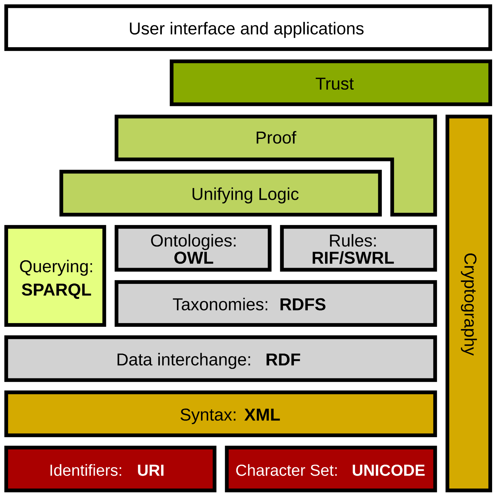

# Sémantický web
- Iniciativa směřující k webu obsahujícím strojově zpracovatelné informace
	- Tim Berners Lee, cca. 1999
- Představa inteligentních aplikací „agentů“ umožňujících využívat informace na webu bez nutnosti číst celé dokumenty
	- Kontextové vyhledávání
	- Doplnění údajů k vyhledávání
	- …

---

# Technické řešení
- Vývoj technologií pro vhodnou reprezentaci dat
	- Možnost sdílení dat i s jejich sémantikou
	- Použitelné technologie jsou již dlouho k dispozici
- Integrace s existujícím webem
	- Anotace ve webových stránkách
	- Poněkud vázne, ale zlepšuje se
- Viz přednáška UPA
http://www.fit.vutbr.cz/~burgetr/upa/05_webscraping/#/35

---

# Web a sémantický web
- World Wide Web (web)
	- Základní jednotkou je dokument
	- „Web of documents“
- Semantic Web (sémantický web)
	- Základními jednotkami jsou data
	- „Web of Data“, „Linked data“

---

# Technologie sémantického webu
- Technologie standardního webu
	- HTTP, URI
- Nástroje pro reprezentaci znalostí
	- Reprezentace dat (faktů)
		- XML, RDF, …
	- Sémantika
		- Ontologie
		- Technologie pro reprezentaci ontologie

---

# Semantic Web Stack

<!-- .slide: class="normal centered fullspace" -->
 <!-- .element: style="height:750px;margin:0;" -->
