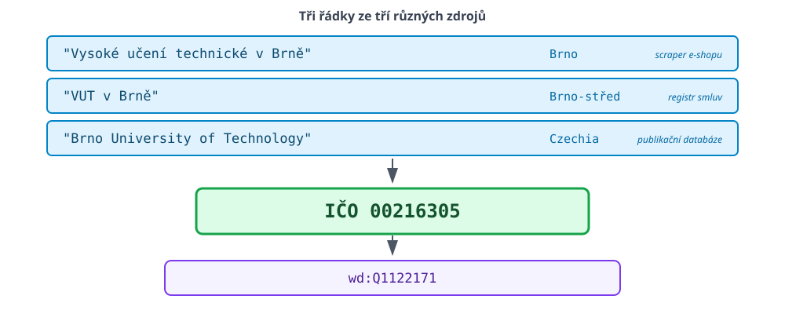
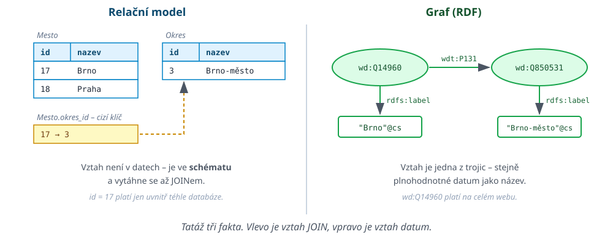
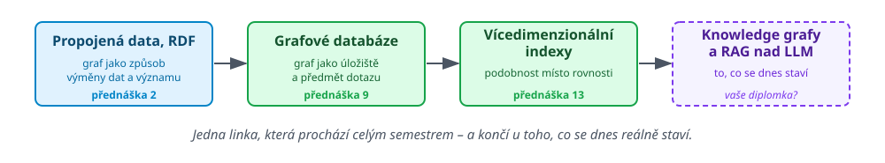

# Kde jsme

 <!-- .element: width="100%" -->

Note:
Tentýž obrázek jako minule, jen s jednou šipkou navíc. Pointa té zelené šipky
je celá dnešní přednáška: to, co dnes uděláme při získávání dat, nám ubere
práci o dvě přednášky dál, při čištění a integraci.

---

# Minule jsme si data brali

 <!-- .element: width="100%" -->

Note:
Potřetí a naposled. Nemluvit dlouho -- pointa je jen ta, že slib z minulého
týdne se teď plní. Levá strana je hotová, dnes je na řadě pravá.

---

# Čtyři dluhy z minulé přednášky

- ??`wdt:P1082` -- co to je a proč ten dotaz vůbec fungoval
- ??`SERVICE wikibase:label` -- proč tam musí být
- ??`data.gov.cz` má SPARQL endpoint -- ``příští týden pochopíte, co to je''
- ??`<script type="application/ld+json">` -- odkud se ten slovník bere

<p class="fragment" style="font-size: 140%; text-align: center; margin-top: 1em;"><strong>Na konci dnešní přednášky umíte vysvětlit všechny čtyři.</strong></p>

Note:
Tohle je smlouva se studenty na dnešek. Na posledním slajdu přednášky se
ty čtyři body vrátí odškrtnuté.

---

# Jedna firma, nebo tři?

 <!-- .element: style="height:620px;margin:0 auto;display:block" -->

Note:
Zeptat se sálu, než pustím fragment: kolik různých subjektů to je?
Odpověď je jeden. Ale žádné dva řetězce se neshodují -- ani po
normalizaci na malá písmena, ani po odstranění diakritiky.

---

# Řetězce se neshodují. Identifikátory ano.

- Textový název je **popis**, ne identita
	- mění se, překládá se, píše se s překlepy
	- ??dvě různé firmy mohou mít stejný název
	- ??jedna firma může mít pět různých názvů
- ??`00216305` je **identita**
	- vydaná jednou, nerecyklovaná, nezávislá na jazyku

<p class="fragment" style="font-size: 130%; text-align: center; margin-top: 0.6em;">Spojovat data přes názvy je práce navíc, kterou si <strong>způsobíme sami</strong>.</p>

---

# Dvě odpovědi na tentýž problém

<div class="small">

| Přístup | Kdy se identita řeší | Čím se platí |
|---|---|---|
| Párování řetězců (přednáška 4) | až po sběru dat | podobnostní míry, prahy, chyby |
| Globální identifikátory (dnes) | už při publikaci dat | někdo se musel předem dohodnout |

</div>

- ??Dnešek je ten **druhý řádek**
- ??Přednáška 4 je ten první -- a bude potřeba, protože druhý řádek
  nikdy nepokryje všechno

Note:
Vazba na tabulku ``Chci / Platím'' z úvodní přednášky. Globální identifikátory
nejsou zadarmo: platí se za ně tím, že existuje autorita, která je vydává,
a že je publikující strana musí použít. Proto je nemáme všude.

---

# Co je globální identifikátor

```
http://www.wikidata.org/entity/Q1122171
```

- Dereferencovatelný -- dá se ``zavolat'' přes HTTP a něco se vrátí
- Nezávislý na jazyku a pravopisu
- Jeden pro celý svět, ne pro jednu databázi
- Vydaný jednou a nerecyklovaný

<div class="small">

| | `id = 17` | IRI |
|---|---|---|
| Platnost | uvnitř jedné databáze | globálně |
| Export do CSV | význam se ztratí | význam zůstane |
| Spojení s cizím zdrojem | nutné párování | rovnost řetězců |

</div>

---

# A najednou to není tabulka

 <!-- .element: style="height:600px;margin:0 auto;display:block" -->

<p class="fragment" style="font-size: 130%; text-align: center;"><strong>Vztah přestal být JOINem a stal se prvotřídním datem.</strong></p>

Note:
Z úvodní přednášky, tabulka předpokladů relačního modelu:
&bdquo;Vztahy jsou vzácné, řeším je JOINem&ldquo; -- proti tomu &bdquo;vztah *je* ten hlavní
obsah&ldquo; -- a odpovědí jsou grafové modely. Tohle je ten okamžik, kdy se
s grafovým modelem potkáváme poprvé.

---

# Kam to vede

 <!-- .element: width="100%" -->

Dnešek je ta **první krabička zleva**.

Note:
Nit, která prochází celým semestrem. Dnes graf jako způsob výměny dat
a významu; v deváté přednášce graf jako úložiště; ve třinácté podobnost
místo rovnosti.
