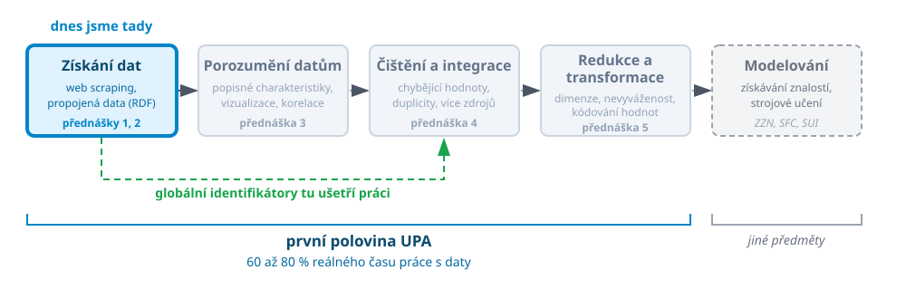
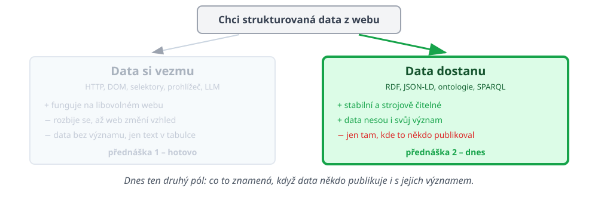

# Kde jsme

 <!-- .element: width="100%" -->

Note:
Tentýž obrázek jako minule, jen s jednou šipkou navíc. Pointa té zelené šipky
je celá dnešní přednáška: to, co dnes uděláme při získávání dat, nám ubere
práci o dvě přednášky dál, při čištění a integraci.

---

# Minule jsme si data brali

 <!-- .element: width="100%" -->

Note:
Potřetí a naposled. Nemluvit dlouho -- pointa je jen ta, že slib z minulého
týdne se teď plní. Levá strana je hotová, dnes je na řadě pravá.

