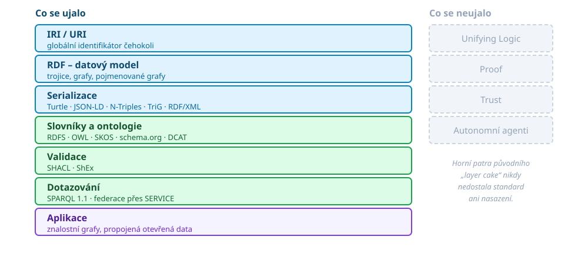

# Sémantický web
- Představa *webu dat* (*web of data* oproti *web of documents*)
	- Publikování strojově srozumitelných dat
- Základní prvky:
	- Reprezentace znalostí -- Resource description framework (RDF)
	- Sdílená konceptualizace (``model světa'') -- ontologie
	- Agenti -- producenti a konzumenti služeb

Berners-Lee, Tim, Hendler, James, et al. &ldquo;The Semantic Web : a new form of Web content that is meaningful to computers will unleash a revolution of new possibilities&rdquo; <em>Scientific American</em> 284 (2001) : 34-43

---

# 25 let poté

- **Nepřišlo:** autonomní agenti vyjednávající mezi sebou, důkazy, vrstva důvěry
	- **Místo toho:** agenti založení na LLM
- **Přišlo:** RDF, SPARQL, JSON-LD, ontologie (schema.org, apod.)
- **Přežilo pod jiným jménem:** *znalostní graf* (Google 2012, dnes každý větší podnik)
- **Reálně rostoucí využití:**
	- E-commerce, vyhledávače
	- Otevřené datové sady (linked open data)

---

# Web dokumentů vs. web dat

**World Wide Web**

- Základní jednotkou je dokument
- Odkaz vede z dokumentu na dokument
- Význam obsahu je implicitní, v textu, pro člověka
- Technologie: HTTP, URI, HTML

**Sémantický web**

- Základní jednotkou je **tvrzení o zdroji**
- Odkaz vede z věci na věc
- Význam je sdílený, zapsaný explicitně, pro stroj
- Technologie: HTTP, IRI, RDF, ontologie

---

# Základní technologie

<!-- .slide: class="normal centered fullspace" -->
 <!-- .element: style="height:700px;margin:0;" -->

Note:
Původní ``layer cake'' z prvních let W3C měl nahoře ještě Unifying Logic,
Proof a Trust. Ty vrstvy nikdy nedostaly standard ani nasazení -- proto jsou
tady čárkovaně stranou. Zbytek zásobníku je dnes běžná praxe.
