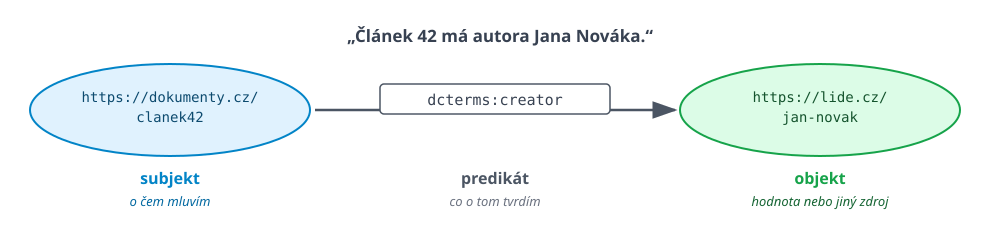
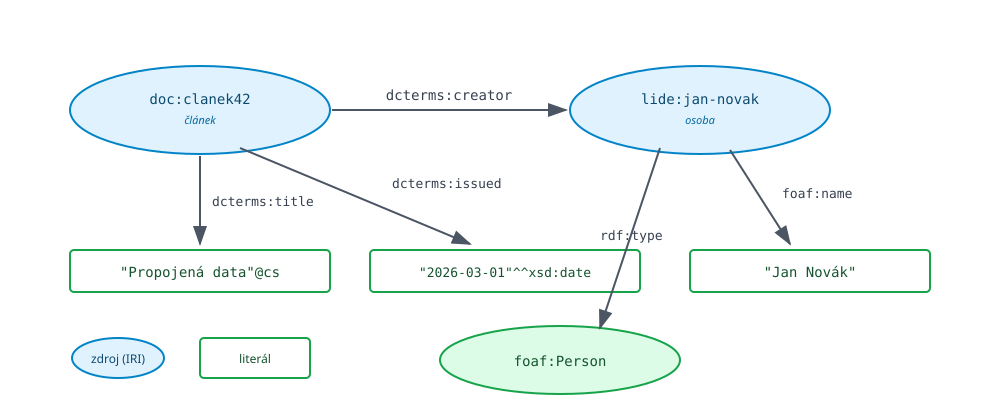
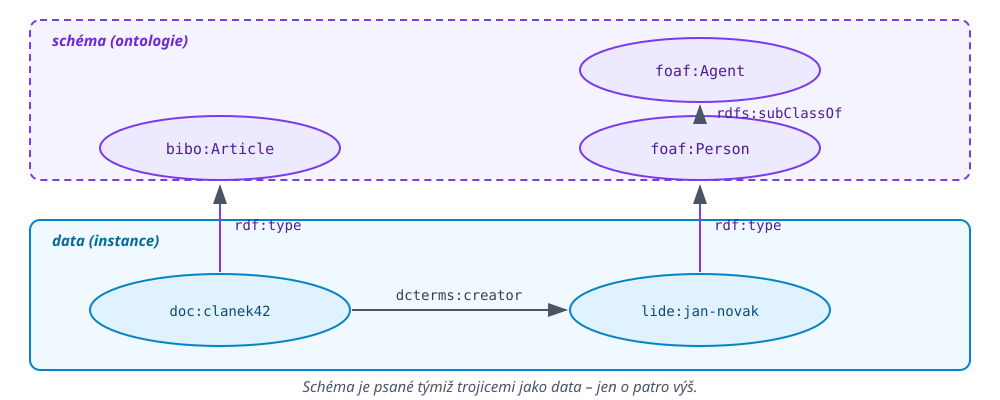

<!-- .slide: class="section" -->

<header>
	<h1>Datový model – RDF</h1>
	<p>Reprezentace a výměna faktů v rámci sémantického webu</p>
</header>

---

# Cíle a prostředky
- Cíle
	- Reprezentace strukturovaných dat a jejich významu (sémantiky)
	- Možnost sdílet data a jejich sémantiku napříč aplikacemi
- Běžná reprezentace dat v IS:
	- Relační/objektové/NoSQL databáze – vázané na aplikaci
	- Veřejná API + serializace (JSON, XML) – není definována sémantika

---

# Serializace – příklad

```xml
<nabidka>
	<polozka>
		<velikost>3+1</velikost>
		<lokalita>Brno-střed</lokalita>
		<cena mena="czk">2 200 000</cena>
	</polozka>
	<polozka>
		<velikost>2+1</velikost>
		<lokalita>Kuřim</lokalita>
		<cena mena="czk">450 000</cena>
	</polozka>
</nabidka>
```

---

# Problémy

- Význam elementů je specifický pro danou aplikaci
	- Je definován v programovém kódu, který data generuje nebo čte
	- Obdobně jako sloupce v relační databázi
- Jiná aplikace přiřadí týmž značkám jiný význam:

<div class="small">

| Zdroj A | Zdroj B | Zdroj C |
|---|---|---|
| `<velikost>3+1</velikost>` | `<velikost>75</velikost>` | `<velikost>75 m2</velikost>` |
| dispozice | plocha v m², číslo | plocha i s jednotkou |

</div>

- Data jsou strojově **čitelná** (*machine readable*), ale ne **srozumitelná** (*machine understandable*)

---

# Identifikace

- Jak identifikovat entity, které popisujeme?
	- Např. VUT, Brno, ...
- Lokální identifikátory (např. generované)
	- Specifické pro konkrétní databázi, při exportu ztrácí smysl
- Unikátní hodnoty z nějakého číselníku (jsou-li k dispozici)
	- Specifické pro různé entity: IČ / DIČ / VAT pro firmu, r.č. pro člověka (chceme ho sdílet?), často nic z toho není k dispozici

---

# Základní myšlenka sémantického webu

- Každé entitě (konkrétní osoba, firma, kniha, film, ...) přiřadíme `IRI`
	- Jednoznačná identifikace nezávislá na původu datasetu a typu entity (`IRI` je zobecnění `URL`)
	- Např. Brno: `http://www.wikidata.org/entity/Q14960`
- Kdokoliv může publikovat **tvrzení** o libovolné entitě
	- Např. Brno má 377508 obyvatel (k 1. 1. 2014)
- Tvrzení může odkazovat na jiné entity
	- Např. Brno je v České republice.

---

# Reprezentace faktů: RDF

- RDF: Resource Description Framework
	- Reprezentuje elementární *tvrzení* (fakta)
- Základním prvkem je **RDF trojice**: **subjekt** -- **predikát** -- **objekt**
- Grafová struktura
	- Tvrzení jsou propojena přes IRI, tvoří orientovaný graf
- Serializace pro uložení a přenos
	- Turtle, JSON-LD, N-Triples, RDF/XML...

---

# RDF trojice -- tvrzení (statement)

 <!-- .element: style="height:400px;margin:0 auto;display:block" -->

- Subjekt a predikát jsou vždy **IRI**
- Objekt je **IRI** nebo **literál** (jen objekt může být literál)
- Zkrácený zápis IRI:
	- `dcterms:` je *prefix*, který se expanduje
	- `dcterms:creator` => `http://purl.org/dc/terms/creator`

---

# Kde vzít IRI?

- Vlastní data -- vlastní IRI
	- Např. `http://www.fit.vut.cz/student/938272`
	- Obvykle společný *prefix*
- Existující data -- veřejné znalostní báze
	- `http://dbpedia.org/resource/Berlin`, `http://www.wikidata.org/entity/Q42`
- Ontologie -- strukturované slovníky
	- IRI pro **predikáty** a pro **typy** (třídy) objektů
- Zabudované: `rdf:type`

**Pravidla Linked Data:** používej IRI · používej *HTTP* IRI, aby se daly dereferencovat · po dereferencování vrať užitečná data · odkazuj na cizí IRI

Note:
Ta čtyři pravidla jsou Berners-Leeho ``Linked Data principles'' z roku 2006.
Třetí je ten, na kterém se to nejčastěji láme: IRI existuje, ale nic se pod ním
nevrátí.

---

# RDF graf

 <!-- .element: style="height:520px;margin:0 auto;display:block" -->

- Literál může nést **jazykovou značku** (`@cs`) nebo **datový typ** (`^^xsd:date`)

---

# Schéma -- ontologie

 <!-- .element: style="height:520px;margin:0 auto;display:block" -->

- Propojení přes `rdf:type`; schéma je definované opět RDF trojicemi
	- Jen používáme jiný slovník -- RDFS, OWL
- Data a schéma mohou, ale nemusí být uložena společně

---

# Serializace do Turtle

```turtle
@prefix doc: <https://dokumenty.cz/> .
@prefix dct: <http://purl.org/dc/terms/> .
@prefix foaf: <http://xmlns.com/foaf/0.1/> .
@prefix xsd: <http://www.w3.org/2001/XMLSchema#> .

doc:clanek42  dct:title   "Propojená data"@cs ;
              dct:issued  "2026-03-01"^^xsd:date ;
              dct:creator doc:jan-novak .

doc:jan-novak  a  foaf:Person ;
               foaf:name "Jan Novák" .
```

- `a` je zkratka za `rdf:type`, `;` opakuje subjekt, `,` opakuje predikát
- Výchozí volba, když má zápis číst člověk

---

# Ostatní serializace

<div class="col small">

**N-Triples** -- jeden řádek = jedna trojice, bez prefixů. Pro dumpy a streamy.

```
<https://dokumenty.cz/clanek42>
  <http://purl.org/dc/terms/title>
  "Propojená data"@cs .
```

</div>
<div class="col small">

**JSON-LD** -- RDF zapsané jako obyčejný JSON. Nejrozšířenější na webu.

```json
{ "@context": "https://schema.org",
  "@type": "Article",
  "name": "Propojená data" }
```

</div>

@@div style="clear:both"@@@@/div@@


- **RDF/XML** -- původní zápis z roku 1999, `<rdf:Description rdf:about="...">`. Existuje, psát to nebudete.
- **TriG / N-Quads** -- totéž co Turtle / N-Triples plus pojmenované grafy (viz další slajd)

Turtle, N-Triples, TriG i JSON-LD jsou **W3C Recommendation** .

---

# Pojmenované grafy

<div class="small">

- Trojice + identifikátor grafu = **čtveřice** (*quad*)
- Serializace: TriG, N-Quads

```turtle
@prefix wd: <http://www.wikidata.org/entity/> .
@prefix ex: <https://upa.fit.vut.cz/def#> .

ex:import-wikidata-2026-03 {
	wd:Q14960 ex:pocetObyvatel 402739 .
}
```

- **Provenience** -- ze kterého zdroje ta trojice je
- **Verzování** -- který import ji přinesl a kdy
- **Oddělení dat a schématu** -- ontologie zvlášť, instance zvlášť

<p>Při integraci zdrojů: Umožňuje určit, ze kterého zdroje jaké tvrzení pochází -- např. v případě konfliktu, aktualizace, apod.</p>

</div>

Note:
Přesně ten problém, který ve čtvrté přednášce nastane: spojíte tři zdroje,
vyjde nesmysl a nevíte, ze kterého zdroje ten nesmysl přišel. Pojmenované
grafy jsou levná odpověď; formálně se to řeší slovníkem PROV-O.

---

# RDF jako databáze

- Repozitář (*triplestore*) -- úložiště RDF trojic, dotazování přes SPARQL
- Lokální úložiště:
	- [Apache Jena / Fuseki](https://jena.apache.org/), [RDF4J](https://rdf4j.org/) (dříve Sesame)
	- [Oxigraph](https://github.com/oxigraph/oxigraph), [GraphDB](https://graphdb.ontotext.com/), [Virtuoso](https://virtuoso.openlinksw.com/)
	- [QLever](https://qlever.dev/) -- zvládne bilion trojic na jednom stroji
	- Amazon Neptune, Stardog
- Globální *znalostní báze*:
	- [DBpedia](https://www.dbpedia.org/), [Wikidata](https://www.wikidata.org/)

Tohle je **grafová databáze**. Druhou rodinu (*property graphs*, Neo4j) potkáte v ``ukádacích'' přednáškách.

---

# Veřejné znalostní báze

- **Wikidata** -- `http://www.wikidata.org/entity/Q42`
	- SPARQL: [query.wikidata.org](https://query.wikidata.org)
- **DBpedia** -- `https://dbpedia.org/resource/Berlin`
	- SPARQL: [dbpedia.org/sparql](https://dbpedia.org/sparql)
	- Strukturovaná data vytěžená z infoboxů Wikipedie
- **Mnoho dalších**, vzájemně propojených přes IRI
	- *Linked Open Data* -- [lod-cloud.net](https://lod-cloud.net/)

Note:
To rozdělení Wikidat je hezká historka: vědecké články byly přes polovinu všech
trojic. Partitioning z přednášky 7 dorazil o pět přednášek dřív.

---

# Otevřená data

- Serializované RDF jako prostředek pro publikování otevřených (propojených) dat
- **Česko:** [data.gov.cz](https://data.gov.cz/) -- Národní katalog otevřených dat
	- Má i [SPARQL endpoint](https://data.gov.cz/sparql) -- za chvíli se v něm budeme ptát
	- Slovník DCAT-AP-CZ, [otevřené formální normy](https://ofn.gov.cz/)
- **EU:** [data.europa.eu](https://data.europa.eu/) -- i zde [SPARQL endpoint](https://data.europa.eu/data/sparql)
- Serializovaná data (dump), např. v [TriG](https://data.gov.cz/datov%C3%A9-sady?form%C3%A1ty=http%3A%2F%2Fpublications.europa.eu%2Fresource%2Fauthority%2Ffile-type%2FRDF_TRIG&po%C4%8Det-form%C3%A1t%C5%AF=24) nebo [Turtle](https://data.gov.cz/datov%C3%A9-sady?form%C3%A1ty=http%3A%2F%2Fpublications.europa.eu%2Fresource%2Fauthority%2Ffile-type%2FRDF_TRIG&form%C3%A1ty=http%3A%2F%2Fpublications.europa.eu%2Fresource%2Fauthority%2Ffile-type%2FRDF_TURTLE&po%C4%8Det-form%C3%A1t%C5%AF=24)
	- Možno importovat do lokálního úložiště a dotazovat se spolu s vlastními daty
	- Např. [Číselník pro sporty](https://data.dia.gov.cz/soubory/%C4%8D%C3%ADseln%C3%ADky/sporty.ttl), [Přehled OSVČ](https://data.gov.cz/datov%C3%A1-sada?iri=https%3A%2F%2Fdata.gov.cz%2Fzdroj%2Fdatov%C3%A9-sady%2F00006963%2F8b8c88fda13b39a12d24ff73a0f5980d)

