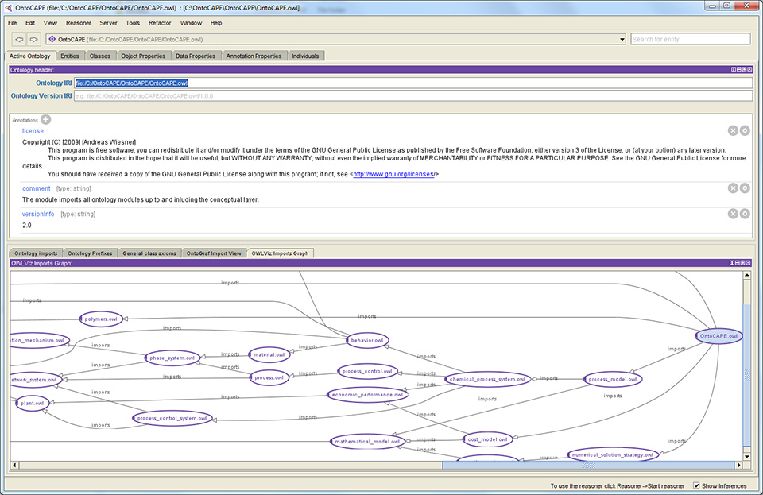

<!-- .slide: class="section" -->

<header>
	<h1>Ontologie</h1>
	<p>Slovníky pro sémantický web</p>
</header>

---

# Pojem ontologie
- Původně obecnější význam (filozofie)
- Nástroj pro sdílení významu pojmů, které se vyskytují v cílové oblasti
- _„Formální, explicitní specifikace sdílené konceptualizace“_
- Definují základní pojmy modelovaného světa a vztahy mezi nimi
- **Sdílené** a **opakovatelně použitelné**

---

# Účel ontologií
- Porozumění mezi lidmi (experty)
- **Porozumění mezi počítačovými aplikacemi**
	- **Dodání významu jednotlivým URI v sémantickém webu**
	- Možnost **integrace** dat z různých zdrojů
- Návrh znalostních aplikací

---

# Typy ontologií
- Terminologické (lexikální)
	- Pojmy a jejich vzájemné vztahy (taxonomie)
	- Např. _WordNet_
- Generické ontologie
	- Zákonitosti a vztahy mezi obecnými pojmy
	- „Upper ontology“, např. SUMO
- Doménové ontologie
	- Konkrétní oblast (např. podnikové, lékařství, …)
- Aplikační ontologie
	- Pro konkrétní aplikaci

---

# Prvky ontologií
- **Třídy (koncepty)**
- **Individua (objekty, instance)**
- **Vlastnosti (role, atributy)**
- Meta-sloty (facety)
- Primitivní datové typy
- Axiomy (pravidla)

Definované prvky můžeme využít v RDF tvrzeních. Ontologie tedy definuje <!-- .element: class="cite" -->
*slovní zásobu* (*vocabulary*) pro RDF. 

---

# Koncepty – třídy
- Množiny konkrétních objektů
- Žádné procedurální metody
- Třídy _definované_ a _primitivní_
	- Podle definice příslušnosti individua
- Dědičnost tříd (často vícenásobná)

---

# Individua – objekty – instance
- Konkrétní objekty reálného světa
- Individuum nemusí být nutně instancí třídy
- Vzhledem k určení ontologií se často nepoužívají
	- Reprezentují konkrétní data

---

# Relace – atributy – sloty – vlastnosti
- Pojetí vlastnosti je jiné, než u OO modelování
- Vlastnost = relace
	- Samostatně definovaný prvek
	- Obvykle binární relace
- Možná dědičnost relací (má otce, má předka)
	- Nadřazená relace obsahuje všechny prvky podřazené relace
- Funkce – speciální relace
	- Hodnota argumentu _n_ jednoznačně určena předchozími _n-1_ argumenty

---

# Primitivní hodnoty, datové typy
- Argumentem relace může být _primitivní hodnota_ (ne objekt)
	- Číslo, řetězec, výčtová hodnota, …
	- *Datatypová vlastnost* vs. *objektová vlastnost*
- Můžeme uvažovat dato-typové třídy (datové typy) a dato-typové instance (hodnoty)
- Dato-typové vlastnosti obvykle deklarujeme  jako funkční (mají pouze jednu hodnotu)

---

<!-- .slide: class="section" -->

<header>
	<h1>Ontologické jazyky</h1>
	<p>RDF Schema, OWL</p>
</header>

---

# RDF Schema
- Sémantické rozšíření RDF
	- V podstatě (meta) **ontologie**
- Umožňuje definici
	- Tříd
	- Binární relace (definiční obor, obor hodnot)
	- Hierarchie nad třídami i relacemi
- Definice opět pomocí RDF tvrzení (trojic)
	- S použitím konceptů a vlastností z RDFS
- Namespace (prefix obvykle **rdfs**)\
`http://www.w3.org/2000/01/rdf-schema#` 

---

# Třídy
- Třída je přiřazena ke zdroji pomocí rdf:type
	- `skola:Osoba rdf:type rdfs:Class`
- Odvozené třídy
	- Např. `skola:Student rdfs:subClassOf skola:Osoba`

---

# Vlastnosti v RDFS
- Vlastnosti jsou instance `rdfs:Property`
	- `skola:maZapsano rdf:type rdfs:Property`
- **rdfs:Range** – typ objektů (obor hodnot)
	- `skola:maZapsano rdfs:range skola:Predmet`
- **rdfs:Domain** – typ subjektů (def. obor)
	- `skola:maZapsano rdfs:domain skola:Student`
- `rdfs:subPropertyOf`
	- Vlastnost je „podvlastností“ jiné vlastnosti

---

# OWL
- Rozšíření RDFS o pokročilé vlastnosti
- Definice kompletní ontologie
- Namespace `http://www.w3.org/2002/07/owl#` 

---

# Definice tříd v OWL
- Kombinace s RDFS
- Třídu lze definovat pomocí logických podmínek
	- Identifikátorem třídy (žádné prvky)
	- Výčtem prvků (instancí)
	- Omezením vlastností
	- Sjednocením nebo průnikem dvou a více tříd
	- Doplňkem

---

# Definice třídy identifikátorem

Turtle
```turtle
foaf:Person rdf:type owl:Class .
```

XML
```xml
<owl:Class rdf:about="&foaf;Person"/>
```

nebo
```xml
<rdf:Description rdf:ID=“Person”>
	<rdf:type resource=“&owl;Class” />
</rdf:Description>
```

---

# V Turtle s prefixy

```turtle
@prefix rdf: <http://www.w3.org/1999/02/22-rdf-syntax-ns#> .
@prefix owl: <http://www.w3.org/2002/07/owl#> .
@prefix foaf:<http://xmlns.com/foaf/0.1/>.

foaf:Person rdf:type owl:Class .
foaf:Person a owl:Class .
```

---

# Definice doplňkem

```xml
<owl:Class>
  <owl:complementOf>
    <owl:Class rdf:about="#Student"/>
  <owl:complementOf/>
</owl:Class>
```

---

# Ostatní operátory nad třídami
- `owl:equivalentClass`
	- Stejná třída (např. z jiné ontologie)
- `owl:disjointWith`
	- Disjunktní třída

---

# Definice vlastností
- RDFS konstruktory
	
```xml
<owl:ObjectProperty rdf:ID="studuje">
  <rdfs:domain rdf:resource="#Student"/>
  <rdfs:range rdf:resource="#Obor"/>
</owl:ObjectProperty>
```

- Vztahy mezi vlastnostmi
	- `owl:equivalentProperty` – stejné hodnoty
	- `owl:inverseOf` – inverzní vlastnost

```xml
<owl:ObjectProperty rdf:ID="maStudenta">
	<owl:inverseOf rdf:resource="#studuje"/>
</owl:ObjectProperty>
```

---

# Data-typové vlastnosti
- RDF Literály
- XSD datové typy
	- Namespace `http://www.w3.org/2001/XMLSchema` 

- `xsd:string`, `xsd:normalizedString`, `xsd:boolean`, `xsd:decimal`,  `xsd:float`, `xsd:double`, `xsd:integer`, `xsd:nonNegativeInteger`  `xsd:positiveInteger`, `xsd:nonPositiveInteger`, `xsd:negativeInteger`, `xsd:long`, `xsd:int`, `xsd:short`, `xsd:byte`,   `xsd:unsignedLong`, `xsd:unsignedInt`, `xsd:unsignedShort`, `xsd:unsignedByte`, `xsd:hexBinary`, `xsd:base64Binary`, `xsd:dateTime`, `xsd:time`, `xsd:date`, `xsd:gYearMonth`, `xsd:gYear`, `xsd:gMonthDay`, `xsd:gDay`, `xsd:gMonth`, `xsd:anyURI`, `xsd:token`, `xsd:language`, `xsd:NMTOKEN`, `xsd:Name`, `xsd:NCName`
<!-- .element style="font-size: 80%"  -->


---

# Editor Protegé
	
http://protege.stanford.edu/




---

# Existující ontologie
- Důraz na maximální využití existujících ontologií
	- Je možno kombinovat koncepty a vlastnosti z různých ontologií
- Přehled
	- https://lov.linkeddata.es/dataset/lov/

---

# Dublin core
- Metadata dokumentů
- Použití zejména v knihovnictví
- Definuje vlastnosti dokumentů:

```xml
<rdf:Description rdf:about="http://www.w3schools.com">
   <dc:description>W3Schools</dc:description>
   <dc:publisher>Refsnes Data as</dc:publisher>
   <dc:date>2008-09-01</dc:date>
   <dc:type>Web Development</dc:type>
   <dc:format>text/html</dc:format>
   <dc:language>en</dc:language>
 </rdf:Description>
```

---

# Friend-of-a-friend (FOAF)
- Ontologie pro popis osob a jejich vzájemných vztahů http://www.foaf-project.org/
- Třídy pro popis osob
	- `foaf:Agent`, `foaf:Person`, …
- Vlastnosti
	- `foaf:name`, `foaf:knows`, …

---

# FOAF příklad

```turtle
@prefix foaf:<http://xmlns.com/foaf/0.1/>.
@prefix dbr:<http://dbpedia.org/resource>.

dbr:Luke_Skywalker foaf:knows dbr:Han_Solo .
dbr:Luke_Skywalker foaf:name "Luke Skywalker" .
```

---

# SKOS
- Simple Knowledge Organization System
- Umožňuje organizaci pojmů v nějaké doméně
	- Koncepty: Concept
	- Vztahy mezi nimi: broader, narrower, related, …
	- …

---

# Schema.org
- Primárně pro anotování webových stránek
	- https://schema.org
- Základní slovníky pro různé obecné domény
	- https://schema.org/docs/gs.html#schemaorg

---

# Další ontologie
- Music ontology
	- http://musicontology.com/
- Event ontology
	- http://motools.sourceforge.net/event/event.html 
- Time ontology
	- http://www.w3.org/TR/2006/WD-owl-time-20060927/ 
- Geo ontology
	- http://www.w3.org/2003/01/geo/

---

# Ontologie a RDF znalostní báze
- DBPedia.org
	- Vlastní ontologie + použití existujících
	- http://dbpedia.org/resource/Berlin
	- http://dbpedia.org/page/Novak_Djokovic 
- Např.
	- [Vlastnost Birth place](http://dbpedia.org/ontology/birthPlace)
	- [Podobně Wikidata](https://www.wikidata.org/wiki/Property:P19) 

