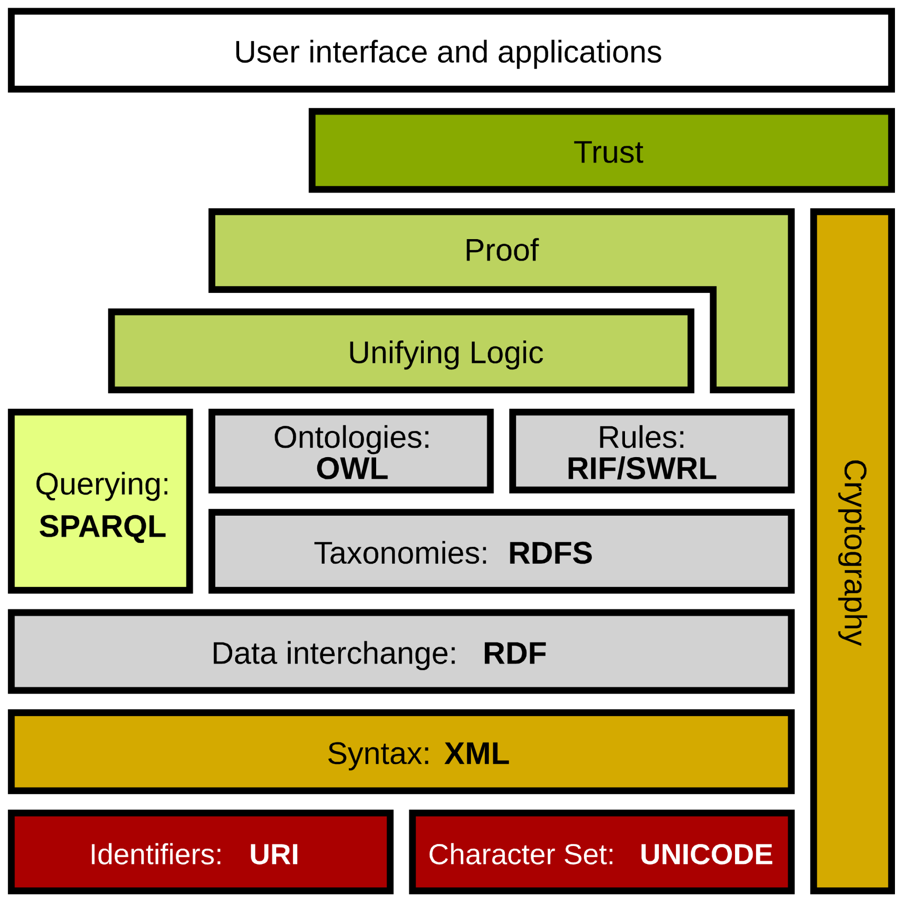

# Sémantický web
- Představa *webu dat* (*web of data* (oproti *web of documents*)
	- Publikování strojově srozumitelných dat
- Základní prvky:
	- Reprezentace znalostí -- Resource description framework (RDF)
	- Sdílená konceptualizace (``model světa'') -- ontologie
	- Agenti -- producenti a konzumenti služeb

Berners-Lee, Tim, Hendler, James, et al. &ldquo;The Semantic Web : a new form of Web content that is meaningful to computers will unleash a revolution of new possibilities&rdquo; <em>Scientific American</em> 284 (2001) : 34-43

---

# Technické řešení
- Vývoj technologií pro vhodnou reprezentaci dat
	- Možnost sdílení dat i s jejich sémantikou
	- Použitelné technologie jsou již dlouho k dispozici
- Integrace s existujícím webem
	- Anotace ve webových stránkách
	- Poněkud vázne, ale zlepšuje se

---

# Web a sémantický web
- World Wide Web (web)
	- Základní jednotkou je dokument
	- „Web of documents“
- Semantic Web (sémantický web)
	- Základními jednotkami jsou data
	- „Web of Data“, „Linked data“

---

# Technologie sémantického webu
- Technologie standardního webu
	- HTTP, URI
- Nástroje pro reprezentaci znalostí
	- Reprezentace dat (faktů)
		- XML, RDF, …
	- Sémantika
		- Ontologie
		- Technologie pro reprezentaci ontologie

---

# Semantic Web Stack

<!-- .slide: class="normal centered fullspace" -->
 <!-- .element: style="height:750px;margin:0;" -->
