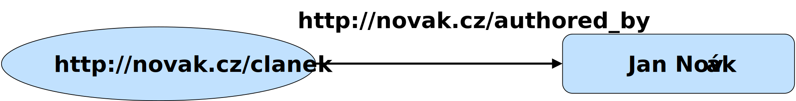
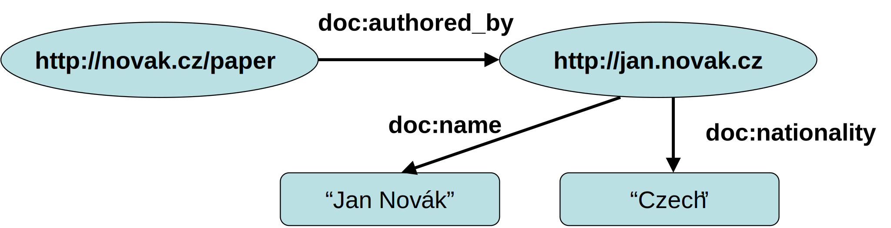
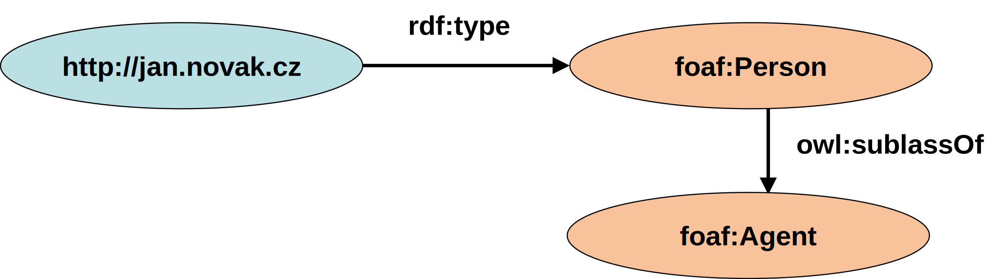

<!-- .slide: class="section" -->

<header>
	<h1>Datový model – RDF</h1>
	<p>Reprezentace a výměna faktů v rámci sémantického webu</p>
</header>

---

# Cíle a prostředky
- Cíle
	- Reprezentace strukturovaných dat a jejich významu (sémantiky)
	- Možnost sdílet data a jejich sémantiku napříč aplikacemi
- Běžná reprezentace dat v IS:
	- Relační/objektové/NoSQL databáze – vázané na aplikaci
	- Veřejné API + serializace (JSON, XML) – není definována sémantika

---

# Serializace – příklad

```xml
<nabidka>
	<polozka>
		<velikost>3+1</velikost>
		<lokalita>Brno-střed</lokalita>
		<cena mena="czk">2 200 000</cena>
	</polozka>
	<polozka>
		<velikost>2+1</velikost>
		<lokalita>Kuřim</lokalita>
		<cena mena="czk">450 000</cena>
	</polozka>
</nabidka>
```

---

# Problémy
- Význam elementů je specifický pro danou aplikaci
	- Je definován v programovém kódu, který generuje nebo načítá serializovaná data
	- Obdobně jako např. sloupce v relační databázi
- Jiná aplikace může stejným elementům přiřadit jiný význam
	- Např. `<velikost>2+1<velikost>` vs. `<velikost>55m2</velikost>`
- Data jsou strojově čitelná (machine readable), ale ne srozumitelná (machine understandable)

---

# Reprezentace sémantiky
- Odlišení značek v různých aplikacích
	- Např. XML namespaces
	- Řeší kolize značek – syntaktický problém
- Oddělená definice významu značek
	- Např. doprovodný dokument vysvětlující význam a případy použití
- Navíc ale potřebujeme definovat sémantické vztahy
	- Např. byt je věc, která má umístění, velikost a cenu
	- Pokud možno formálně => **Ontologie**

---

# Reprezentace faktů
- XML
	- Mapování elementů na vlastnosti ontologií
	- Pouze hierarchická struktura – omezující
- RDF
	- Grafová struktura
	- Lze zapsat pomocí XML nebo jiných jazyků

---

# RDF trojice
- Základním prvkem je **RDF trojice**
 

**subjekt** – **predikát** – **objekt**

- Základní *tvrzení* (*statement*)

---

# RDF trojice – tvrzení (statement)
- *Autorem* **dokumentu X** je **pan Y**
	- Subjekt: **dokument X**
	- Predikát: *je autorem*
	- Objekt: *pan Y*
 
- Jednotlivé části tvrzení (zdroje) *(resources)* jsou reprezentované pomocí **URI** nebo **literálem** (pouze objekt).

---

# RDF tvrzení (II)

<!-- .slide: class="normal centered fullspace" -->
 

---

# RDF Graf

 <!-- .element: style="height:300px;margin:1em auto;display:block" -->

- RDF graf lze rozložit na trojice subjekt – predikát – objekt 
- Subjekt a predikát jsou vždy **URI**
	- `doc:` je prefix URI, který se expanduje
	- Např. `doc:name` => `http://my.docs.com/#name` 
- Objekt je **URI** nebo **literál** (různých datových typů)


---

# Schéma – Ontologie 

 <!-- .element: style="height:300px;margin:1em auto;display:block" -->

- RDF data lze propojit s metadaty (ontologií, schématem)
	- Pomocí predikátu rdf:type
- Definice metadat opět pomocí RDF
	- Je možné (ale ne nutné) spojit data i metadata do jednoho grafu.

---

# Ukládání a přenos RDF dat
- Uložení do RDF úložiště (např. [RDF4J](https://rdf4j.org))
	- Rozložení na trojice a uložení do interní struktury
	- Následně možnost dotazování (jazyk SPARQL)
- Serializace do souboru a zpět – několik variant
	- RDF/XML (standard W3C)
	- N-triples (N3)
	- Turtle (podmnožina N3)


---

# Serializace do Turtle

```turtle
@prefix doc: <http://dokumenty.cz/def#> .
@prefix foaf: <http://xmlns.com/foaf/0.1/> . 

<http://novak.cz/clanek>
	doc:authored-by <http://jan.novak.cz> .

<http://jan.novak.cz>
	doc:name "Jan Novák" ;
	doc:nationality "česká" ;
	a foaf:Person .
```

 <!-- .element: style="height:200px;margin:1em auto;" -->
 <!-- .element: style="height:200px;margin:1em auto;" -->

---

# XML Serializace

```xml
<rdf:RDF
    xmlns:rdf="http://www.w3.org/1999/02/22-rdf-syntax-ns#"
    xmlns:doc="http://dokumenty.cz/def\#">
  
	<rdf:Description rdf:about="http://novak.cz/clanek">
    	<doc:authored-by
			rdf:resource="http://jan.novak.cz" />
  	</rdf:Description>

  	<rdf:Description rdf:about="http://jan.novak.cz">
    	<doc:name>Jan Novák</doc:name>
    	<doc:nationality>česká</doc:nationality>
  		<rdf:type
      		rdf:resource="http://xmlns.com/foaf/0.1/Person" />
  </rdf:Description>

</rdf:RDF>
```

---

# RDF jako databáze
- Repozitář – úložiště RDF trojic
- Dotazování – jazyk SPARQL
- Lokální úložiště:
	- Virtuoso http://virtuoso.openlinksw.com/ 
	- RDF4J (dříve Sesame) http://rdf4j.org/ 
	- Blazegraph https://www.blazegraph.com/product/ 
- Globální *znalostní báze* (*knowledge base*)
	- DBPedia http://dbpedia.org
	- WikiData https://www.wikidata.org/
	- ...

---

# Dotazování – SPARQL 
- Výsledkem dotazu je
	- CSV (tabulka) – dotaz SELECT
	- Nebo nový graf – dotaz CONSTRUCT


```sparql
PREFIX rdf: <http://www.w3.org/1999/02/22-rdf-syntax-ns#>
PREFIX yago: <http://dbpedia.org/class/yago/>
PREFIX dbpedia-owl: <http://dbpedia.org/ontology/>
PREFIX dbprop: <http://dbpedia.org/property/>
SELECT ?place ?name ?label WHERE {
    ?place rdf:type dbpedia-owl:Country .
    ?place dbprop:commonName ?name .
    ?place rdfs:label ?label .
   OPTIONAL {?place dbprop:yearEnd ?yearEnd}
   FILTER (!bound(?yearEnd))
}
```

---

# Veřejné znalostní báze
- DBPedia http://dbpedia.org
	- http://dbpedia.org/resource/Berlin
	- http://dbpedia.org/sparql 
- Wikidata http://wikidata.org 
	- http://wikidata.org/entity/Q42 
- Mnoho dalších
	- Mohou být vzájemně propojené pomocí URI
	- *Linked open data*
	- http://lod-cloud.net/

---

# Otevřená data

- Serializované RDF jako prostředek pro publikování otevřených (propojených) dat
- Např. [RDF datasety na data.europa.eu](https://data.europa.eu/data/datasets?locale=en&minScoring=0&format=RDF&page=1&sort=relevance%2Bdesc,%20modified%2Bdesc,%20title.en%2Basc)
- Možno importovat do lokálního RDF úložiště
	- Případně spolu s jinými propojenými datasety
	- Nasledně dotazování pomocí SPARQL
- Příp. veřejný SPARQL endpoint
	- Např. https://data.europa.eu/en/about/sparql
