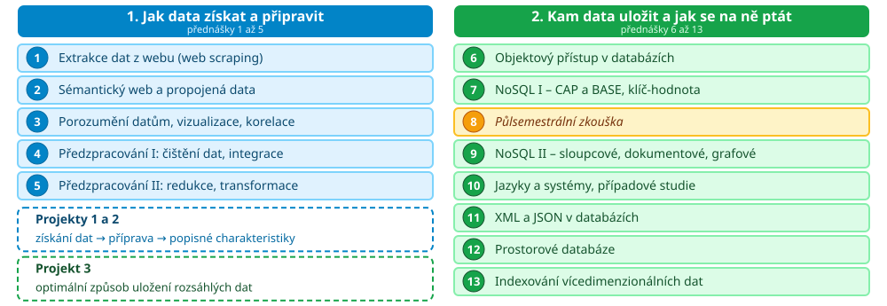

# Osnova předmětu

1. Extrakce dat z webu
2. Sémantický web a propojená data
3. Porozumění datům, vizualizace, korelace
4. Předzpracování I: čištění, integrace
5. Předzpracování II: redukce, transformace
6. Objektový přístup v databázích
7. NoSQL I: CAP a BASE, klíč-hodnota

8. *Půlsemestrální zkouška*
9. NoSQL II: sloupcové, dokumentové, grafové
10. Jazyky a systémy, případové studie
11. XML a JSON v databázích
12. Prostorové databáze
13. Indexování vícedimenzionálních dat

---

# Nejčastější stížnost

``Je to spousta nesouvisejících témat. Nedá se to nijak propojit.''

- ??Je to pochopitelné 
- ??a **není to pravda**
- ??Jaký je záměr a souvislosti?

---

# Rozvržení předmětu

 <!-- .element: width="100%" -->

---

# Mimochodem: název předmětu

- Předmět se jmenuje **Ukládání a příprava dat**
- ??Učíme to **v opačném pořadí**, než jak zní název
	- Nejdřív příprava, potom ukládání
- ??A je to tak správně &ndash; **v tom pořadí se to v praxi děje**
- ??Jedno bez druhého nemůže existovat
	- Ukládání bez přípravy je **skládka**
	- Příprava bez ukládání je **jednorázový skript**, který nikdo nezopakuje

---

# Osoby a obsazení

- [doc. Ing. Radek Burget, Ph.D.](https://www.fit.vut.cz/person/burgetr/) (garant)
	- Web scraping, propojená data
- [Ing. Ivana Burgetová, Ph.D.](https://www.fit.vut.cz/person/burgetova/)
	- Porozumění datům, předzpracování
- [RNDr. Marek Rychlý, Ph.D.](https://www.fit.vut.cz/person/rychly/) (organizace, přihlašování, atd.)
	- Pokročilé databáze
-  [doc. Dr. Ing. Dušan Kolář](https://www.fit.vut.cz/person/kolar/)
	- Prostorové databáze, indexování vícedimenzionálních dat
