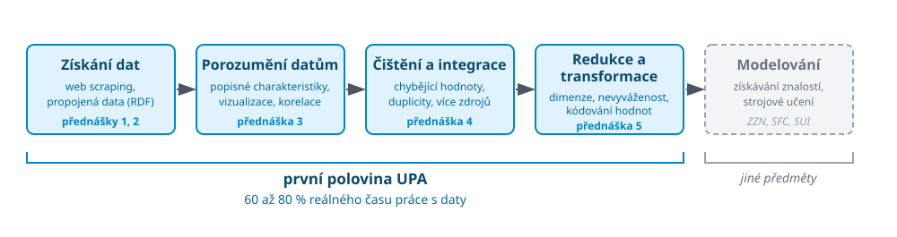

<!-- .slide: class="section" -->

<header>
    <h1>Příprava dat</h1>
    
Jak data získat a připravit. Přednášky 1 až 5.

</header>

---

# Cesta dat

 <!-- .element: width="100%" -->

Note:
Detail po přednáškách &ndash; podle času vybrat jednu dvě poznámky, ne odvyprávět všechny:

- **1. Extrakce dat z webu.** Kde vůbec vzít data, když nemám hezké API ani dataset?
  Crawling, DOM, wrappery, dnes i extrakce pomocí LLM. Co z toho vyleze, je nepravidelné
  a špinavé &ndash; a to je přesně obsah přednášek 3 až 5.
- **2. Sémantický web a propojená data.** Co kdyby web ta data publikoval rovnou strojově
  čitelně? RDF, ontologie, knowledge grafy. Přednášky 1 a 2 jsou dva protipóly téhož
  problému: data si vezmu násilím (funguje vždy, ale křehké) vs. data dostanu dohodou
  (stabilní, ale málo rozšířené). Tady se poprvé potkáte s grafovým modelem.
- **3. Porozumění datům.** Co v těch datech vlastně je? Rozložení, odlehlé hodnoty,
  korelace. Vizualizace je tu diagnostický nástroj, ne prezentační &ndash; Anscombeho
  kvartet. Korelační analýza přímo připravuje redukci dimenzí v přednášce 5.
- **4. Čištění a integrace.** Chybějící hodnoty a zkreslení, které vnese jejich doplnění.
  Duplicity, entity resolution, schema matching. Je to přesně ten problém, který se
  globální identifikátory a ontologie z druhé přednášky snaží vyřešit.
- **5. Redukce a transformace.** Vzorkování, agregace, redukce dimenzí, diskretizace,
  normalizace, nevyvážené třídy. Tady končí UPA a začíná ZZN.

---

# Kde končí UPA

- Modelování a získávání znalostí učí **jiné předměty** (ZZN, SFC, SUI)
- UPA je všechno **před** modelem
- Což je v praxi **60 až 80 % času** práce s daty
	- Sexy část je ten zbytek :-)
