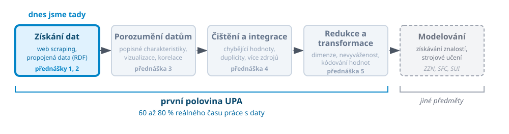

# Kde jsme

 <!-- .element: width="100%" -->

- Web jako významný zdroj dat (různými způsoby)

---

# Dvě cesty ke stejným datům

 <!-- .element: width="100%" -->

Note:
Tohle je nosná myšlenka prvních dvou přednášek. Dnes budeme data dobývat
z dokumentů, které o nás nestojí. Příští týden se podíváme, jak to vypadá,
když nám je někdo publikuje dobrovolně a strojově čitelně.

Obrázek se vrátí na posledním slajdu dnešní přednášky.

