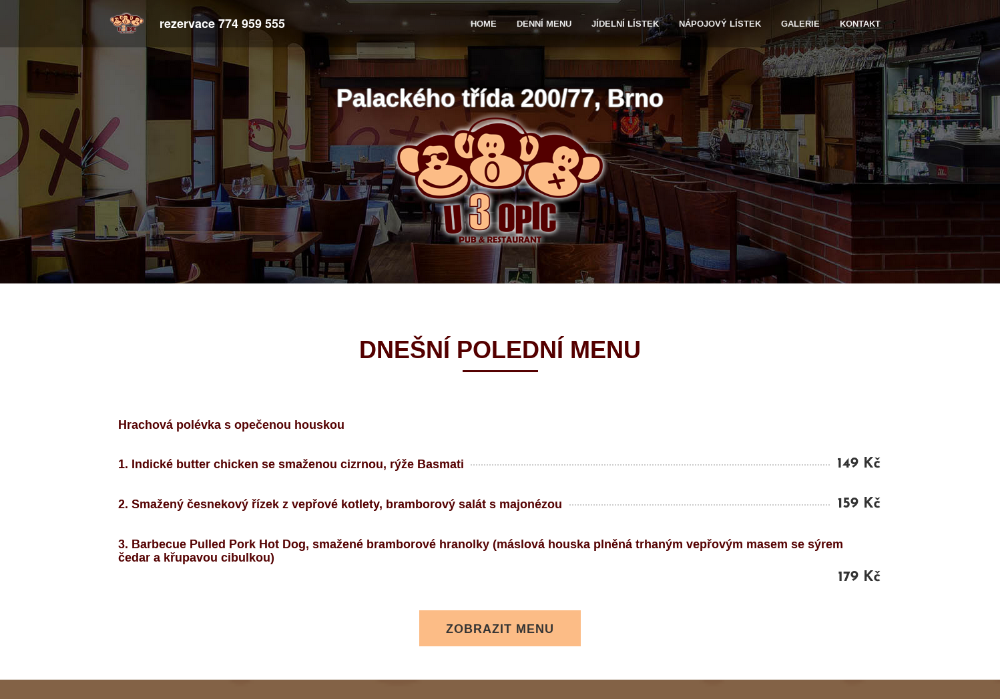

# Motivace

- **Na webu je spousta dat** ||ukrytých ve webových stánkách||
- ??Potřebujeme dále zpracovat tato data v počítačových aplikacích
	- ??Propojení s vlastními daty
	- ??Agregace -- spojení výsledků z různých zdrojů
	- ??Analýza -- statistiky, získávání znalostí
	- ??... a mnohé další
- ??Potřebujeme **strukturovaná data**
	- Reprezentovatelná tabulkami relační databáze
	- Nebo alespoň XML, JSON, apod. *s pevnou strukturou*

---

# Data na webu
- Webové stránky nejsou silně strukturované
- Nejčastěji v HTML
	- Prvotním cílem je *vizuální prezentace*
	- Kód je druhotný, *podřízený prvnímu cíli*
	- Není určen k dalšímu zpracování
    - Často proměnlivé schéma
- **Slabě strukturované dokumenty**

---

# Vzhled a kód
 <!-- .element: style="height:700px;float:left;margin-right:2em" -->

[Zdrojová stránka](https://www.zomato.com/cs/brno/u-3-opic-kr%C3%A1lovo-pole-brno-sever/denn%C3%AD-menu)

@@div class="fragment" style="position: absolute; font-size: 50%; top: 0; right: 0; width: 50em; max-height: 50%;"@@
```html
<div class="restab_wrap">

                    <div id="tabtop" class="tabcontent-wrapper brstd  daily-menu ">
                <div class="ui segment"><div id="menu-container" class="relative">            <div class="clear"></div>
                <div id="daily-menu-container" data-supertab-menu-type = "daily-menu" class="supertab-data-container ">
                <div class="menu-preview  mt10" id="menu-preview">
                                                
                                                        <div class="dm-serving-time mbot0" data-icon="c">Podává se od 11:00 do 14:00</div>
                
                <div class="tmi-groups">
                                                                                                                                                            
                                                                                                                                                                
                                                
                                                <div class="tmi-group  mtop">
                                                            <div class="tmi-group-name bold fontsize3 pb5 bb">
                                    Thursday, 08 October (dnes)
                                </div>
                            
                                                                            
                                                        
                            <div class="tmi tmi-daily pb5 pt5  ">
                                <div class="tmi-text-group col-l-14 col-s-14">
                                    <div class="row">
                                        <div class="tmi-name">
                                            Gulášová polévka z hlívy ústřičné
                                        </div>
                                                                            </div>
                                </div>
                                <div class="tmi-price ta-right col-l-2 col-s-2 bold600">
                                    <div class="row">
                                        
                                    </div>
                                </div>
                                <div class="clear"></div>
                            </div>
                                                    
                                                        
                            <div class="tmi tmi-daily pb5 pt5  ">
                                <div class="tmi-text-group col-l-14 col-s-14">
                                    <div class="row">
                                        <div class="tmi-name">
                                            1. Konfitovaný vepřový bok na česneku a kmínu, dušené hlávkové bílé zelí, houskový knedlík
                                        </div>
                                                                            </div>
								</div>
```
@@/div@@

---

# Další zdroje

- Komerční
	- e-shopy||, realitní servery||||, letenky||||, sportovní výsledky||||, sledování konkurence||
- ?? Výsledky vyhledávání
	- Např. hlídání pozice
- ?? Veřejné rejstříky
	- jízdní řády
	- živnostenský rejstřík
	- statistický úřad
	- weby zastupitelstev
- ?? Kontrola reklamy
- ?? @@span class="large" style="line-height:0.5; vertical-align:top;" @@ &#8734; @@/span@@ dalších

---

# Dílčí problémy

- Získání zdrojových dat
	- Jak stáhnout potřebné dokumenty z WWW (aby obsahovaly to, co mají?)
	- Paralelizace
- **Nalezení a extrakce dat**
	- Identifikace požadovaných údajů ve stránce
- Uložení výsledků <!-- .element: class="grey" -->
	- Může jich být **opravdu mnoho** 

---

# Architektura

Základní architektura

 <!-- .element: width="100%" -->
