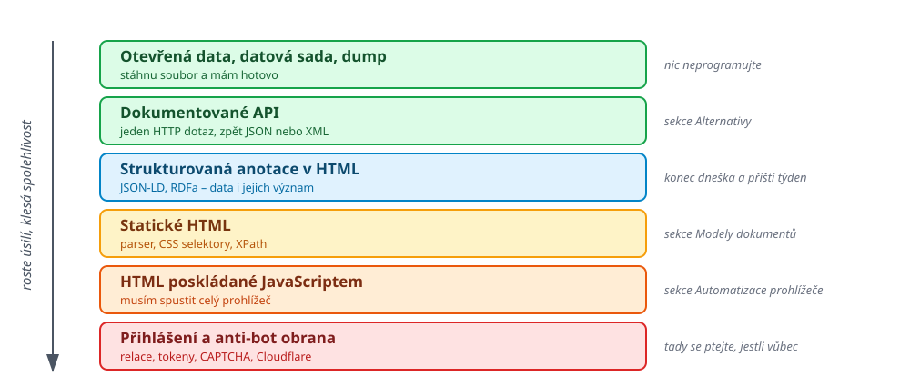

<!-- .slide: class="section" -->

<header>
	<h1>Kde vzít data</h1>
	<p>Scraping je jedna z možností. Vyplatí se zkusit i ostatní.</p>
</header>

---

# Než začnete scrapovat

 <!-- .element: style="height:640px;margin:0 auto;display:block" -->

Note:
Pointa slajdu: každá příčka směrem dolů znamená víc kódu, víc údržby
a větší pravděpodobnost, že to jednoho dne bez varování přestane fungovat.

Studenti se často pustí rovnou do parsování HTML, i když tatáž data leží
o dvě příčky výš jako hotový CSV soubor.

---

# Otevřená data a API &ndash; Česko

<div class="small">

- **ARES** &ndash; ekonomické subjekty, REST API vracející JSON ([dokumentace](https://ares.gov.cz/stranky/vyvojar-info))
- **ČNB** &ndash; denní kurzy devizového trhu jako prostý textový soubor
- **NKOD** &ndash; [data.gov.cz](https://data.gov.cz/), katalog českých otevřených dat
	- Má i [SPARQL endpoint](https://data.gov.cz/sparql) &ndash; příští týden pochopíte, co to je
- **ČSÚ** ([vdb.czso.cz](https://vdb.czso.cz/)), [volby.cz](https://www.volby.cz/opendata/opendata.htm) (XML), [Registr smluv](https://smlouvy.gov.cz/stranka/otevrena-data) (XML, XSD)
- [Hlídač státu](https://api.hlidacstatu.cz/swagger/index.html), [Golemio](https://api.golemio.cz/v2/pid/docs/openapi/) (PID a data Prahy), [ČHMÚ](https://opendata.chmi.cz/), [data.europa.eu](https://data.europa.eu/)

</div>

---

# Jeden řádek místo scraperu

```bash
ARES=https://ares.gov.cz/ekonomicke-subjekty-v-be/rest/ekonomicke-subjekty
curl -s $ARES/00216305 | jq '.obchodniJmeno, .sidlo.textovaAdresa'
```

```json
"Vysoké učení technické v Brně"
"Antonínská 548/1, Veveří, 60200 Brno"
```

- Nebo ještě jednodušeji &ndash; **ani to nemusí být HTML nebo JSON**

```bash
curl -s https://www.cnb.cz/cs/financni-trhy/devizovy-trh/\
kurzy-devizoveho-trhu/kurzy-devizoveho-trhu/denni_kurz.txt
```

```
14.09.2026 #177
země|měna|množství|kód|kurz
Austrálie|dolar|1|AUD|14,996
Brazílie|real|1|BRL|4,078
```

---

# Pokrytí v UPA

Zdroje a související problematika v UPA

<div style="font-size: 70%">

| Typ dat | Zdroj | Doběhne v přednášce |
|---|---|---|
| Grafová, propojená | Wikidata (SPARQL), DBpedia | 2 sémantický web, 9 grafové DB |
| Prostorová | OpenStreetMap / Overpass API, RÚIAN, Golemio | 12 prostorové DB |
| Časové řady | ČNB kurzy, ČHMÚ, polohy vozů PID | 7 a 9 NoSQL, sloupcové |
| Objemná, textová | Common Crawl, OpenAlex, arXiv | 13 vícedimenzionální indexy |
| Hierarchická | volby.cz (XML), Registr smluv | 11 XML a JSON v databázích |
| Nepravidelná, špinavá | e-shopy, jídelníčky, sportovní výsledky | 4 a 5 čištění, transformace |

</div>

- Poslední řádek -- projekty 1 a 2

Note:
Tenhle slajd má studentům ušetřit týden bloudění při volbě tématu projektu.
Zároveň ukazuje, že volba zdroje dat předurčuje, jakou databázi budou
ve druhé polovině semestru potřebovat.

Pokud někdo chce téma, které se potká s víc přednáškami najednou: OSM
nebo Wikidata, obojí je zároveň grafové i prostorové.

---

# A když nic z toho nestačí

- **Zdroj žádné API nemá**
	- Typicky menší weby, obecní úřady, jídelníčky, rozvrhy
- **API existuje, ale nevrací to, co potřebujete**
	- Jiná granularita, chybějící atributy, limit na počet záznamů
- **Potřebujete spojit víc zdrojů dohromady**
	- A aspoň jeden z nich je obyčejná webová stránka

<p class="fragment" style="font-size: 140%; text-align: center; margin-top: 1em;">
<strong>Můžeme to zjistit přímo z HTML?</strong>
</p>
