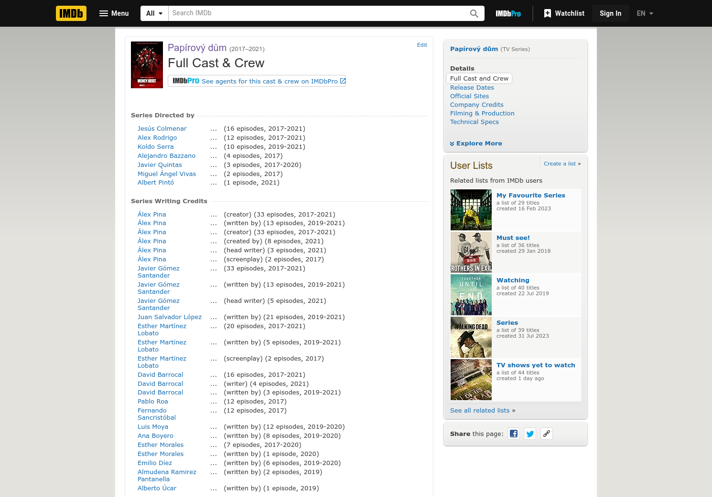
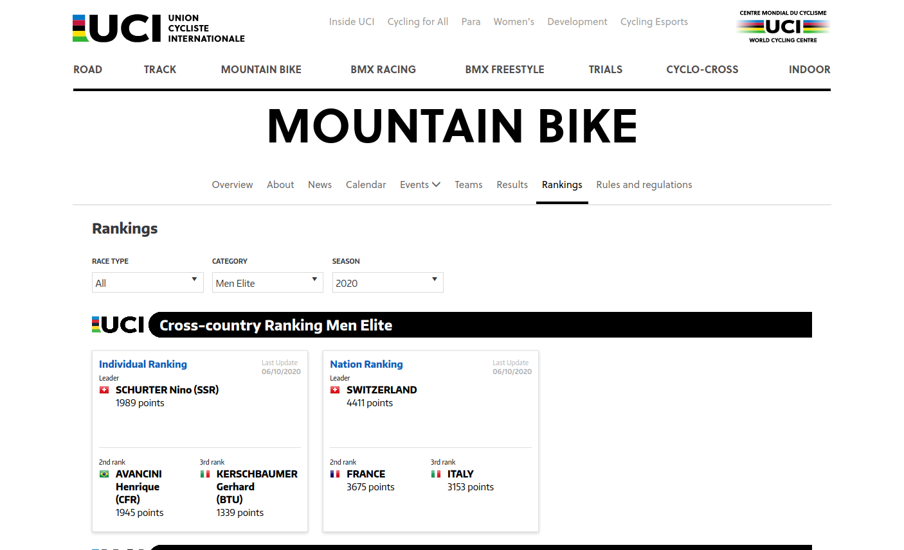
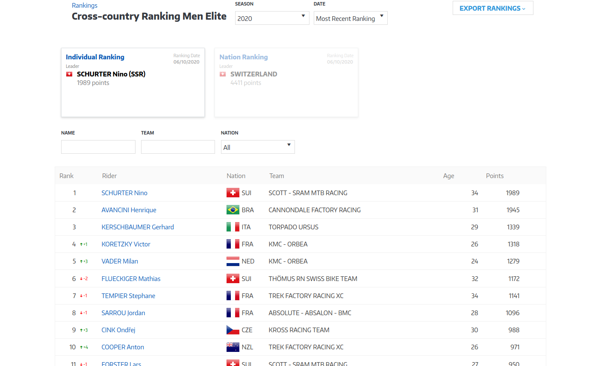
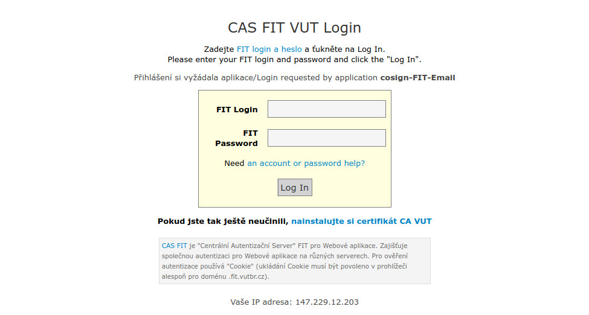

<!-- .slide: class="section" -->

<header>
	<h1>Quick &amp; Dirty</h1>
	<p>Když potřebujeme rychle a jednorázově data z jednoduššího webu a nikdo se nás nebude ptát, jak jsme to udělali.</p>
</header>

---

# Shell je přítel

Motivace: [Evolution of a programmer](https://cgg.mff.cuni.cz/~semancik/cvika/programmer.html)

Co se hodí, než začneme programovat:
- `wget`, `curl`
- `cat`, `grep`, `sed`, `cut`
- `awk` (jen pro fajnšmekry :-)
- `jq`, když zdroj vrací JSON &ndash; viz předchozí sekce

```bash
wget https://www.fit.vut.cz/study/courses/ -O out.html
cat out.html | grep 'list-links__link' | sed 's/<[^<>]*>/;/g' | sed 's/;;*/;/g' >data.csv
cat data.csv | cut -f2 -d';'
```

```bash
wget https://www.fit.vut.cz/study/courses/ -O - | grep 'list-links__link' | sed 's/<[^<>]*>/;/g' | sed 's/\;;*/;/g' | cut -f2 -d';'
```

---

# Totéž v pythonu

```python
import urllib.request
import re

fid = urllib.request.urlopen('https://www.fit.vut.cz/study/courses/')
webpage = fid.read().decode('utf-8')
for line in webpage.split('\n'):
    if ('list-links__link') in line:
        line = re.sub(r"<[^<>]*>", ";", line);
        line = re.sub(r";;*", ";", line);
        print(line)
```

---

# Java

```java
import java.net.URI;
import java.net.http.HttpClient;
import java.net.http.HttpRequest;
import java.net.http.HttpResponse;

public class Courses {

    public static void main(String[] args) throws Exception {
        var client = HttpClient.newHttpClient();
        var req = HttpRequest.newBuilder(
                URI.create("https://www.fit.vut.cz/study/courses/")).build();

        client.send(req, HttpResponse.BodyHandlers.ofString()).body().lines()
            .filter(l -> l.contains("list-links__link"))
            .map(l -> l.replaceAll("<[^<>]*>", ";").replaceAll(";;*", ";"))
            .forEach(System.out::println);
    }
}
```

---

# Omezení: složitá struktura stránky

 <!-- .element: style="height:600px" -->

[Zdrojová stránka](https://www.imdb.com/title/tt6468322/fullcredits) -- regex?!

---

# Omezení: data nejsou v HTML

 <!-- .element height="60%" width="60%" -->

[Světový žebříček UCI MTB](https://www.uci.org/discipline/mountain-bike/4LArSj7CKcytMrGEDtKwkb?tab=rankings&discipline=MTB) -- kde jsou data?

---

# Omezení: stejné URL, jiný obsah

 <!-- .element height="60%" width="60%" -->

[Tentýž žebříček, jiný závodník](https://www.uci.org/discipline/mountain-bike/4LArSj7CKcytMrGEDtKwkb?tab=rankings&discipline=MTB) -- stejné URL

---

# Omezení: přihlášení a přesměrování

 <!-- .element: style="display: block; margin: auto" -->

- Přihlašovací formulář s přesměrováním (a možným zabezpečením proti strojovému vyplnění)
- Zvládnutelné, ale komplikované
