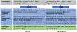

<!-- .slide: class="section" -->

<header>
	<h1>Když za nás pracuje model</h1>
	<p>Současná realita ve zpracování webu</p>
</header>

---

# Nedávný stav

 <!-- .element: style="float:right;height:700px" -->

- Manuální programování, aka **Webscraping**
    - Ruční tvorba programů, které z HTML kódu extrahují, co je třeba
- Platformy pro zpřístupnění obsahu dokumentů přes API
    - Integrace ručně vytvořených scraperů
    - **Přístup ``manufaktura''**

---

# Inteligentní extrakce

Tzn. bez ``ruční práce'' v podobě hledání elementů, regulárních výrazů, CSS selektorů, XPath výrazů, apod.

1. **Jazykové modely**
	- Text dokumentu nebo kód jako součást promptu
2. **Strojové učení**
	- ``Naučení'' extraktoru na anotovaných příkladech
3. **Modelem řízená extrakce**
	- Specifikace předpokládané struktury dat (ER diagram?, *ontologie*, ...)
	- Nalezení výskytu požadovaných skupin dat ve zdrojové stránce

---

# Jazykové modely

- Předáme text nebo kód dokumentu a ptáme se

<p class="cite">Je-li toto stránka produktu, jak se tento produkt jmenuje a kolik stojí?</p>

- **Zero-shot** &ndash; pouze instrukce, žádné příklady
- **One (few)-shot** &ndash; příklady zdrojových dat a očekávaných výsledků
- Specifikace cílového formátu odpovědi
	- Instrukce (použij JSON, názvy atributů) nebo rovnou schéma

<p class="cite">A. Brinkmann et al.: <a href="https://arxiv.org/abs/2310.12537">ExtractGPT: Exploring the Potential of Large Language Models for Product Attribute Value Extraction</a></p>

---

# Příklad promptu

 <!-- .element: style="height:640px;margin:0 auto;display:block" -->

---

# Strukturovaný výstup

- Formát odpovědi dnes nemusíme *prosit*, můžeme ho **vynutit schématem**
	- Model fyzicky nemůže vygenerovat token, který by schéma porušil

```json
{
  "type": "object",
  "properties": {
    "nazev":   { "type": "string" },
    "cena":    { "type": "number" },
    "mena":    { "type": "string", "enum": ["CZK", "EUR"] },
    "skladem": { "type": "boolean" }
  },
  "required": ["nazev", "cena"]
}
```

- Odpadá parsování odpovědi a ošetřování ``skoro JSONu''
- **Pozor:** schéma zaručí *tvar* odpovědi, ne její *pravdivost*

---

# Cena a jak ji srazit

- Zdrojové HTML má běžně stovky kB a z velké části jsou to skripty a styly
	- **Předzpracování** &ndash; zahodit `<script>`, `<style>`, navigaci, převést na text
	- Poslat jen **relevantní podstrom**, nalezený lacino selektorem
	- Cache a dávkové zpracování
- Hlavní problém je **nedeterminismus a ověřitelnost**
	- Dva běhy nad stejnou stránkou, dva různé výsledky
	- Jak poznáte, že model tiše vynechal tři řádky tabulky?

Note:
Tohle je návrat ke &bdquo;Chci / Platím&ldquo; ze začátku přednášky.
LLM kupuje odolnost vůči změnám webu a platí za ni tím, že u žádného
konkrétního výsledku nemáte jistotu, že je úplný.

U scraperu se selektory poznáte poruchu okamžitě &ndash; spadne.
U LLM extrakce se porucha tváří jako platná odpověď.

---

# Hybridní vzor

- Zeptáme se modelu **jednou**: *vygeneruj selektory pro tuhle stránku*
- Pak běží obyčejný **deterministický scraper**
	- Levný, rychlý, opakovatelný, snadno testovatelný
- Model zavoláme znovu, **teprve až scraper přestane fungovat**
	- Změna webu je událost, ne každodenní stav

---

# AI agenti a MCP

- LLM nejen analyzuje vstup, ale i **řídí nástroje**
	- Popíšeme schopnosti nástrojů, model generuje sekvenci volání
- **MCP** (Model Context Protocol) &ndash; standard pro připojení nástrojů k modelu
	- Nástroj napsaný jednou funguje s libovolným klientem
	- Viz přednáška PIS [Alternativní technologie a architektury](https://gitshow.net/https/difs-teaching.github.io/slides/pis/p05_alternativy)
	- Existuje **Playwright MCP** &ndash; prohlížeč jako nástroj modelu
- Agenti typu *browser-use* / *computer-use* &ndash; model stránku vidí a klikáním se proklikává
- Knihovny pro slepení, např. [LangChain](https://www.langchain.com/)
- Nedeterminismus z předchozího slajdu tu platí dvojnásob
